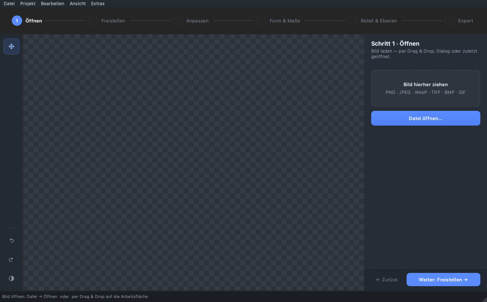
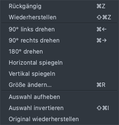
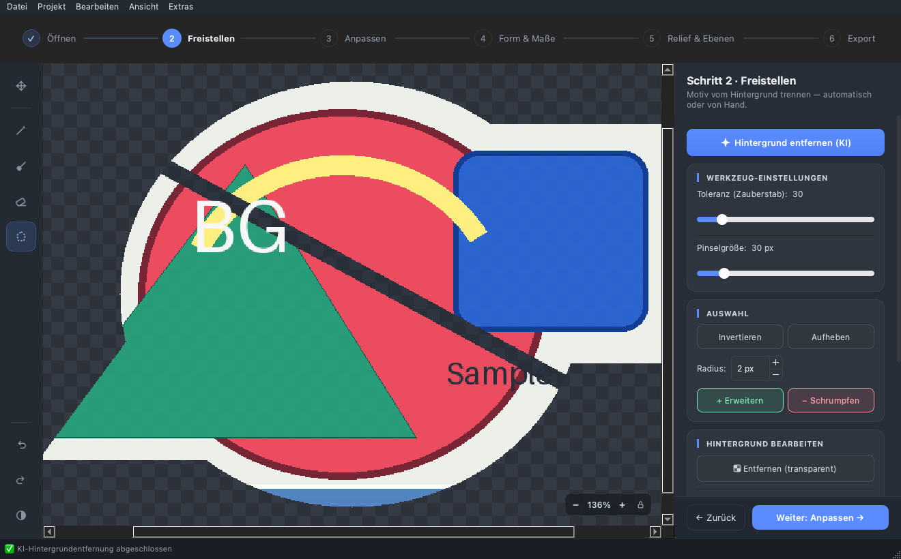
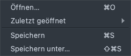
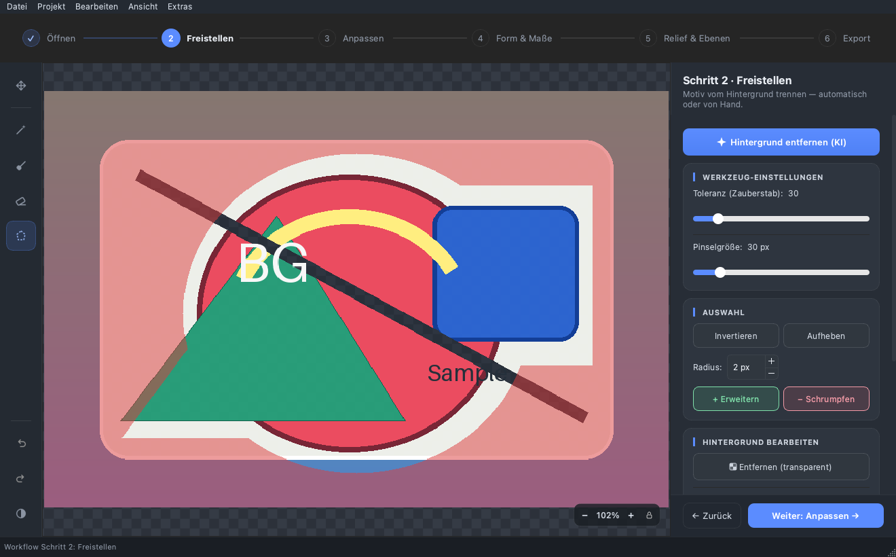
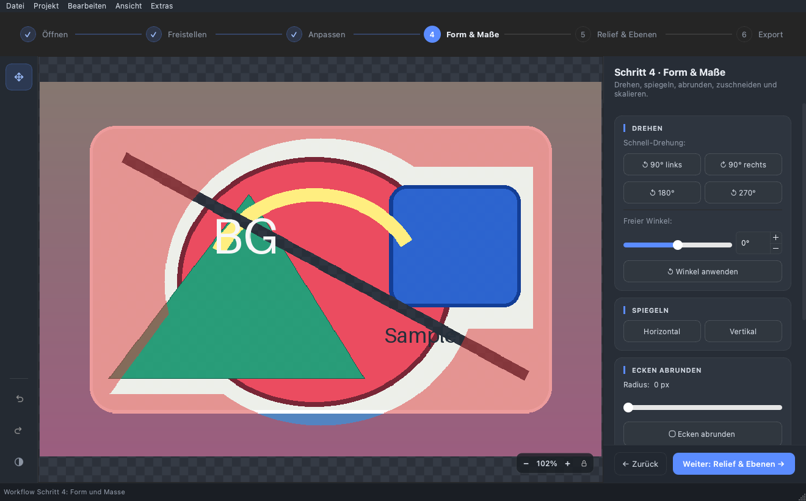
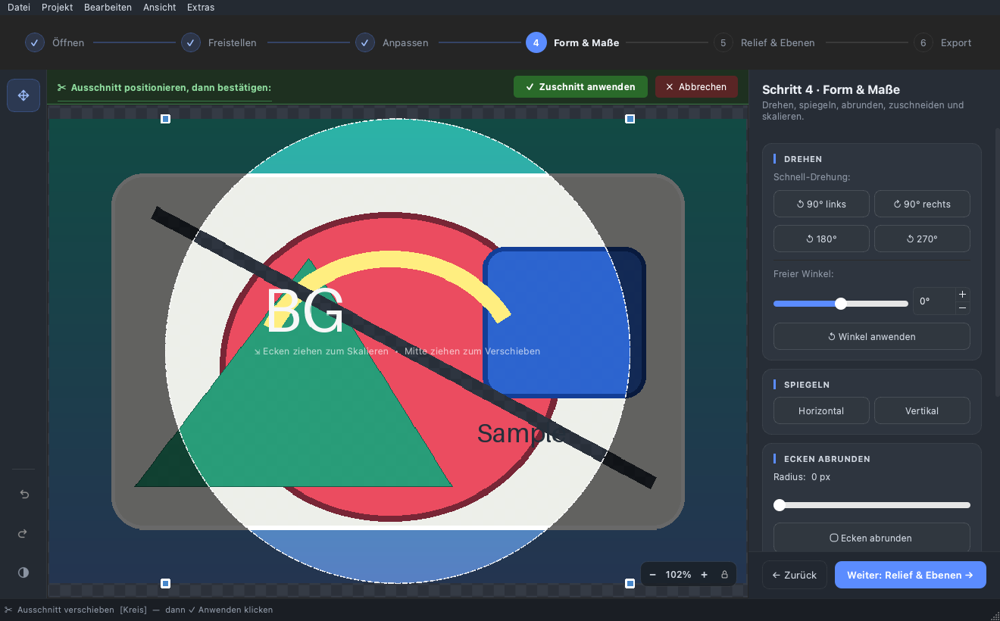
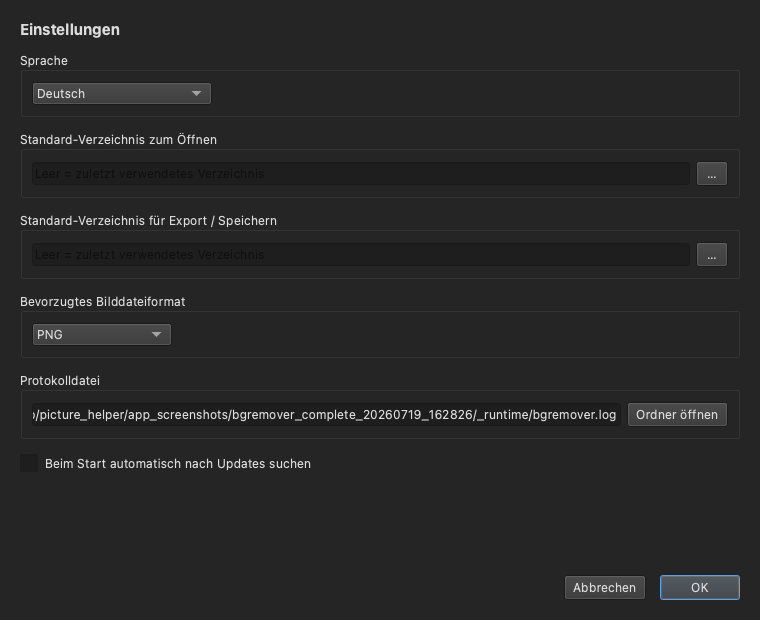

# BgRemover – Anleitung für die Nutzung

**Deutsch** · [README](README.md) · [Installation macOS](INSTALL_MAC.md) · [Installation Linux](INSTALL_LINUX.md)

Diese Anleitung beschreibt Schritt für Schritt, wie das Programm
**BgRemover** bedient wird – von der ersten Bildöffnung bis zum
Speichern des fertigen Ergebnisses. Sie richtet sich an Anwenderinnen
und Anwender ohne Vorkenntnisse in der Bildbearbeitung.

> Hinweise zur **Installation** stehen bewusst nicht hier, sondern in
> [INSTALL_MAC.md](INSTALL_MAC.md) (macOS) bzw.
> [INSTALL_LINUX.md](INSTALL_LINUX.md) (Linux). Diese Anleitung setzt
> voraus, dass das Programm bereits gestartet werden kann.

---

## Inhaltsverzeichnis

1. [Was kann BgRemover?](#1-was-kann-bgremover)
2. [Die Programmoberfläche im Überblick](#2-die-programmoberfläche-im-überblick)
3. [Schnellstart in 5 Schritten](#3-schnellstart-in-5-schritten)
4. [Schritt 1 – Bild öffnen](#4-schritt-1--bild-öffnen)
5. [Die Werkzeugleiste (links)](#5-die-werkzeugleiste-links)
6. [Eine Auswahl treffen](#6-eine-auswahl-treffen)
7. [Schritt 2 – Freistellen](#7-schritt-2--freistellen)
8. [Schritt 3 – Anpassen (Farbkorrektur)](#8-schritt-3--anpassen-farbkorrektur)
9. [Schritt 4 – Form & Maße](#9-schritt-4--form--maße)
10. [Größe ändern & physische Maße](#10-größe-ändern--physische-maße)
11. [Schritt 5 – Relief & Ebenen](#11-schritt-5--relief--ebenen)
12. [Schritt 6 – Export](#12-schritt-6--export)
13. [Einstellungen](#13-einstellungen)
14. [Tastatur-Kürzel](#14-tastatur-kürzel)
15. [Typische Arbeitsabläufe](#15-typische-arbeitsabläufe)
16. [Tipps & Tricks](#16-tipps--tricks)
17. [Bekannte Einschränkungen](#17-bekannte-einschränkungen)
18. [Fehlerbehebung & Log-Datei](#18-fehlerbehebung--log-datei)
19. [Lizenz](#19-lizenz)

---

## 1. Was kann BgRemover?

BgRemover ist ein Bildbearbeitungs-Werkzeug zum **Entfernen, Ersetzen
und Bearbeiten von Hintergründen** – mit zusätzlichen Funktionen für
einfache Bildoptimierung, Ebenen/Projekte und die Vorbereitung von
UV-Druck-Assets. Ein **geführter 6-Schritte-Workflow** (Öffnen →
Freistellen → Anpassen → Form & Maße → Relief & Ebenen → Export) führt
durch die Bearbeitung. Die wichtigsten Funktionen:

- **KI-Hintergrundentfernung** – Hintergrund mit einem Klick automatisch
  freistellen.
- **Manuelle Auswahl** mit Zauberstab, Pinsel, Radiergummi und
  Polygon-Lasso.
- **Hintergrund ersetzen** – Auswahl transparent machen oder mit einer
  beliebigen Farbe füllen.
- **Transformieren** – Drehen (in 90°-Schritten oder freiem Winkel) und
  Spiegeln.
- **Form & Zuschnitt** – Ecken abrunden, auf Kreis oder ein festes
  Seitenverhältnis zuschneiden.
- **Bildoptimierung** – Helligkeit, Kontrast und Sättigung anpassen sowie
  die Alphakante glätten (Feather).
- **Größe & physische Maße** – Pixelgröße ändern oder über Millimeter und
  DPI eine Druckgröße festlegen (mit Druckflächen-Hinweis).
- **Ebenen & Projekte** – mehrere Ebenen (Farbe/Höhe/Gloss/Generisch)
  verwalten und das Ganze als `.bgrproj`-Projekt speichern und öffnen.
- **Höhenkarten** – aus einem Bild eine Höhenkarte erzeugen, per Regler
  oder direkt mit dem Pinsel bearbeiten und optimieren.
- **2D-Vorschau** – Farbe, Relief, Höhe und Gloss am Bildschirm prüfen.
- **EufyMake-Studio-Export** – Import-Assets für den UV-Druck erzeugen.
- **Verlauf** mit Rückgängig/Wiederherstellen und Sprung zu jedem
  früheren Bearbeitungsschritt.
- **Speichern** als PNG, JPEG, WebP oder TIFF.

---

## 2. Die Programmoberfläche im Überblick



*Das Hauptfenster direkt nach dem Start: Menüleiste oben, Werkzeugleiste
links, Arbeitsfläche mit Transparenz-Schachbrett in der Mitte, die
Schrittleiste über der Arbeitsfläche, der Karten-Inspector rechts (hier
Schritt 1 „Öffnen") und die Statusleiste unten.*

Das Fenster ist in fünf Bereiche aufgeteilt:

```
┌─────────────────────────────────────────────────────────────┐
│ Menüleiste                                                   │
├──────────┬───────────────────────────────┬──────────────────┤
│          │      Schrittleiste (6 Schritte)                  │
│ Werkzeug-├───────────────────────────────┼──────────────────┤
│  leiste  │                               │  Karten-         │
│  (links) │        Arbeitsfläche          │  Inspector       │
│          │      (Bild + Auswahl)         │  (rechts)        │
│          │                               │                  │
├──────────┴───────────────────────────────┴──────────────────┤
│ Statusleiste (Hinweise & Meldungen)                          │
└──────────────────────────────────────────────────────────────┘
```

| Bereich | Zweck |
|---|---|
| **Menüleiste** (oben) | Datei, Projekt, Bearbeiten, Ansicht, Extras |
| **Schrittleiste** (über der Arbeitsfläche) | Sechs Schritte: Öffnen, Freistellen, Anpassen, Form & Maße, Relief & Ebenen, Export |
| **Werkzeugleiste** (links) | Verschieben/Zoom, kontextuelle Auswahl-/Höhen-Werkzeuge, Rückgängig/Wiederherstellen/Theme |
| **Arbeitsfläche** (Mitte) | Zeigt das Bild und die aktuelle Auswahl; die Zoom-Pille unten rechts zeigt und steuert die Vergrößerung |
| **Karten-Inspector** (rechts) | Kopf mit Schritt-Titel/-Beschreibung, die Karten des aktiven Schritts, Fußzeile mit „Zurück"/„Weiter" |
| **Statusleiste** (unten) | Hinweise und Rückmeldungen des Programms |

### Menüs „Bearbeiten", „Ansicht", „Projekt" & „Extras"

Viele Aktionen sind zusätzlich über die Menüleiste erreichbar:

- **Bearbeiten** – Rückgängig/Wiederherstellen, Drehen (90° links/rechts/
  180°), Horizontal/Vertikal spiegeln, *Größe ändern…* sowie Auswahl
  aufheben/invertieren und *Original wiederherstellen*. Praktisch, wenn
  Sie eine Funktion lieber über das Menü als über Werkzeugleiste oder
  Karten-Inspector aufrufen.
- **Ansicht** – *Fit to View* (⌘0), *Verlauf* (öffnet dieselbe
  Änderungshistorie wie zuvor der Werkzeugleisten-Knopf), das Untermenü
  *Vorschaumodus* (siehe [Abschnitt 12](#12-schritt-6--export)) sowie
  *Heller Modus* zum Umschalten des Farbschemas.
- **Projekt** – *Neues Projekt*, *Projekt öffnen…*, *Projekt speichern* /
  *…unter…* (`.bgrproj`) sowie *Assets für EufyMake Studio exportieren…*
  (siehe [Abschnitt 11](#11-schritt-5--relief--ebenen) und
  [Abschnitt 12](#12-schritt-6--export)).
- **Extras** – *Einstellungen…* (siehe [Abschnitt 13](#13-einstellungen)),
  *Nach Updates suchen…*, *KI-Modell verwalten…* sowie
  *KI-Hintergrundentfernung installieren…* (siehe [Abschnitt 7](#7-schritt-2--freistellen)
  und [Abschnitt 18](#18-fehlerbehebung--log-datei)).



*Das Menü „Bearbeiten" bündelt Rückgängig/Wiederherstellen, Drehen, Spiegeln
und die Auswahl-Aktionen.*

### Die Schrittleiste

Über der Arbeitsfläche führt die **Schrittleiste** durch sechs Stationen:
**Öffnen → Freistellen → Anpassen → Form & Maße → Relief & Ebenen →
Export**. Ein Klick auf einen bereits erreichten oder freigegebenen
Schritt springt direkt dorthin; ohne geladenes Bild bleiben die Schritte
2–6 gesperrt (nur Schritt 1 ist frei). Erledigte Schritte zeigen ein
Häkchen, der aktive Schritt ist hervorgehoben. Am unteren Rand des
Karten-Inspectors führen **„← Zurück"** und **„Weiter: …"** durch den
Ablauf; im letzten Schritt löst die Schaltfläche stattdessen
**„Exportieren ✓"** (Speichern) aus.

### Zoomen & Ansicht

- **Zoomen:** Mit dem **Mausrad** über der Arbeitsfläche vergrößern bzw.
  verkleinern Sie die Ansicht, oder nutzen Sie die schwebende
  **Zoom-Pille** unten rechts auf der Arbeitsfläche (**−** / Prozentwert /
  **+** / Schloss zum Fixieren des Zoomstands).
- **Verschieben:** Ist das Bild größer als das Fenster, verschieben Sie es
  mit dem **Verschieben/Zoom**-Werkzeug (Linksklick-Ziehen) oder über die
  Bildlaufleisten.
- **Einpassen:** `Ansicht → Fit to View` (⌘0) passt das Bild wieder
  vollständig ins Fenster ein. Beim Laden eines Bildes geschieht das
  automatisch.

---

## 3. Schnellstart in 5 Schritten

So entfernen Sie einen Hintergrund in unter einer Minute:

1. **Bild öffnen** – im Schritt *Öffnen* das Bild in das Ablagefeld
   ziehen, `Datei → Öffnen` (⌘O / Strg+O) nutzen oder es direkt auf die
   Arbeitsfläche ziehen.
2. **KI starten** – im Schritt *Freistellen* oben auf **„Hintergrund
   entfernen (KI)"** klicken. Der Hintergrund wird automatisch entfernt.
3. **Nachbessern (optional)** – mit dem **Radiergummi** Reste der
   Auswahl entfernen oder mit dem **Pinsel** ergänzen.
4. **Kontrolle** – ggf. mit **Rückgängig** (⌘Z) einen Schritt
   zurückgehen.
5. **Speichern** – im Schritt *Export* Format **PNG** wählen (behält die
   Transparenz) und **Speichern** klicken, oder `Datei → Speichern`
   (⌘S).



*Nach einem Klick auf „Hintergrund entfernen (KI)" ist der Hintergrund
automatisch freigestellt – die Statusleiste meldet „KI-Hintergrundentfernung
abgeschlossen", freie Bereiche zeigt das Schachbrettmuster an.*

Die folgenden Kapitel erklären jeden Schritt im Detail.

---

## 4. Schritt 1 – Bild öffnen

Es gibt mehrere Wege, ein Bild zu laden:

- **Ablagefeld (Schritt 1):** Ein Bild aus dem Dateimanager direkt auf
  das gestrichelte Feld im Karten-Inspector ziehen, oder darauf klicken,
  um den Datei-Dialog zu öffnen.
- **Menü:** `Datei → Öffnen…` (⌘O / Strg+O).
- **Drag & Drop auf die Arbeitsfläche:** Eine Bilddatei direkt auf die
  Arbeitsfläche ziehen. Beim Ziehen mehrerer Dateien wird nur das erste
  Bild geladen.
- **Zuletzt geöffnet:** `Datei → Zuletzt geöffnet` sowie die Karte
  „Zuletzt geöffnet" im Schritt *Öffnen* (bis zu drei Einträge mit
  Vorschaubild) listen zuletzt verwendete Einträge auf. Das sind sowohl
  Bilder als auch `.bgrproj`-**Projekte** (siehe
  [Abschnitt 11](#11-schritt-5--relief--ebenen)); beim Anklicken erkennt
  das Programm den Typ und öffnet ihn passend.
- **Start mit Bildpfad:** Wird das Programm mit einem Bildpfad gestartet –
  über die **Kommandozeile** (`bgremover bild.png`) oder eine **Linux-
  Desktop-Verknüpfung** (Dateizuordnung) –, lädt es dieses Bild direkt
  beim Start.
- **macOS Finder-Öffnen:** Auf macOS lässt sich ein Bild auch per
  **Doppelklick**, über „Öffnen mit…" oder eine **Dateizuordnung** im
  Finder an BgRemover übergeben.

Alle Wege nutzen denselben **validierten, asynchronen Ladepfad**: Es gelten
dieselben Format- und Größenprüfungen, und große Bilder werden im
Hintergrund geladen – die Statusleiste zeigt den Fortschritt an. Nach dem
Laden schaltet die Schrittleiste automatisch zum nächsten Schritt frei.



*Das Menü „Datei" bündelt Öffnen (⌘O), „Zuletzt geöffnet", Speichern (⌘S)
und Speichern unter… (⇧⌘S).*

**Unterstützte Eingabeformate** sind verbindlich **PNG, JPEG, WebP, TIFF,
BMP und GIF**. Diese Liste ist der aktuelle Eingabevertrag, kein Beispiel:
Andere Formate werden kontrolliert abgelehnt. Insbesondere wird
**HEIC/HEIF derzeit bewusst nicht unterstützt** – eine HEIC-/HEIF-Datei
wird als nicht unterstütztes Format abgewiesen. Gespeichert wird in PNG,
JPEG, WebP oder TIFF (siehe [Abschnitt 12](#12-schritt-6--export)).

> **Maximale Bildgröße: 40 Megapixel.** Größere Bilder werden mit einer
> Hinweismeldung in der Statusleiste abgelehnt.

---

## 5. Die Werkzeugleiste (links)

Die senkrechte Leiste am linken Rand ist **kontextuell**: Sie zeigt nur
die Werkzeuge des aktuell aktiven Schritts. Von oben nach unten:

### Verschieben / Zoom (immer verfügbar)

| Symbol | Werkzeug | Funktion |
|---|---|---|
| ✥ | **Verschieben / Zoom** | Linksklick-Ziehen verschiebt den Bildausschnitt, das Mausrad zoomt. Aktiv in allen Schritten außer *Freistellen* und *Relief & Ebenen*. |

### Auswahl-Werkzeuge (nur im Schritt „Freistellen")

| Symbol | Werkzeug | Funktion |
|---|---|---|
| 🪄 | **Zauberstab** | Wählt mit einem Klick eine zusammenhängende Farbfläche aus (Flood-Fill). Über die *Toleranz* steuerbar. |
| 🖌 | **Pinsel** | Auswahl manuell „aufmalen". |
| 🧽 | **Radiergummi** | Aufgemalte Auswahl wieder entfernen. |
| ⬡ | **Polygon-Lasso** | Punkte nacheinander anklicken; **Doppelklick** schließt das Polygon. **Esc** bricht ab. |

Schnellwechsel per Tastatur: **W** Zauberstab, **B** Pinsel,
**E** Radiergummi, **L** Lasso – diese Kürzel greifen nur, solange der
Schritt *Freistellen* aktiv ist.

Bei allen Auswahl-Werkzeugen gilt:

- **Shift + Klick** → zur Auswahl **hinzufügen**
- **Ctrl/Cmd + Klick** → von der Auswahl **abziehen**

### Höhen-Werkzeuge (nur im Schritt „Relief & Ebenen")

| Symbol | Werkzeug | Funktion |
|---|---|---|
| ▲ | **Aufhellen (höher)** | Malstrich hebt die Höhe der aktiven Höhen-Ebene an. |
| ▼ | **Abdunkeln (tiefer)** | Malstrich senkt die Höhe der aktiven Höhen-Ebene ab. |

Beide Werkzeuge sind deaktiviert, solange keine Höhen-Ebene aktiv ist
(siehe [Abschnitt 11](#11-schritt-5--relief--ebenen)); der Tooltip nennt
dann den Grund. Sie ergänzen die reglerbasierten Aufhellen-/Abdunkeln-
Aktionen im Karten-Inspector um ein freihändiges Malwerkzeug.

### Rail-Fuß: Rückgängig, Wiederherstellen, Theme

Unten in der Werkzeugleiste bleiben – schrittunabhängig – drei
Schaltflächen sichtbar:

| Symbol | Funktion |
|---|---|
| ↩ | **Rückgängig** (⌘Z) – letzten Schritt zurücknehmen |
| ↪ | **Wiederherstellen** (⇧⌘Z) – rückgängig gemachten Schritt erneut anwenden |
| ◐ | **Heller/Dunkler Modus umschalten** – wechselt das Farbschema (dieselbe Aktion wie `Ansicht → Heller Modus`) |

> Die KI-Hintergrundentfernung, die Änderungshistorie sowie Bild öffnen/
> speichern liegen nicht mehr in der Werkzeugleiste: Sie sind über den
> Karten-Inspector der jeweiligen Schritte, das Menü oder ihre Tastatur-
> Kürzel erreichbar (siehe [Abschnitt 7](#7-schritt-2--freistellen) und
> [Abschnitt 12](#12-schritt-6--export)).

> **Tipp:** Fahren Sie mit der Maus über ein Symbol, um einen kurzen
> Hilfetext (Tooltip) anzuzeigen.

---

## 6. Eine Auswahl treffen

Fast alle Bearbeitungen (transparent machen, Farbe ersetzen) wirken auf
den **aktuell ausgewählten Bereich**. Die Auswahl wird auf dem Bild
farblich hervorgehoben. Die Auswahl-Werkzeuge sind im Schritt
*Freistellen* aktiv.


*Ein geladenes Bild mit aktiver Auswahl: Der ausgewählte Hintergrundbereich
ist auf der Arbeitsfläche farblich hervorgehoben.*

### Mit dem Zauberstab (empfohlen für einfarbige Hintergründe)

1. Zauberstab in der Werkzeugleiste wählen.
2. Auf den Hintergrund klicken – alle ähnlichen, zusammenhängenden
   Farben werden ausgewählt.
3. Reicht die Auswahl nicht? Mit **Shift+Klick** weitere Flächen
   hinzunehmen oder die **Toleranz** erhöhen (Karte *Werkzeug-
   Einstellungen* im Schritt *Freistellen*).

### Mit Pinsel & Radiergummi (für feine Korrekturen)

- **Pinsel:** über den gewünschten Bereich malen, um ihn zur Auswahl
  hinzuzufügen.
- **Radiergummi:** über fälschlich ausgewählte Bereiche malen, um sie
  zu entfernen.
- Die **Pinselgröße** stellen Sie in der Karte *Werkzeug-Einstellungen*
  ein.

### Mit dem Polygon-Lasso (für gerade Kanten)

1. Lasso wählen.
2. Eckpunkt für Eckpunkt um das Objekt klicken.
3. **Doppelklick** schließt das Polygon und erzeugt die Auswahl.
4. **Esc** bricht den Vorgang ab.

---

## 7. Schritt 2 – Freistellen

Im Schritt *Freistellen* trennen Sie das Motiv vom Hintergrund –
automatisch per KI oder von Hand. Der Karten-Inspector bündelt dafür vier
Karten.



*Schritt 2 „Freistellen": oben die KI-Schaltfläche, darunter Werkzeug-
Einstellungen, Auswahl-Aktionen und „Hintergrund bearbeiten".*

### KI-Hintergrundentfernung

Oben im Karten-Inspector entfernt die Schaltfläche **„Hintergrund
entfernen (KI)"** den Hintergrund vollautomatisch. Beim ersten Aufruf wird
das KI-Modell geladen, das kann einen Moment dauern.

> Ist die KI-Komponente (`rembg`) nicht installiert, ist die Schaltfläche
> ausgegraut. Über `Extras → KI-Hintergrundentfernung installieren…` zeigt
> BgRemover direkt in der App den passenden Nachrüst-Befehl für Ihre
> Plattform an (mit Kopieren-Button) – alternativ hilft die
> Installationsanleitung bei der Einrichtung der KI-Funktion.

Über `Extras → KI-Modell verwalten…` sehen Sie jederzeit, ob das
KI-Modell bereits heruntergeladen ist, und können den Download dort
starten oder abbrechen.

### Werkzeug-Einstellungen (Toleranz & Pinselgröße)

| Regler | Bereich | Wirkung |
|---|---|---|
| **Toleranz (Zauberstab)** | 0 – 255 (Standard: 30) | Wie ähnlich Farben sein müssen, um mit dem Zauberstab gemeinsam ausgewählt zu werden. **Niedrig** = nur sehr ähnliche Farben · **Hoch** = viele Farbtöne. |
| **Pinselgröße** | 4 – 200 px (Standard: 30 px) | Durchmesser von Pinsel und Radiergummi. |

### Auswahl-Aktionen

- **Auswahl aufheben** – hebt die aktuelle Auswahl auf. **Esc** bricht zuerst
  einen aktiven Zuschnitt oder ein begonnenes Polygon-Lasso ab und hebt die
  Auswahl nur auf, wenn keine solche Interaktion aktiv ist.
- **Auswahl invertieren** (⌘⇧I) – tauscht ausgewählte und nicht
  ausgewählte Bereiche. Praktisch: erst das *Objekt* auswählen, dann
  invertieren, um den *Hintergrund* zu bearbeiten.
- **Erweitern / Schrumpfen** – vergrößert bzw. verkleinert die Auswahl
  um den daneben eingestellten Radius (1 – 20 px, Standard: 2 px). Nützlich, um einen
  schmalen Farbsaum nach der Freistellung zu entfernen.

### Hintergrund bearbeiten

| Aktion | Beschreibung |
|---|---|
| **Entfernen (transparent)** | Macht den ausgewählten Bereich vollständig durchsichtig. Tipp: zuerst mit dem Zauberstab den Hintergrund auswählen. |
| **Farbe wählen** | Öffnet einen Farbwähler. Die kleine farbige Schaltfläche zeigt die aktuell gewählte Ersatzfarbe. |
| **Farbe ersetzen** | Füllt den ausgewählten Bereich mit der gewählten Farbe. |


*Über „Farbe wählen" öffnet sich der Farbwähler; die gewählte Farbe landet
im Farbfeld und wird mit „Farbe ersetzen" auf die Auswahl angewendet.*

**Typischer Ablauf:** Hintergrund mit Zauberstab/KI auswählen →
*Entfernen (transparent)* für eine freigestellte PNG-Datei, **oder** eine
Farbe wählen und *Farbe ersetzen* für einen einfarbigen Hintergrund
(z. B. weiß für Passfotos).

### Kante glätten (Feather)

Im Abschnitt *Kante glätten* derselben Karte lässt sich die **Alphakante**
weicher zeichnen – nützlich gegen harte, „ausgeschnitten" wirkende Ränder
nach einer Freistellung.

- **Radius:** 0 – 20 px (Standard: 2 px) stellt die Breite des weichen
  Übergangs ein.
- **Kante glätten** wendet die Glättung an. Sie betrifft nur den
  **Transparenz-Kanal** (die Farben bleiben unverändert) und wirkt – wenn
  eine Auswahl aktiv ist – nur innerhalb der Auswahl.

---

## 8. Schritt 3 – Anpassen (Farbkorrektur)

Der Schritt *Anpassen* enthält eine einfache **Farbkorrektur**. Sie wirkt auf
die **aktive Farbebene** (siehe [Abschnitt 11](#11-schritt-5--relief--ebenen)) und
lässt die Transparenz unverändert.

| Regler | Bereich | Wirkung |
|---|---|---|
| **Helligkeit** | 0 – 200 % (Standard: 100 %) | Bild aufhellen oder abdunkeln. |
| **Kontrast** | 0 – 200 % (Standard: 100 %) | Unterschied zwischen hellen und dunklen Bereichen. |
| **Sättigung** | 0 – 200 % (Standard: 100 %) | Farbintensität; 0 % ergibt Graustufen. |

- Während Sie an den Reglern ziehen, zeigt die Arbeitsfläche eine
  **Live-Vorschau**.
- **Anwenden** übernimmt die Korrektur (undo-/redobar im Verlauf).
- **Zurücksetzen** stellt alle drei Regler wieder auf 100 % und verwirft
  die Vorschau.

---

## 9. Schritt 4 – Form & Maße

Der Schritt *Form & Maße* bündelt Drehen/Spiegeln sowie Ecken abrunden,
Zuschnitt und eine schnelle Pixel-Größenänderung.



*Schritt 4 „Form & Maße": Drehen (Schnell-Drehung/freier Winkel),
Spiegeln, Ecken abrunden sowie unten die Zuschnitt-Formate.*

### Drehen

- **Schnell-Drehung:** Schaltflächen für *90° links*, *90° rechts*,
  *180°* und *270°*.
- **Freier Winkel:** Regler oder Eingabefeld von **−180° bis +180°**,
  anschließend **Winkel anwenden**. Bei schrägen Winkeln entstehen
  transparente Ecken.

> Schnelles Drehen geht auch per Tastatur: ⌘← (90° links) und
> ⌘→ (90° rechts).

### Spiegeln

- **Horizontal** – links ↔ rechts spiegeln.
- **Vertikal** – oben ↕ unten spiegeln.

### Ecken abrunden

1. Mit dem Regler **Radius** den Rundungsgrad einstellen (0 = keine
   Rundung, bis 500 px = maximal rund).
2. **Ecken abrunden** anklicken.

Das Ergebnis wird mit transparenten Ecken gespeichert – am besten als
PNG.

### Größe ändern (Pixel, direkt im Schritt)

Die Karte „Größe ändern" bietet **Breite × Höhe in Pixeln** direkt im
Schritt an: Werte eintragen und **Übernehmen** anklicken. Für das
gekoppelte Seitenverhältnis, Resampling-Verfahren und die physischen
Maße (mm/DPI) nutzen Sie den vollständigen Dialog aus
[Abschnitt 10](#10-größe-ändern--physische-maße).

### Ausgabe-Format & Zuschnitt

1. Ein Format wählen – es erscheint ein **Rahmen** auf dem Bild:
   - **Sonderformat:** ⬤ Kreis
   - **Quadratisch:** 1:1
   - **Querformat:** 16:9, 4:3
   - **Hochformat:** 9:16, 3:4
2. **Rahmen verschieben:** in die Mitte klicken und ziehen.
3. **Größe ändern:** an den Ecken ziehen – das Seitenverhältnis bleibt
   erhalten.
4. Oberhalb der Arbeitsfläche erscheint eine Leiste:
   - **✓ Zuschnitt anwenden** – schneidet das Bild zu.
   - **✗ Abbrechen** – verwirft den Rahmen.



*Beispiel „Kreis": Der Zuschnitt-Rahmen liegt mit Anfasspunkten über dem
Bild. Über „✓ Zuschnitt anwenden" wird zugeschnitten, „✗ Abbrechen" verwirft
den Rahmen.*

---

## 10. Größe ändern & physische Maße

Über `Bearbeiten → Größe ändern…` (Strg+R) öffnen Sie den vollständigen
Größenänderungs-Dialog – mit gekoppeltem Seitenverhältnis, Resampling-
Verfahren und physischen Maßen. Für eine schnelle Pixel-Größenänderung
ohne Dialog steht im Schritt *Form & Maße* die Inline-Karte aus
[Abschnitt 9](#9-schritt-4--form--maße) bereit. Der Dialog kennt zwei
Maßeinheiten:

### Pixelgröße ändern

Im Modus **Pixel** geben Sie **Breite** und **Höhe** direkt in Pixeln an.
Mit **Seitenverhältnis koppeln** bleibt das Verhältnis erhalten. Das
Resampling-Verfahren bestimmt die Qualität:

| Verfahren | Eignung |
|---|---|
| **Lanczos** | Beste Qualität (Standard), ideal zum Verkleinern. |
| **Bikubisch** | Glatte Ergebnisse, guter Allrounder. |
| **Bilinear** | Schneller, etwas weicher. |
| **Nächster Nachbar** | Erhält harte Kanten/Pixel, kein Glätten. |

Der Dialog zeigt die resultierende Megapixel-Zahl an und respektiert das
Limit von **40 Megapixeln**.

### Physische Maße (mm/DPI) & Druckfläche

Im Modus **Millimeter (mm + DPI)** legen Sie **Breite/Höhe in Millimetern**
und eine **Auflösung (DPI)** fest; daraus ergibt sich die Pixelgröße. Diese
physische Größe ist die maßgebliche Druckgröße und wird im
`.bgrproj`-Projekt gespeichert.

Über **Zielmedium** wählen Sie ein gängiges Druckmedium (z. B. A4 oder A3).
Passt das Motiv darauf, bestätigt der Dialog dies; ist es größer als das
Medium, weist ein Hinweis auf die Überschreitung der Druckfläche hin.

---

## 11. Schritt 5 – Relief & Ebenen

Der Schritt *Relief & Ebenen* bündelt die Ebenenverwaltung und den
Höhenkarten-Arbeitsbereich in zwei Karten.

### Ebenen-Arten und Rollen

BgRemover kann mehrere **Ebenen** in einem **Projekt** verwalten und das
Ganze als `.bgrproj`-Datei speichern. Für die klassische
Hintergrundbearbeitung müssen Sie sich damit nicht befassen – ein einzelnes
Bild verhält sich wie eine einzige Farbebene. Jede Ebene hat eine **Art**
und optional eine **Rolle**. Nur **Farb-Ebenen** fließen in das sichtbare
Farbbild ein; die übrigen Arten sind Datenebenen für die
Druckvorbereitung.

| Art / Rolle | Bedeutung |
|---|---|
| **Farbe** (Farbmotiv) | Das sichtbare Bild. Mehrere Farb-Ebenen ergeben zusammen das Komposit, das auch exportiert wird. |
| **Höhe** (Height Map) | Eine Graustufen-Höhenkarte für Relief/UV-Druck. |
| **Gloss** (Gloss-Maske) | Eine Maske für Glanzeffekte (experimentell). |
| **Generisch** | Eine neutrale Datenebene ohne feste Rolle. |

### Ebenen verwalten

In der Karte *Ebenen* verwalten Sie die Ebenenliste:

| Aktion | Beschreibung |
|---|---|
| **Neue Ebene / Duplizieren / Löschen** | Ebene hinzufügen, die aktive Ebene kopieren oder entfernen. |
| **Nach oben / unten** | Stapelreihenfolge der Ebenen ändern. |
| **Umbenennen** | Die aktive Ebene umbenennen. |
| **Rolle** | Der aktiven Ebene eine Rolle zuweisen (nur passende Kombinationen sind erlaubt). |
| **Sichtbarkeit** | Eine Ebene ein- oder ausblenden. |
| **Auswählen** | Eine Ebene als **aktive** Ebene wählen – Werkzeuge wirken auf sie. |
| **Opazität** | Deckkraft der Ebene (wird beim Loslassen übernommen). |

### Projektdateien (.bgrproj)

Über das **Projekt**-Menü arbeiten Sie mit Projektdateien:

- **Neues Projekt** (Strg+N), **Projekt öffnen…** (Strg+Umschalt+O).
- **Projekt speichern** (Strg+Alt+S) und **Projekt speichern unter…**
  (Strg+Alt+Umschalt+S).

Eine `.bgrproj`-Datei ist ein Archiv aus einem **Manifest** (Reihenfolge,
Arten, Rollen, Namen, physische Maße) und **je einem PNG pro Ebene**;
Höhen-Ebenen speichern zusätzlich ihre 16-Bit-Höhenwerte in einer eigenen
Datei (Formatversion 2). So bleiben alle Ebenen samt Transparenz – und
Höhen in voller Präzision – verlustfrei erhalten. Ältere Projekte werden
beim Öffnen automatisch übernommen und beim nächsten Speichern ins neue
Format überführt. Ältere BgRemover-Versionen (bis 2.6.0) können
v2-Projektdateien nicht öffnen und melden einen unerwarteten Eintrag –
die Datei bleibt dabei unangetastet. Projekte
erscheinen zusätzlich unter „Zuletzt geöffnet" (siehe
[Abschnitt 4](#4-schritt-1--bild-öffnen)).

### Höhenkarten: Beschaffen

Eine **Höhenkarte** ist eine Graustufen-Ebene, in der die Helligkeit eine
Höhe darstellt: **hell = hoch, dunkel = niedrig**. Sie ist die Grundlage
für Relief und UV-Druck. Die Karte *Höhe* arbeitet auf der aktiven
**Höhen-Ebene**; die Abschnitte Bearbeiten und Optimieren sind nur aktiv,
wenn eine Höhen-Ebene aktiv ist.

- **Aus Bild erzeugen** – wandelt das aktuelle Farbbild deterministisch in
  eine Höhenkarte um und legt sie als neue Höhen-Ebene an.
- **Graustufe importieren…** – lädt ein Graustufenbild als Höhenkarte und
  skaliert es auf die Projektgröße. 16-Bit-Graustufen (PNG/TIFF) werden
  dabei **nativ mit allen 65536 Stufen** übernommen; Farb- und 8-Bit-Bilder
  werden über ihre Helligkeit umgerechnet. 16-Bit-Bilder mit Alphakanal
  sowie Float-Bilder lassen sich nicht verlustfrei lesen und werden mit
  einer Meldung abgewiesen. Beim EufyMake-Export warnt BgRemover, wenn ein
  8-Bit-Ziel die intern 16-Bit geführten Höhen quantisieren würde.

### Höhenkarten: Bearbeiten

- **Aufhellen / Abdunkeln** – hebt die Höhe an oder senkt sie ab; die
  **Stärke** steuert, wie stark. Für freihändiges Malen stehen im
  Schritt *Relief & Ebenen* zusätzlich die gleichnamigen Pinsel-Werkzeuge
  in der Werkzeugleiste bereit (siehe [Abschnitt 5](#5-die-werkzeugleiste-links)).
- **Höhe setzen** – setzt die Höhe auf einen festen **Wert**.
- **Invertieren** – kehrt hoch und niedrig um.

Ist eine Auswahl aktiv, wirken die reglerbasierten Aktionen nur innerhalb
der Auswahl, sonst auf die ganze Ebene.

### Höhenkarten: Optimieren

Die Optimieren-Operationen zeigen eine **Live-Vorschau**; **Anwenden**
übernimmt sie (undo-/redobar), **Vorschau verwerfen** verwirft sie.

| Operation | Wirkung |
|---|---|
| **Tonwert (Schwarz/Weiß)** | Schwarz- und Weißpunkt der Höhe setzen. |
| **Gamma** | Mittlere Höhen heller/dunkler ziehen. |
| **Gauß-Glättung (Radius)** | Weiche, gleichmäßige Glättung. |
| **Median-Glättung (Radius)** | Glättet und erhält dabei Kanten. |
| **Schwelle** | Höhe in zwei Stufen aufteilen. |
| **Stufen** | Höhe auf eine Anzahl Stufen quantisieren. |
| **Bereich (Min/Max)** | Höhe auf einen Wertebereich begrenzen. |

### 3D-Reliefvorschau

Neben der 2D-Reliefvorschau können Sie die aktive Höhenkarte als **echte,
drehbare 3D-Oberfläche** betrachten. Oben in der Karte *Höhe* schaltet die
Zeile **Darstellung** zwischen **2D** und **3D** um; alternativ über
„Ansicht → 3D-Relief anzeigen". Das 3D-Segment ist nur aktiv, wenn eine
Höhenkarte mit gültigen Daten vorhanden ist und Ihre Grafikumgebung
OpenGL 2.1 bereitstellt.

Die 3D-Ansicht ist **reine Darstellung**: Sie dreht, prüft und beurteilt die
Oberfläche aus verschiedenen Blickwinkeln, verändert dabei aber **weder die
Höhendaten noch das gespeicherte Bild oder den Export**. Bedienung im
Viewport: linke Maustaste ziehen dreht (Orbit), mittlere Maustaste oder
Alt+Ziehen verschiebt (Pan), das Mausrad zoomt. Mit der Tastatur drehen die
Pfeiltasten, Umschalt+Pfeiltasten verschieben, `+`/`−` zoomen, `Pos1` passt
ein und `Umschalt+Pos1` setzt Kamera, Überhöhung, Licht und Qualität auf die
Standardwerte zurück.

Über die Regler im 3D-Abschnitt stellen Sie **Überhöhung** (wie stark das
flache Relief räumlich überzeichnet wird – nur die Anzeige, nie die
Höhendaten), **Licht-Azimut/-Höhe** und die **Qualität** (Reduziert /
Standard / Hoch) ein. Sehr große Bilder werden für die 3D-Darstellung
automatisch und deterministisch vereinfacht; ein Hinweis „Vereinfachte
Darstellung 1:N" oben links im Viewport zeigt das an. Die pixelgenaue
Referenz bleibt die 2D-Vorschau.

Bietet die Umgebung kein OpenGL 2.1 oder tritt ein Grafikfehler auf, bleibt
die App uneingeschränkt nutzbar: Das 3D-Segment ist dann deaktiviert bzw. der
Viewer zeigt einen verständlichen Hinweis mit den Aktionen „2D-Relief
anzeigen" und „Erneut versuchen" – die bewährte 2D-Reliefvorschau steht
immer als sichere Rückfallebene zur Verfügung.

---

## 12. Schritt 6 – Export

Der letzte Schritt *Export* bündelt die 2D-Vorschau, das Speichern des
Bildes und den UV-Druck-Export in drei Karten.

### 2D-Vorschau (Farbe, Relief, Höhe, Gloss, Kombiniert)

Die **2D-Vorschau** zeigt verschiedene Ansichten desselben Motivs direkt
auf der Arbeitsfläche. Sie ist eine **reine Bildschirmanzeige** und ändert
weder das Bild noch den Export. Die Karte *Vorschau* bietet ein
Segmented-Control mit vier Modi; der fünfte Modus „Kombiniert" ist über
`Ansicht → Vorschaumodus` erreichbar.

| Modus | Anzeige |
|---|---|
| **Farbe** | Das normale Farbbild. |
| **Relief** | Ein Schummerungs-Relief aus der Höhenkarte, multiplikativ über das Farbbild gelegt. |
| **Höhe** | Die Höhenkarte als Graustufenbild. |
| **Gloss** | Die Gloss-Maske als Glanz-Sheen. |
| **Kombiniert** (nur über `Ansicht → Vorschaumodus`) | Farbe, Relief und Gloss zusammen. |

- Mit **Relief-Stärke** (0 – 100 %, Standard 70 %) stellen Sie die
  Intensität des Reliefs ein; bei 0 % wird das Relief übersprungen.
- **Gloss anzeigen** blendet den Glanzanteil ein oder aus.

Der Vorschau-Karte und das Ansicht-Untermenü bleiben synchron. Unsichtbare
Datenebenen werden in der Vorschau ignoriert.

### Speichern

Die Karte *Speichern* bietet eine Formatauswahl (PNG/JPEG/WebP/TIFF) und
den Speichern-Knopf direkt im Schritt; alternativ speichern Sie über das
Menü:

- **Speichern:** `Datei → Speichern` (⌘S / Strg+S)
- **Speichern unter…:** `Datei → Speichern unter…` (⇧⌘S)

Beim Speichern wird stets das **Farb-Komposit** geschrieben (unabhängig
davon, welche Ebene gerade aktiv ist oder welcher Vorschaumodus eingestellt
ist).

| Format | Eigenschaften | Empfehlung |
|---|---|---|
| **PNG** | Mit Transparenz | Für freigestellte Objekte – **Standardempfehlung** |
| **JPEG** | Kein Transparenz-Kanal, transparente Bereiche werden weiß | Für Fotos mit deckendem Hintergrund |
| **WebP** | Modernes Web-Format, Transparenz möglich | Für die Verwendung im Web |
| **TIFF** | Verlustfrei, Transparenz möglich | Für Archivierung/Druck |

> Soll die Freistellung erhalten bleiben, **immer PNG, WebP oder TIFF**
> wählen – JPEG füllt transparente Stellen weiß.

### Export für EufyMake Studio

Über die Karte *UV-Druck* im Schritt *Export* oder
`Projekt → Assets für EufyMake Studio exportieren…` (Strg+Alt+E) schreibt
BgRemover **Import-Assets** für EufyMake Studio – **keine** fertige
`.empf`-Datei:

- **Farbmotiv** (Pflicht) als RGBA-PNG – aus einer Ebene mit Rolle *Farbmotiv*
  oder, falls keine vorhanden ist, aus dem Farbkomposit.
- **Höhenkarte** (optional) als Graustufe mit **hell = hoch, dunkel = niedrig** –
  nur verfügbar, wenn eine Ebene die Rolle *Height Map* trägt (z. B. eine über
  „Aus Bild erzeugen" angelegte Höhenebene; eine bloße Höhen-Ebene ohne diese
  Rolle wird nicht exportiert).
- **Gloss-Maske** (optional, experimentell) als Hilfsasset – nur verfügbar, wenn
  eine Ebene die Rolle *Gloss* trägt.

Im Dialog wählen Sie den Exportordner, die optionalen Assets und die
**Bittiefe** der Höhenkarte (8 Bit Standard, 16 Bit experimentell). Eine
**Pre-Export-Prüfung** läuft fortlaufend mit und meldet Befunde nach
Schweregrad:

- **Fehler** (⛔) blockieren den Export, bis sie behoben sind – z. B. ein
  fehlendes Farbmotiv oder nicht zusammenpassende Größen.
- **Warnungen** (⚠️) müssen bewusst bestätigt werden – z. B. leere Höhen-/
  Gloss-Daten oder die unbestätigte 16-Bit-Ausgabe.

Danach importieren und positionieren Sie die Assets in EufyMake Studio,
weisen dort Ink-Modi/Layer zu und speichern das Studio-Projekt selbst als
`.empf`.

---

## 13. Einstellungen

Über `Extras → Einstellungen…` (⌘, / Strg+,) lassen sich folgende
Einstellungen verwalten:



*Der Einstellungen-Dialog: Sprache, Standard-Verzeichnisse zum Öffnen und
Speichern, bevorzugtes Bilddateiformat sowie der Pfad zur Protokolldatei mit
dem Knopf „Ordner öffnen".*

| Einstellung | Beschreibung |
|---|---|
| **Standard-Verzeichnis zum Öffnen** | Startordner des Öffnen-Dialogs (leer = zuletzt verwendet) |
| **Standard-Verzeichnis für Export/Speichern** | Startordner des Speichern-Dialogs (leer = zuletzt verwendet) |
| **Bevorzugtes Bilddateiformat** | PNG, JPEG, WebP oder TIFF – erscheint als erste Option im Speichern-Dialog |
| **Sprache** | Deutsch, Englisch, Spanisch, Französisch, Ukrainisch oder Chinesisch; die Änderung wird nach einem Neustart wirksam |
| **Protokolldatei** | Zeigt den Pfad der Log-Datei; Knopf „Ordner öffnen" öffnet das Verzeichnis im Dateimanager |
| **Beim Start automatisch nach Updates suchen** | Checkbox, Standard aus; prüft still im Hintergrund und zeigt nur bei verfügbarem Update einen dezenten, klickbaren Hinweis in der Statusleiste |

Die Verzeichnisse, das bevorzugte Dateiformat, die Sprache sowie die
Auto-Update-Check-Einstellung bleiben über Programmstarts hinweg erhalten.

Über `Extras → Nach Updates suchen…` lässt sich der Update-Check auch
jederzeit manuell auslösen; das Ergebnis erscheint als Dialog mit Link zur
Release-Seite (falls ein Update verfügbar ist).

---

## 14. Tastatur-Kürzel

Unter macOS ist die Modifikatortaste **⌘ (Cmd)**, unter Linux/Windows
**Strg**. Die Werkzeug-Kürzel (W/B/E/L) greifen nur, solange der Schritt
*Freistellen* aktiv ist; Aktionen ohne Kürzel in der Tabelle sind nur über
Menü bzw. Karten-Inspector erreichbar.

| Aktion | Shortcut |
|---|---|
| Zauberstab wählen (nur Schritt „Freistellen") | W |
| Pinsel wählen (nur Schritt „Freistellen") | B |
| Radiergummi wählen (nur Schritt „Freistellen") | E |
| Polygon-Lasso wählen (nur Schritt „Freistellen") | L |
| Bild öffnen | ⌘O |
| Bild speichern | ⌘S |
| Bild speichern unter… | ⇧⌘S |
| Neues Projekt | ⌘N |
| Projekt öffnen… | ⇧⌘O |
| Projekt speichern | ⌥⌘S |
| Projekt speichern unter… | ⇧⌥⌘S |
| Assets für EufyMake Studio exportieren… | ⌥⌘E |
| Rückgängig | ⌘Z |
| Wiederherstellen | ⇧⌘Z |
| Größe ändern… | ⌘R |
| 90° links drehen | ⌘← |
| 90° rechts drehen | ⌘→ |
| Auswahl aufheben (wenn kein Crop/Lasso aktiv ist) | Esc |
| Auswahl invertieren | ⌘⇧I |
| An Fenster anpassen (Fit to View) | ⌘0 |
| Einstellungen öffnen | ⌘, |

---

## 15. Typische Arbeitsabläufe

### A) Produktfoto freistellen (transparenter Hintergrund)

1. Bild öffnen.
2. Im Schritt *Freistellen* **„Hintergrund entfernen (KI)"** klicken.
3. Mit **Radiergummi**/**Pinsel** Ränder nachbessern.
4. Ggf. **Schrumpfen** (1–2 px), um den Farbsaum zu entfernen.
5. Im Schritt *Export* als **PNG** speichern.

### B) Passfoto mit weißem Hintergrund

1. Bild öffnen.
2. Im Schritt *Freistellen* **Zauberstab** auf den Hintergrund klicken
   (Toleranz anpassen).
3. **Farbe wählen** (Weiß) → **Farbe ersetzen**.
4. Im Schritt *Form & Maße* Format **1:1** wählen, Rahmen positionieren,
   **✓ Zuschnitt anwenden**.
5. Im Schritt *Export* als **JPEG** oder **PNG** speichern.

### C) Rundes Profilbild

1. Bild öffnen.
2. Hintergrund per **KI** entfernen (optional).
3. Im Schritt *Form & Maße* **⬤ Kreis** wählen, Rahmen über das Gesicht
   ziehen.
4. **✓ Zuschnitt anwenden**.
5. Im Schritt *Export* als **PNG** speichern (Transparenz außerhalb des
   Kreises).

### D) Objekt behalten, nur Hintergrund tauschen

1. Bild öffnen, im Schritt *Freistellen* **Zauberstab** auf das
   **Objekt** klicken.
2. **Auswahl invertieren** (⌘⇧I) → jetzt ist der Hintergrund ausgewählt.
3. Farbe wählen → **Farbe ersetzen**.
4. Im Schritt *Export* speichern.

### E) Höhenrelief-Asset für EufyMake Studio

1. Bild öffnen und freistellen.
2. Im Schritt *Relief & Ebenen* **Aus Bild erzeugen**.
3. Höhe im Abschnitt *Optimieren* nachschärfen (z. B. *Tonwert*, *Glättung*)
   und **Anwenden**.
4. Im Schritt *Export* den Vorschau-Modus **Relief** oder über
   `Ansicht → Vorschaumodus` **Kombiniert** zur Kontrolle wählen.
5. Karte *UV-Druck* → Befunde prüfen und exportieren.

---

## 16. Tipps & Tricks

- **Erst grob, dann fein:** Mit KI oder Zauberstab grob freistellen,
  danach mit Pinsel/Radiergummi korrigieren.
- **Toleranz anpassen:** Wird zu viel ausgewählt → Toleranz senken.
  Wird zu wenig erfasst → Toleranz erhöhen oder Shift+Klick nutzen.
- **Farbsaum loswerden:** Nach dem Freistellen im Schritt *Freistellen*
  „Schrumpfen" um 1–2 px anwenden, bevor der Hintergrund entfernt wird.
- **Weiche Kanten:** Mit *Kante glätten* (Schritt *Freistellen*) wirken
  freigestellte Ränder weniger hart.
- **Schritt zurück:** Jeder Schritt landet im Verlauf – über `Ansicht →
  Verlauf` per Doppelklick zu jedem früheren Zustand zurückspringen.
- **Nichts geht mehr?** `Bearbeiten → Original wiederherstellen` setzt
  das Bild auf den Ladezustand zurück.

---

## 17. Bekannte Einschränkungen

- **Maximale Bildgröße: 40 Megapixel.** Größere Bilder werden abgelehnt.
- **Eingabeformate:** Unterstützt werden PNG, JPEG, WebP, TIFF, BMP und GIF.
  **HEIC/HEIF wird derzeit nicht unterstützt** und kontrolliert abgewiesen.
- Die **KI-Funktion** benötigt die optionale Komponente `rembg`. Ohne
  sie ist die KI-Schaltfläche deaktiviert; alle manuellen Werkzeuge
  funktionieren weiterhin.
- Die **2D-Vorschau** ist eine reine Bildschirmanzeige; der Bildexport
  schreibt unverändert das Farb-Komposit.
- Der **EufyMake-Export** erzeugt nur Import-Assets, **keine** native
  `.empf`-Datei; die 16-Bit-Höhenausgabe ist experimentell.
- Das **App-Bundle** (`BgRemover.app`) ist macOS-spezifisch; unter Linux
  läuft die Anwendung über den direkten Programmstart. Windows gehört
  derzeit nicht zur offiziell getesteten Matrix.

---

## 18. Fehlerbehebung & Log-Datei

Bei Problemen lohnt ein Blick in die interne **Log-Datei**
`bgremover.log`. Sie liegt im von Qt ermittelten App-Datenverzeichnis
und wird beim ersten Log-Eintrag angelegt. Der genaue Pfad kann je nach
Plattform und Qt-Konfiguration variieren:

- **macOS (aktuelle Konfiguration):**
  `~/Library/Application Support/BgRemover/BgRemover/bgremover.log`
- **Linux:** unter `~/.local/share/`

Der macOS-App-Bundle-Launcher schreibt Startdiagnosen zusätzlich nach
`~/Library/Application Support/BgRemover/bgremover.log`.

Die interne Datei enthält Laufzeitmeldungen und Fehlerdetails
(Stacktraces) und ist bei Support-Anfragen die erste Anlaufstelle.

Am einfachsten finden Sie die Datei über `Extras → Einstellungen… →
Protokolldatei`: Dort wird der vollständige Pfad angezeigt, und der
Knopf **„Ordner öffnen"** öffnet das Verzeichnis direkt im Dateimanager
– ideal, um die Log-Datei an eine Support-Mail anzuhängen.

| Problem | Mögliche Lösung |
|---|---|
| KI-Schaltfläche ausgegraut | `rembg` ist nicht installiert – `Extras → KI-Hintergrundentfernung installieren…` zeigt den Nachrüst-Befehl, alternativ siehe Installationsanleitung |
| Bild lässt sich nicht öffnen | Über 40 Megapixel? Format unterstützt (kein HEIC/HEIF)? Statusleiste lesen |
| KI dauert sehr lange | Erster Aufruf lädt das Modell – einmalig, danach schneller |
| Transparenz weg nach Speichern | Als JPEG gespeichert → stattdessen PNG/WebP/TIFF wählen |
| Projekt lässt sich nicht öffnen | Beschädigte/unvollständige `.bgrproj`-Datei? Statusleiste lesen |

---

## 19. Lizenz

BgRemover steht unter der **GNU General Public License v3.0 oder später**
(`GPL-3.0-or-later`) – siehe [LICENSE](LICENSE). Eine vollständige
Auflistung aller verwendeten Bibliotheken und Lizenzen steht in
[RESOURCES.md](RESOURCES.md).

---

*Diese Anleitung gehört zum Projekt BgRemover. Bei Fragen oder
Verbesserungsvorschlägen bitte ein Issue im GitHub-Repository erstellen.*
