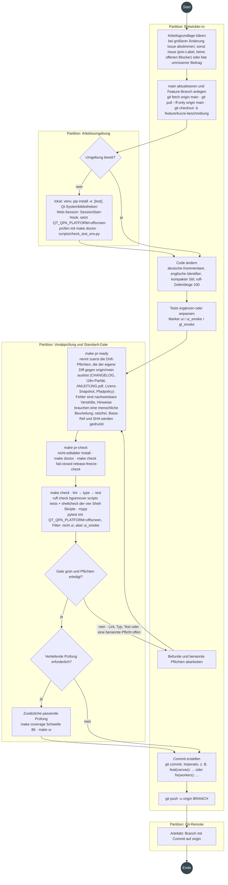
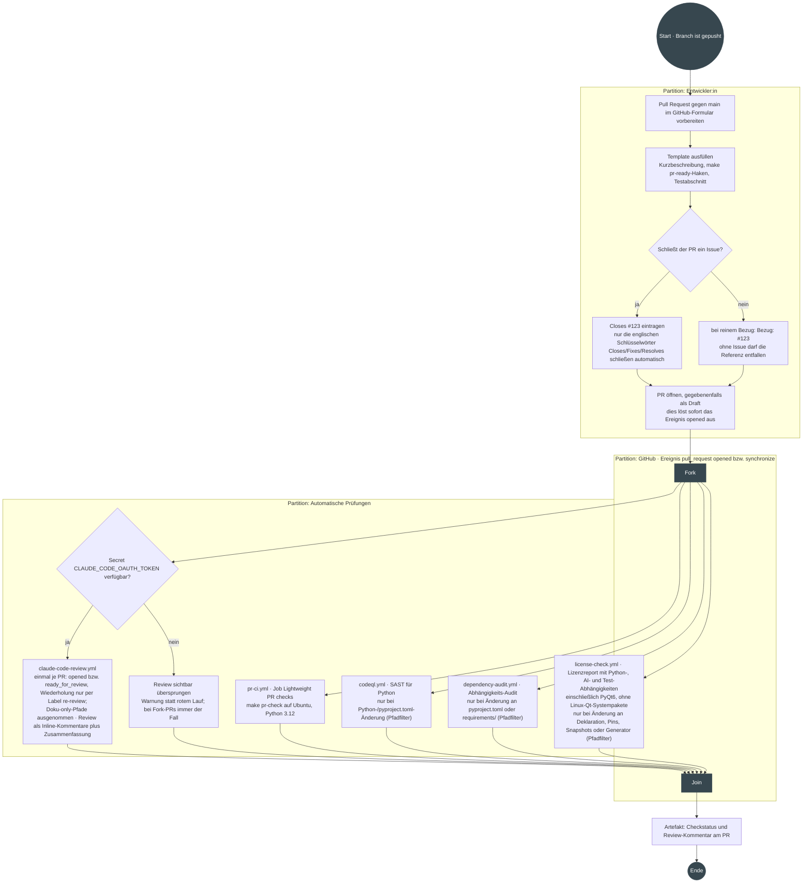
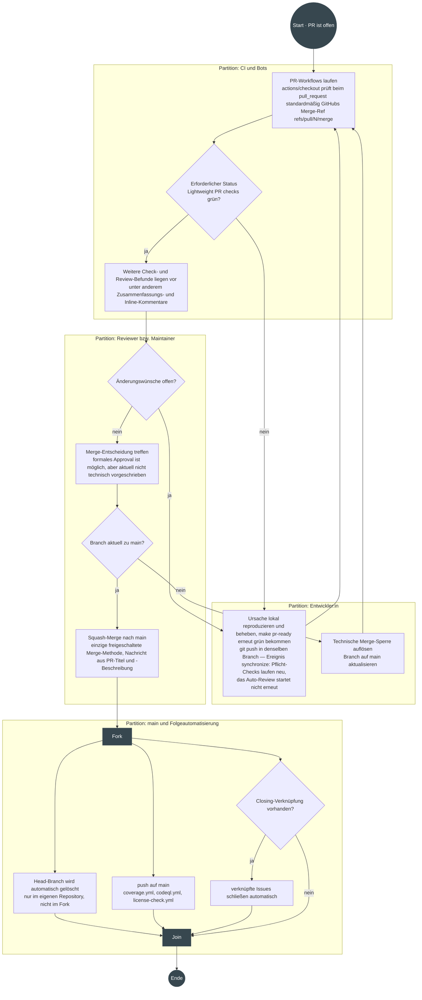
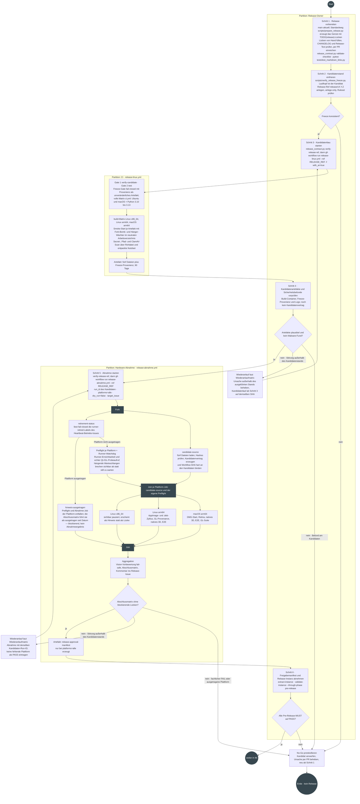

# UML-Ablaufdiagramme der Entwicklungs- und Release-Prozesse

Vier UML-Aktivitätsdiagramme für die gelebten Abläufe dieses Repositories:
**Commit in einem Branch**, **PR erstellen**, **PR durchführen** (Review bis
Merge) und **Release veröffentlichen**. **Nicht normativ:** Sie *bilden ab*,
sie *bestimmen nicht*, und sie zeichnen den Happy Path — Fehler- und
Wiederanlaufwege sind ein Verweis auf die Wiederanlaufmatrix des Runbooks.
Verbindlich bleiben:

| Gegenstand | Verbindliche Quelle |
|---|---|
| Beitrag, Konventionen, lokales Gate | [`CONTRIBUTING.md`](../CONTRIBUTING.md) |
| PR-Pflichten | [`.github/PULL_REQUEST_TEMPLATE.md`](../.github/PULL_REQUEST_TEMPLATE.md) |
| Automatisierung | die Workflows unter [`.github/workflows/`](../.github/workflows) |
| Release-Ablauf | [`docs/RELEASE_PROCESS.md`](RELEASE_PROCESS.md) |
| Wiederanlauf nach einer Störung | [`docs/RELEASE_PROCESS.md` §„Wiederanlaufmatrix“](RELEASE_PROCESS.md#wiederanlaufmatrix) |
| Release-Kriterien | [`docs/RELEASE_ACCEPTANCE_CHECKLIST.md`](RELEASE_ACCEPTANCE_CHECKLIST.md) |
| Agenten-/Projektkontext | [`CLAUDE.md`](../CLAUDE.md) |

Weicht ein Diagramm von einer dieser Quellen ab, gilt die Quelle und das
Diagramm ist der Fehler; ein hier fehlender Störungsfall gehört ins Runbook.

### Aktueller GitHub-Rahmen

Die folgenden Repository-Einstellungen sind **Live-Konfiguration**, nicht Teil
des versionierten Codes (authentifiziert geprüft am 22. und 24. August 2026,
zuletzt am 9. September 2026 mit der Umstellung auf Squash-only und automatische
Branch-Löschung). Der Snapshot hat keinen Drift-Test und muss bei jeder Änderung
der GitHub-Einstellungen erneut abgeglichen werden.

| Einstellung | Aktueller Stand | Bedeutung für die Diagramme |
|---|---|---|
| Branch Protection für `main` | einziger erforderlicher Status: `Lightweight PR checks`; Branch muss aktuell zu `main` sein (`strict`); Review-Konversationen sind keine Merge-Sperre; kein formales Approval erforderlich; für Admins nicht erzwungen | Weitere Checks, Review-Kommentare und ein `APPROVED`-Review sind keine technischen Merge-Sperren, ein veralteter Branch oder ein roter Pflichtstatus dagegen schon |
| Merge-Methoden | nur Squash-Merge; Merge-Commit und Rebase sind deaktiviert; Squash-Voreinstellung `PR_TITLE`/`PR_BODY` (PR-Titel und -Beschreibung) | Die lineare `main`-Historie ist technisch erzwungen statt nur Konvention; die Squash-Commit-Nachricht entsteht aus PR-Titel und PR-Beschreibung, nicht aus den Branch-Commits |
| Auto-Merge | deaktiviert | Die Merge-Entscheidung erfolgt manuell |
| Branch nach Merge automatisch löschen | aktiviert | Der Head-Branch eines gemergten PRs verschwindet ohne manuellen Schritt; Branches aus einem Fork kann GitHub nicht löschen, sie bleiben dort stehen |

Nur der erforderliche Status samt Durchsetzungsebene ist anonym über die
[`main`-Branch-Metadaten](https://api.github.com/repos/NikolayDA/picture_helper/branches/main)
prüfbar; alle übrigen Werte kontrolliert der Repository-Owner authentifiziert in
den [Repository-Einstellungen](https://github.com/NikolayDA/picture_helper/settings).

## Notation

Gezeichnet wird in Mermaid (GitHub rendert es direkt) mit
UML-Aktivitätsdiagramm-Semantik: Kreis = Start-/Endknoten (Initial Node,
Activity Final), Rechteck = Aktion — mit Präfix „Artefakt:“ ein Objektfluss —,
Raute = Entscheidung mit Wächterbedingung an den Kanten, dunkler Balken =
Fork/Join, umrahmter Bereich = Partition (Swimlane).

---

## 1. Commit in einem Branch

**Auslöser:** Eine Änderung soll umgesetzt werden. Grundlage ist ein
GitHub-Issue (Priorität und Blocker stehen dort als Labels und Abhängigkeiten,
siehe [`CONTRIBUTING.md`](../CONTRIBUTING.md)) oder ein klar umrissener Beitrag;
größere Änderungen werden vorher in einem Issue abgestimmt.
**Ergebnis:** Ein Commit auf einem Feature-Branch liegt auf `origin`, das
Standard-Gate war lokal grün.
**Quellen:** [`CONTRIBUTING.md`](../CONTRIBUTING.md) §„Code beitragen“,
[`Makefile`](../Makefile), [`CLAUDE.md`](../CLAUDE.md) §„Standard-Gate“.

**Anmerkungen**

- `make pr-ready` ist der Einstieg vor jedem PR: Es benennt die Drift-Pflichten aus
  dem eigenen Diff und läuft danach in `pr-check`. Der Nutzen liegt bei den drei
  Pflichten mit **versetztem** Wächter – `ANLEITUNG.pdf` (greift erst nach dem
  Commit), Lizenz-Snapshot und `release-freeze-check` (beide erst in der PR-CI).
  Regeln und Wächter: [`CLAUDE.md`](../CLAUDE.md) §„Standard-Gate“ und
  §„Drift-Disziplin“; Teststufen: [`TESTING.md`](../TESTING.md).
- `make check` ist die maßgebliche Baseline; ein rotes Teilziel bricht die Kette
  `lint` → `type` → `test` ab, deshalb die Rückkante. `make pr-check` führt dasselbe
  Gate aus wie [`pr-ci.yml`](../.github/workflows/pr-ci.yml) — dort aber mit
  vollständiger Historie (`fetch-depth: 0`), Python 3.12 und installiertem Qt und
  `shellcheck`; lokal ist das Ergebnis nur in einer vergleichbaren Umgebung
  gleichwertig.
- Ein Pfad, den `release/path-policy.json` nicht kennt, blockiert nicht: Er gilt
  als kandidatenrelevant und erscheint in `release-freeze-check` als Warnung. Ein
  Eintrag ist nur für einen bewusst **neutralen** Pfad nötig; wann
  `policy_version` steigt, steht im ADR-Nachtrag in
  [`ADR-2026-release-freeze-provenienz.md`](history/ADR-2026-release-freeze-provenienz.md).

---

## 2. Pull Request erstellen

**Auslöser:** Der Branch liegt auf `origin`.
**Ergebnis:** Ein PR gegen `main` mit ausgefülltem Template; alle
PR-Automatismen sind angelaufen.
**Quellen:** [`.github/PULL_REQUEST_TEMPLATE.md`](../.github/PULL_REQUEST_TEMPLATE.md),
Workflows unter [`.github/workflows/`](../.github/workflows).

**Anmerkungen**

- Die Schlüsselwort-Entscheidung ist keine Formalie: Ein deutsches „Löst #123“
  wertet GitHub nicht aus, verknüpfte Issues bleiben dann offen (im
  [PR-Template](../.github/PULL_REQUEST_TEMPLATE.md) vermerkt).
- Das Öffnen des PR startet die gezeichneten Workflows sofort; ein weiterer
  Commit löst `synchronize` aus und wiederholt die Checks. Das Claude-Review ist
  die Ausnahme: einmal je PR – bei `opened`, bei `ready_for_review` beim
  Verlassen des Draft-Status – und danach nur auf Anforderung über das Label
  `re-review`; reine Doku-PRs sind per `paths-ignore` ausgenommen.
- `codeql.yml`, `dependency-audit.yml` und `license-check.yml` tragen seit #1038
  einen `paths`-Filter auf ihrem `pull_request`-Trigger: Ein reiner Doku-PR
  startet keinen von ihnen. Ihre Push- bzw. Zeitplan-Läufe bleiben ungefiltert
  und tragen die Frische — neue CodeQL-Queries und neue CVEs entstehen ohne
  jeden Commit, und der Lizenz-Snapshot wird auch nach einem Docs-only-Merge
  geprüft. Der Filter setzt voraus, dass keiner der drei laut
  [GitHub-Rahmen](#aktueller-github-rahmen) ein erforderlicher
  Branch-Protection-Status ist: Ein übersprungener Pflicht-Check meldet gar
  keinen Status und ließe den PR dauerhaft auf `Expected` stehen.
  `tests/test_ci_workflow_yaml.py` hält fest, dass kein pfadgefilterter
  Workflow den Jobnamen `Lightweight PR checks` trägt.
- Abdeckungsgrenze von `dependency-audit.yml`: Der Abgleich läuft gegen
  PyPI-Distributionen, Qt-Advisories werden aber gegen *Qt* geführt und nicht
  gegen `PyQt6-Qt6`; der Qt-Stand wird beim Anheben des Pins von Hand geprüft und
  in `requirements/constraints.txt` festgehalten.
- Die Raute prüft nur, ob das Secret vorhanden ist. Ein abgelaufenes Token oder
  ein erschöpftes Nutzungslimit macht den Lauf rot statt übersprungen — ein roter
  Lauf ohne Review-Ausgabe heißt weder blockiert noch geprüft. Das Review
  kommentiert ohnehin nur: keine Schreibrechte, keine Merge-Sperre; für Befunde
  gilt die Konvergenzregel aus Abschnitt 3.
- Nicht gezeichnet: `claude.yml` reagiert auf `@claude`-Erwähnungen und darf
  schreiben, aber seine mit dem Standard-`GITHUB_TOKEN` erzeugten Commits starten
  keine nachgelagerten Workflows — dafür braucht es einen menschlich
  authentifizierten Folge-Push. Ebenfalls nicht gezeichnet, weil
  Live-Konfiguration: das Codex-Review der App `chatgpt-codex-connector`, dessen
  automatisches Review abgeschaltet ist — es läuft nur auf ausdrückliches
  `@codex review`. Damit gibt es genau **einen** automatisch konfigurierten
  Review-Dienst: das versionierte Claude-Review, weil es die Doku-Pfad-Ausnahme
  trägt und über `re-review` wiederholbar ist. Aus-Schalter ist der persönliche
  „Automatische Überprüfung“, über die Repository-API **nicht** prüfbar.

---

## 3. Pull Request durchführen (Review bis Merge)

**Auslöser:** Der PR ist offen, die Checks laufen.
**Ergebnis:** Der PR ist per Squash auf `main` gemergt – der einzigen
freigeschalteten Merge-Methode; Closing-Verknüpfungen und Folgeautomatisierung
sind verarbeitet.
**Quellen:** [`CONTRIBUTING.md`](../CONTRIBUTING.md) („PRs, die `make check`
nicht bestehen, werden nicht gemergt“), die Workflows unter
[`.github/workflows/`](../.github/workflows) sowie die lineare Commit-Historie
von `main` (ein Squash-Commit je PR).

**Anmerkungen**

- Die Rückkante `synchronize` taktet nur die Pflicht-Checks: Jeder neue Commit
  startet `pr-ci.yml` neu. Das Claude-Review läuft nicht erneut mit – nur über das
  Label `re-review`, wo `concurrency: cancel-in-progress` einen älteren Lauf
  abbricht. Ein `@claude`-Kommentar ist der optionale Nebenweg für Bot-Fixes; sein
  Ergebnis braucht wegen des `GITHUB_TOKEN`-Limits ein menschlich
  authentifiziertes Folge-Update und mündet ebenfalls in den Push.
- **Konvergenzregel für Bot-Reviews:** Höchstens zwei Bot-Review-Runden je PR.
  Danach entscheidet ein Mensch gesammelt (ein Kommentar), welche Befunde
  umgesetzt werden; die übrigen werden mit einem Satz Begründung geschlossen.
  Bot-Befunde sind Input der Merge-Entscheidung, keine Merge-Bedingung –
  konvergieren sie nicht mehr, ist Aufhören die richtige Auflösung, nicht der
  nächste Fix-Push.
- Weil Squash die einzige Merge-Methode ist, sind PR-Titel und PR-Beschreibung der
  dauerhafte Commit-Text. Technisch erzwungen ist für Nicht-Admins allein der
  gegenüber `main` aktuelle Branch (siehe
  [GitHub-Rahmen](#aktueller-github-rahmen)) – Befunde und Approvals bewerten
  Maintainer bewusst.
- Nicht gezeichnet sind die reinen Zeitplan-Einstiege neben den Ereignispfaden
  (nächtliche UI-Suite, wöchentliche Vollmatrix, Audit, Benchmark, CodeQL,
  Signaturcache, Runner-Heartbeat, monatlicher Release-Dry-Run). Eine Liste davon
  wird bewusst nicht gepflegt: Quelle ist die `on:`-Sektion der jeweiligen Datei
  unter [`.github/workflows/`](../.github/workflows).
- Ein Issue-Zustandswechsel löst keinen Workflow aus; Priorität und Blocker stehen
  im Issue selbst ([`CONTRIBUTING.md`](../CONTRIBUTING.md)). Nicht als Workflow
  versioniert und deshalb ebenfalls nicht gezeichnet sind GitHub-eigene Funktionen
  wie der `Dependency Graph`: Ohne `.github/dependabot.yml` gibt es keine
  regelmäßigen Versionsupdates, nur aktivierte Sicherheitsupdates können eigene
  Bot-Branches und PRs erzeugen.

---

## 4. Release veröffentlichen

**Auslöser:** Der vereinbarte Funktionsumfang liegt auf `main` oder ein Hotfix
ist freigegeben.
**Ergebnis:** Ein öffentlicher GitHub-Release mit exakt fünf abgenommenen,
byteidentischen Dateien; Post-Release-Nachweise sind protokolliert.
**Verbindliche Quelle:** [`docs/RELEASE_PROCESS.md`](RELEASE_PROCESS.md) (neun
Schritte) und [`docs/RELEASE_ACCEPTANCE_CHECKLIST.md`](RELEASE_ACCEPTANCE_CHECKLIST.md)
(stabile Kriterien-IDs). Die zwei Diagramme sind zwei Sichten eines Prozesses.
**Vertragsumfang:** genau fünf Dateien — Linux x86_64 AppImage und `.deb`, Linux
arm64 AppImage und `.deb`, macOS arm64 DMG. Kein Windows; Linux x86_64 bleibt in
der Hardware-Abnahme sichtbar pausiert.

**Störungen** sind hier nicht einzeln ausgezeichnet: Jede rote Stufe führt auf
„No-Go“ (Kandidat verwerfen, Ursache per PR beheben, neu ab Schritt 1) oder auf
einen Wiederanlauf nach der
[Wiederanlaufmatrix](RELEASE_PROCESS.md#wiederanlaufmatrix) — dort steht je
Störung, welcher Weg zulässig ist und was unzulässig bleibt.

### 4a. Kandidat bauen und abnehmen (Schritte 1 bis 6)

### 4b. Taggen, veröffentlichen, abschließen (Schritte 7 bis 9)

```mermaid
flowchart TD
  START(("Start · Go-Entscheidung ist protokolliert")):::terminal --> T1
  subgraph OWN["Partition: Release-Owner"]
    T1["Schritt 7 · Tag setzen<br/>von Hand oder per create_tag im Publish-Lauf<br/>immer auf candidate.head_sha aus dem Manifest, danach verifiziert"]
    T2["Schritt 8 · Veröffentlichung starten<br/>verify-release-ref, dann gh workflow run release-publish.yml --ref RELEASE_REF<br/>mit tag, candidate_run_id, acceptance_run_id, approval_artifact_name<br/>create_tag und predecessor_tag optional; target_issue schaltet die Issue-Kommentare frei"]
    T3["Schritt 9 · öffentliche Prüfung<br/>public-download-report.json lesen: Gesamtverdikt und jedes Asset auf PASS<br/>sichtbare Produktversion auf den aktiven Plattformen prüfen<br/>Handprozedur nur als Rückfallweg, wenn der Nachweis-Job nicht lief"]
    T4["Post-Release-Nachweis UPDATE-LINUX-ARM-01 + UPDATE-MACOS-ARM-01<br/>vom Publish-Lauf nur ausgelöst (Job update-dispatch, Marker im run-name), sein Ergebnis wartet der Lauf nicht ab<br/>gleiche run_id, platforms=alle, predecessor_tag, target_issue; manueller Start bleibt Rückfallweg"]
    FQ{"Update-Nachweis: beide Kriterien auf PASS?"}
    T5["Instanz prüfen und Release-Issue schließen<br/>Publish-Lauf setzt PUBLISH-01 bis 03 und PUBLIC-DOWNLOAD-01 (bis Phase publish),<br/>der ausgelöste Abnahme-Lauf trägt beide UPDATE-Kriterien nach (bis post-release); set-criterion bleibt Rückfallweg<br/>Kriterienmatrix mit URLs und Hashes ist im Issue verlinkt"]
  end
  subgraph PUB["Partition: CI · release-publish.yml, baut nichts neu"]
    P1["Freigabemanifest nur aus dem Abnahme-Run laden<br/>verify-approval: Workflows, Runs, Commit, Checklisten-Pin<br/>Tag muss auf exakt den abgenommenen Commit zeigen, Freeze-Provenienz am Kandidaten-Commit rekonstruieren"]
    P5["Kandidatenbytes aus dem Build-Run laden<br/>verify-artifacts: exakte Dateimenge und alle SHA-256"]
    PQ1{"Bestehender Release-Zustand?<br/>plan-publish"}
    P6["Draft anlegen bzw. bestücken<br/>die fünf Dateien ohne Clobber hochladen"]
    P7["hochgeladene Bytes erneut vom Release laden und gegen das Manifest prüfen"]
    PQ2{"byteidentisch?"}
    P8["Draft veröffentlichen · gh release edit --draft=false --latest"]
    P9["Vertrag stoppt<br/>partieller oder abweichender Zustand, kein Clobber, kein Asset-Tausch"]
    P10["already-complete<br/>Release steht bereits vollständig und byteidentisch, keine Mutation"]
    P11["public-download · eigener Job nach dem Publish<br/>lädt alle fünf Assets ohne Authorization über browser_download_url;<br/>Sollwerte aus dem Freigabemanifest, Verdikt aus demselben verify-artifacts<br/>Artefakt public-download-report.json, Job-Summary, Issue-Kommentar — auch im Fehlerfall"]
    PQ3{"Download-Nachweis: Gesamtverdikt PASS?"}
  end
  subgraph FIN["Partition: Störung"]
    INC["Fall laut Wiederanlaufmatrix einordnen<br/>Fehler am Prüfpfad: denselben Nachweis mit denselben gebundenen Inputs wiederholen und den Fehlversuch protokollieren<br/>Fehler am Release: Incident, Rollback bzw. Yank-Hinweis oder Hotfix mit neuer Patch-Version ab Schritt 1<br/>Tag nie verschieben, Assets nie ersetzen"]
  end
  T1 --> T2 --> P1 --> P5 --> PQ1
  PQ1 -->|"kein Release oder Draft ohne Assets · create-draft-upload bzw. upload-to-draft"| P6
  PQ1 -->|"vollständiger Draft · publish-existing-draft"| P7
  PQ1 -->|"teilweise oder abweichend"| P9 --> INC
  PQ1 -->|"bereits veröffentlicht"| P10 --> P11
  P6 --> P7 --> PQ2
  PQ2 -->|"ja"| P8 --> P11 --> T3 --> PQ3
  PQ2 -->|"nein"| P9
  PQ3 -->|"ja"| T4 --> FQ
  PQ3 -->|"nein"| INC
  FQ -->|"ja"| T5 --> ENDE(("Ende · Release abgeschlossen")):::terminal
  FQ -->|"nein · CHECK_FAILED oder ein Kriterium bleibt PENDING"| INC --> ENDE2(("Ende · Release nicht abgeschlossen")):::terminal
  classDef terminal fill:#37474f,stroke:#37474f,color:#ffffff;
  classDef bar fill:#37474f,stroke:#37474f,color:#ffffff;
```

**Anmerkungen**

- Kandidatenbau, Abnahme und Veröffentlichung starten ausschließlich manuell per
  `workflow_dispatch`; einen Tag-Trigger oder einen Weg am Manifest vorbei gibt es
  nicht. Einzige Zeitplan-Ausnahme ist der monatliche Dry-Run von
  `release-linux.yml` auf dem `main`-Head: Er probt den Kandidatenpfad, erzeugt
  aber ausdrücklich keinen Kandidaten.
- Den Kandidatenvertrag erzeugt nicht `release-linux.yml`, sondern erst
  `candidate-source` in `release-abnahme.yml` — parallel zu `retirement-status`,
  weshalb Preflights bereits laufen können, während er noch prüft. Weil er
  `GITHUB_SHA` hart mit dem Kandidaten-SHA vergleicht, laufen alle Dispatches auf
  dem unveränderlichen Release-Ref `release/vX.Y.Z`
  ([`ADR-2026-release-ref-entkopplung.md`](history/ADR-2026-release-ref-entkopplung.md));
  `main` darf weiterlaufen. Welche Voraussetzung `workflow_dispatch` trotzdem an
  `main` stellt, steht im [Runbook](RELEASE_PROCESS.md).
- Der Publish-Lauf baut nichts; seine einzige Dateiquelle ist die im Manifest
  gebundene Build-Run-ID. Jeder teilweise oder abweichende Release-Zustand
  blockiert in `plan-publish`, statt repariert zu werden.
- Die Go-/No-Go-Entscheidung bleibt an jeder Raute menschlich; die
  Vision-Vorbewertung der Screenshots bewertet fail-safe nie abschließend.
  `MALWARE-01` ist `SHOULD`, ein Fund aber immer No-Go, und ein fehlender
  Signaturcache wird sichtbar `UNAVAILABLE`.
- `PUBLIC-DOWNLOAD-01` erbringt der Nachweis-Job des Publish-Laufs, nicht der
  Release-Owner: Er kann erst **nach** `--draft=false` laufen, weil Draft-Assets
  anonym nicht erreichbar sind — maßgeblich ist der Bericht, nie die Lauf-URL. Ein
  rotes Verdikt hält auch `release-instance` und `update-dispatch` an.
- `UPDATE-LINUX-ARM-01` und `UPDATE-MACOS-ARM-01` sind erst nach dem Tag prüfbar,
  weil `/releases/latest` die neue Version vorher nicht meldet. Sie blockieren den
  Tag nicht, aber den Abschluss des Release-Issues — daher die Raute vor `T5`:
  Ohne Nachweis bleiben sie `PENDING`, und `CHECK_FAILED` gilt nie als „kein
  Update“, belegt aber für sich auch keinen Release-Fehler. `platforms=alle`
  erbringt beide in einem Lauf, der macOS-Kanal setzt einen Vorgänger ab v2.7.3
  voraus; der Tag wird auch bei `create_tag` gegen `candidate.head_sha`
  verifiziert.
- Ein Hotfix überspringt keinen Schritt: neue Patch-Version, neuer Kandidat, neue
  Abnahme, neues Manifest, neuer Tag. Eine per Heartbeat-Eskalation ausgetragene
  Plattform reaktiviert man durch Neuregistrierung und Entfernen des Labels
  ([`RUNNER_SETUP.md`](RUNNER_SETUP.md) §4). Welcher Weg bei welcher Störung gilt,
  steht ausschließlich in der
  [Wiederanlaufmatrix](RELEASE_PROCESS.md#wiederanlaufmatrix).
