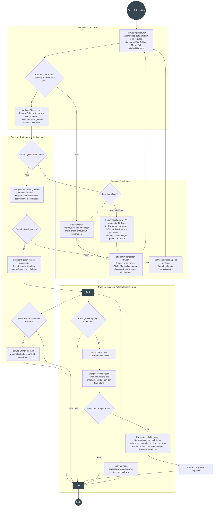
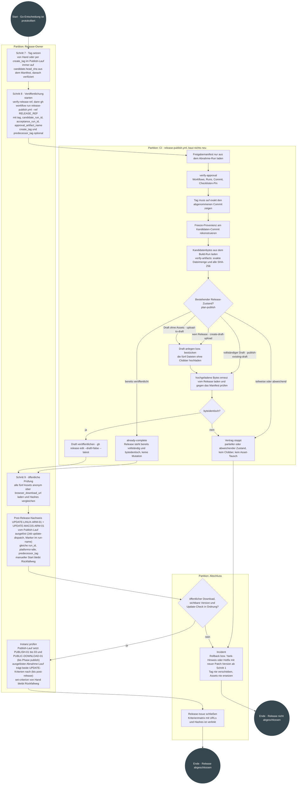

# UML-Ablaufdiagramme der Entwicklungs- und Release-Prozesse

Vier UML-Aktivitätsdiagramme für die tatsächlich gelebten Abläufe dieses
Repositories: **Commit in einem Branch**, **PR erstellen**, **PR durchführen**
(Review bis Merge) und **Release veröffentlichen**.

**Nicht normativ.** Die Diagramme *bilden ab*, sie *bestimmen nicht*.
Verbindlich bleiben:

| Gegenstand | Verbindliche Quelle |
|---|---|
| Beitrag, Konventionen, lokales Gate | [`CONTRIBUTING.md`](../CONTRIBUTING.md) |
| PR-Pflichten | [`.github/PULL_REQUEST_TEMPLATE.md`](../.github/PULL_REQUEST_TEMPLATE.md) |
| Automatisierung | die Workflows unter [`.github/workflows/`](../.github/workflows) |
| Release-Ablauf | [`docs/RELEASE_PROCESS.md`](RELEASE_PROCESS.md) |
| Release-Kriterien | [`docs/RELEASE_ACCEPTANCE_CHECKLIST.md`](RELEASE_ACCEPTANCE_CHECKLIST.md) |
| Agenten-/Projektkontext | [`CLAUDE.md`](../CLAUDE.md) |

Weicht ein Diagramm von einer dieser Quellen ab, gilt die Quelle und das
Diagramm ist der Fehler.

### Aktueller GitHub-Rahmen

Die folgenden Repository-Einstellungen sind **Live-Konfiguration**, nicht Teil
des versionierten Codes (manuell und authentifiziert geprüft am 22. August
2026; vollständig nachgeprüft und auf den Stand der Reviewschleifen-
Entschärfung umgestellt am 24. August 2026). Dieser Snapshot hat noch keinen
automatischen Drift-Test und muss bei Änderungen in den GitHub-Einstellungen
erneut abgeglichen werden.

| Einstellung | Aktueller Stand | Bedeutung für die Diagramme |
|---|---|---|
| Branch Protection für `main` | einziger erforderlicher Status: `Lightweight PR checks`; Branch muss aktuell zu `main` sein (`strict`); Review-Konversationen sind keine Merge-Sperre (Konversationsauflösungs-Pflicht am 24.08.2026 entfernt); kein formales Approval erforderlich; für Admins nicht erzwungen | Weitere Checks, Review-Kommentare und ein `APPROVED`-Review sind keine technischen Merge-Sperren, ein veralteter Branch oder ein roter Pflichtstatus dagegen schon |
| Merge-Methoden | Merge-Commit, Squash und Rebase sind erlaubt | Squash ist die gelebte Projektkonvention, nicht die einzige von GitHub erlaubte Methode |
| Auto-Merge | deaktiviert | Die Merge-Entscheidung erfolgt manuell |
| Branch nach Merge automatisch löschen | deaktiviert | Das Löschen eines Feature-Branches ist ein optionaler manueller Schritt |

Der erforderliche Status samt Durchsetzungsebene ist anonym über die
[`main`-Branch-Metadaten](https://api.github.com/repos/NikolayDA/picture_helper/branches/main)
prüfbar. Die `strict`-Vorgabe, die Konversationsauflösung, die Zahl der
erforderlichen Approvals sowie Merge-Methoden, Auto-Merge und automatische
Branch-Löschung fehlen dagegen in dieser anonymen Antwort; ihre Werte wurden
über den authentifizierten Branch-Protection-/Repository-Endpunkt geprüft und
müssen in den
[Repository-Einstellungen](https://github.com/NikolayDA/picture_helper/settings)
authentifiziert kontrolliert werden.

Verantwortlich für den Snapshot ist der Repository-Owner. Er wird bei jeder
Änderung der GitHub-Einstellungen und bei der Turnusprüfung in
[`RECOMMENDATIONS.md`](../RECOMMENDATIONS.md) erneut mit der Live-Konfiguration
verglichen.

## Notation

Gezeichnet wird in Mermaid (GitHub rendert es direkt) mit
UML-Aktivitätsdiagramm-Semantik:

| UML-Element | Darstellung hier |
|---|---|
| Startknoten (Initial Node) | Kreis „Start“ |
| Aktion (Action) | Rechteck |
| Entscheidung/Zusammenführung (Decision/Merge) | Raute, Kanten mit Wächterbedingung |
| Parallelisierung/Synchronisation (Fork/Join) | dunkler Balken „Fork“ / „Join“ |
| Partition (Swimlane) | umrahmter Bereich mit Rollen-/Systemnamen |
| Endknoten (Activity Final) | Kreis „Ende“ |
| Objektfluss/Artefakt | Rechteck mit Präfix „Artefakt:“ |

---

## 1. Commit in einem Branch

**Auslöser:** Eine Änderung soll umgesetzt werden. Ein Issue oder ein Befund
aus `RECOMMENDATIONS.md` kann die Grundlage sein; größere Änderungen werden
vorher in einem Issue abgestimmt.
**Ergebnis:** Ein Commit auf einem Feature-Branch liegt auf `origin`, das
Standard-Gate war lokal grün.
**Quellen:** [`CONTRIBUTING.md`](../CONTRIBUTING.md) §„Code beitragen“ und
§„Konventionen“,
[`Makefile`](../Makefile), [`CLAUDE.md`](../CLAUDE.md) §„Standard-Gate“,
[`.claude/hooks/session-start.sh`](../.claude/hooks/session-start.sh).

```mermaid
flowchart TD
  START(("Start")):::terminal --> D1

  subgraph DEV["Partition: Entwickler:in"]
    direction TB
    D1["Arbeitsgrundlage klären<br/>bei größerer Änderung Issue abstimmen; sonst Issue, Befund oder klar umrissener Beitrag"]
    D2["main aktualisieren<br/>git fetch origin main · git pull --ff-only origin main"]
    D3["Feature-Branch anlegen<br/>git checkout -b feature/kurze-beschreibung"]
    D4["Code ändern<br/>deutsche Kommentare; englische Identifier; kompakter Stil; ruff-Zeilenlänge 100"]
    D5["Tests ergänzen oder anpassen<br/>Marker ui / ui_smoke / gl_smoke"]
    D7["Befunde beheben"]
    D8["Commit erstellen<br/>git commit, Imperativ, z. B. feat(canvas): ... oder fix(workers): ..."]
    D9["git push -u origin BRANCH"]
  end

  subgraph ENV["Partition: Arbeitsumgebung"]
    direction TB
    EQ{"Umgebung bereit?"}
    E1["lokal: venv, pip install -e .[test], Qt-Systembibliotheken<br/>Web-Session: SessionStart-Hook, setzt QT_QPA_PLATFORM=offscreen"]
    E2["make doctor · scripts/check_test_env.py"]
  end

  subgraph DOC["Partition: Doku- und Drift-Pflichten"]
    direction TB
    DQ1{"Nutzersichtbare Änderung?"}
    DA1["CHANGELOG-Abschnitt Unreleased ergänzen<br/>sechs Sprachfassungen synchron"]
    DQ2{"Basis-Doku berührt?"}
    DA2["i18n-Parität unter docs/i18n wahren<br/>keine toten Markdown-Links"]
    DQ3{"Qt-apt-Paketliste geändert?"}
    DA3["Befund N6: alle sechs Dateien angleichen<br/>ci.yml, pr-ci.yml, ui-nightly.yml, benchmark.yml, coverage.yml, session-start.sh"]
  end

  subgraph GATE["Partition: Standard-Gate · make check"]
    direction TB
    G1["make lint<br/>ruff check bgremover scripts tests + shellcheck der drei Shell-Skripte"]
    G2["make type<br/>mypy"]
    G3["make test<br/>pytest mit QT_QPA_PLATFORM=offscreen, Filter: nicht ui, aber ui_smoke"]
    GQ{"Gate grün?"}
    GQ2{"Vertiefende Prüfung erforderlich?"}
    G4["Zusätzliche passende Prüfung<br/>make coverage Schwelle 86 · make ui · make pr-check im CI-nahen Umfeld"]
  end

  subgraph REM["Partition: Git-Remote"]
    R1["Artefakt: Branch mit Commit auf origin"]
  end

  D1 --> D2 --> D3 --> EQ
  EQ -->|"nein"| E1 --> E2 --> D4
  EQ -->|"ja"| D4
  D4 --> D5 --> DQ1
  DQ1 -->|"ja"| DA1 --> DQ2
  DQ1 -->|"nein"| DQ2
  DQ2 -->|"ja"| DA2 --> DQ3
  DQ2 -->|"nein"| DQ3
  DQ3 -->|"ja"| DA3 --> G1
  DQ3 -->|"nein"| G1
  G1 --> G2 --> G3 --> GQ
  GQ -->|"nein · Lint, Typ oder Test rot"| D7 --> G1
  GQ -->|"ja"| GQ2
  GQ2 -->|"ja"| G4 --> D8
  GQ2 -->|"nein"| D8
  D8 --> D9 --> R1 --> ENDE(("Ende")):::terminal

  classDef terminal fill:#37474f,stroke:#37474f,color:#ffffff;
```

**Anmerkungen**

- `make check` ist die maßgebliche Baseline und ruft `lint` → `type` → `test`
  in dieser Reihenfolge; ein rotes Teilziel bricht ab, deshalb die Rückkante
  auf `make lint`.
- `make pr-check` führt dasselbe Projekt-Gate wie
  [`pr-ci.yml`](../.github/workflows/pr-ci.yml) aus: nicht-editabler Install,
  `doctor`, `check`, dann das fail-closed `release-freeze-check`. Die CI holt
  dafür Basis-Tag und Git-Historie vollständig (`fetch-depth: 0`), legt
  zusätzlich Python 3.12 fest, aktualisiert `pip` und installiert
  Qt-Systembibliotheken sowie `shellcheck`; lokal ist das Ergebnis deshalb nur
  in einer vergleichbaren Umgebung gleichwertig.
- Die volle qtbot-UI-Suite (`make ui`) läuft regulär nur nachts
  ([`ui-nightly.yml`](../.github/workflows/ui-nightly.yml)), nicht im
  Standard-Gate.
- `shellcheck` wird übersprungen statt zu scheitern, wenn es lokal fehlt — in
  der CI ist es installiert.

---

## 2. Pull Request erstellen

**Auslöser:** Der Branch liegt auf `origin`.
**Ergebnis:** Ein PR gegen `main` mit ausgefülltem Template; alle
PR-Automatismen sind angelaufen.
**Quellen:** [`.github/PULL_REQUEST_TEMPLATE.md`](../.github/PULL_REQUEST_TEMPLATE.md),
[`pr-ci.yml`](../.github/workflows/pr-ci.yml),
[`codeql.yml`](../.github/workflows/codeql.yml),
[`dependency-audit.yml`](../.github/workflows/dependency-audit.yml),
[`license-check.yml`](../.github/workflows/license-check.yml),
[`claude-code-review.yml`](../.github/workflows/claude-code-review.yml).

**Anmerkungen**

- Die Schlüsselwort-Entscheidung ist keine Formalie: Ein deutsches „Löst #123“
  wertet GitHub nicht aus. Bei PR 812 blieben dadurch sieben umgesetzte Issues
  nach dem Merge offen und mussten von Hand nachgezogen werden.
- Das Öffnen des PR startet die gezeichneten PR-Workflows sofort; ein weiterer
  Commit löst `synchronize` aus und wiederholt die Checks. Das Claude-Review
  ist seit der Reviewschleifen-Entschärfung die Ausnahme: Es hört nicht auf
  `synchronize`, sondern läuft einmal je PR – bei `opened` für normal
  geöffnete PRs, bei `ready_for_review` beim Verlassen des Draft-Status
  (Drafts überspringt das Job-`if`) – und danach nur noch auf ausdrückliche
  Anforderung über das Label `re-review`. Reine Doku-PRs (Markdown, `docs/`)
  sind per `paths-ignore` ausgenommen.
- `dependency-audit.yml` läuft ohne Pfadfilter auch bei reinen Doku-PRs. Der
  Audit ist laut dem aktuellen [GitHub-Rahmen](#aktueller-github-rahmen) kein
  erforderlicher Branch-Protection-Status.
- Das Review kommentiert nur; es hat weder Schreibrechte auf den Code noch
  blockiert es den Merge. Das erledigen die Pflicht-Checks. Auch seine
  Inline-Konversationen sperren den Merge nicht mehr (siehe
  [GitHub-Rahmen](#aktueller-github-rahmen)); für den Umgang mit Befunden
  gilt die Konvergenzregel aus Abschnitt 3.
- Die Raute prüft nur, ob das Secret vorhanden ist. Der andere Fehlerweg ist
  seit #828 (PR #853) im Workflow-Kopf festgehalten: Ein vorhandenes, aber
  abgelaufenes Token (`claude setup-token` erzeugt ein Jahr Gültigkeit; der
  konkrete Stichtag steht drift-geschützt in beiden Workflow-Köpfen) oder ein
  erschöpftes Nutzungslimit des Abos macht den Lauf rot, statt ihn zu
  überspringen. Belegt ist das Fehlerbild nur für den Limitfall (früher
  Abbruch ohne Modellnutzung); der Ablauffall wäre ein
  Authentifizierungsfehler. Endet ein roter Lauf ohne Review-Ausgabe, ist
  der PR weder blockiert noch geprüft — auch der indirekte Sperrweg über
  aufzulösende Inline-Konversationen existiert seit der
  Reviewschleifen-Entschärfung ohnehin nicht mehr.
- `claude.yml` ist ein eigener, hier nicht gezeichneter Pfad: Er reagiert auf
  `@claude`-Erwähnungen in Issues, PRs und Reviews und darf im Gegensatz zum
  Review-Workflow schreiben. Seine mit dem Standard-`GITHUB_TOKEN` erzeugten
  Commits starten keine nachgelagerten Workflows. Für die vollständige
  PR-Workflow-Kette ist danach ein menschlich authentifizierter Folge-Push
  nötig; ein manueller Dispatch ist nur bei einzelnen Workflows vorhanden und
  daher kein gleichwertiger Ersatz.
- Ebenfalls nicht gezeichnet und kein versionierter Workflow, sondern
  Live-Konfiguration: das Codex-Review der GitHub-App
  `chatgpt-codex-connector`. Es reviewt laut eigener Beschreibung bei
  PR-Eröffnung, `ready_for_review` und auf `@codex review` – unabhängig vom
  Claude-Review und ohne dessen Doku-Pfad-Ausnahme. Wie alle
  Review-Kommentare ist es laut [GitHub-Rahmen](#aktueller-github-rahmen)
  keine Merge-Sperre.

---

## 3. Pull Request durchführen (Review bis Merge)

**Auslöser:** Der PR ist offen, die Checks laufen.
**Ergebnis:** Der PR ist nach der üblichen Squash-Konvention auf `main`
gemergt; vorhandene Closing-Verknüpfungen und die passende
Folgeautomatisierung sind verarbeitet.
**Quellen:** [`CONTRIBUTING.md`](../CONTRIBUTING.md) („PRs, die `make check`
nicht bestehen, werden nicht gemergt“),
[`claude-code-review.yml`](../.github/workflows/claude-code-review.yml),
[`claude.yml`](../.github/workflows/claude.yml),
[`coverage.yml`](../.github/workflows/coverage.yml),
[`codeql.yml`](../.github/workflows/codeql.yml),
[`license-check.yml`](../.github/workflows/license-check.yml),
[`recommendations-live-check.yml`](../.github/workflows/recommendations-live-check.yml),
[`codex-security-scan.yml`](../.github/workflows/codex-security-scan.yml),
[`benchmark.yml`](../.github/workflows/benchmark.yml),
sowie die lineare Commit-Historie von `main` (ein Squash-Commit je PR).

**Anmerkungen**

- Die Rückkante `synchronize` taktet nur noch die Pflicht-Checks: Jeder neue
  Commit startet `pr-ci.yml` neu. Das Claude-Review läuft dabei nicht erneut
  mit – eine Wiederholung gibt es nur über das Label `re-review`; dort bricht
  `concurrency: cancel-in-progress` einen noch laufenden älteren Lauf ab.
- **Konvergenzregel für Bot-Reviews:** Höchstens zwei Bot-Review-Runden je PR.
  Danach entscheidet ein Mensch gesammelt (ein Kommentar), welche Befunde
  umgesetzt werden; die übrigen werden mit einem Satz Begründung geschlossen.
  Bot-Befunde sind Input der Merge-Entscheidung, keine Merge-Bedingung –
  konvergieren Befunde nicht mehr (jeder Fix zieht neue oder umformulierte
  nach), ist Aufhören die richtige Auflösung, nicht der nächste Fix-Push.
- Squash-Merge ist die aus der `main`-Historie belegte Projektpraxis. GitHub
  erzwingt sie nicht: Auch Merge-Commit und Rebase sind freigeschaltet.
- Ein formales `APPROVED`-Review ist derzeit keine Branch-Protection-Pflicht.
  GitHub erzwingt für Nicht-Admins nur einen gegenüber `main` aktuellen
  Branch (`strict`); Review-Konversationen sperren den Merge nicht mehr.
  Maintainer müssen Befunde deshalb bewusst bewerten; die technische
  Durchsetzung ist im [GitHub-Rahmen](#aktueller-github-rahmen) festgehalten.
- Nicht gezeichnet sind reine Zeitplan-Einstiege beziehungsweise zusätzliche
  Zeitplan-Läufe neben den gezeichneten Ereignispfaden:
  `ui-nightly.yml` (täglich 03:00 UTC), `ci.yml` (sonntags, volle Matrix),
  `dependency-audit.yml` (montags 05:00 UTC), `benchmark.yml` und `codeql.yml`
  (montags 05:17 UTC),
  `recommendations-live-check.yml` (täglich 06:30 UTC),
  `clamav-db-refresh.yml` (montags 03:00 UTC),
  `runner-heartbeat.yml` (täglich 05:30 UTC, Erreichbarkeit der Self-hosted
  Abnahme-Runner) und der monatliche Dry-Run von `release-linux.yml`
  (am 3. um 04:40 UTC, siehe Abschnitt 4).
- Ebenfalls nicht gezeichnet ist der `workflow_run`-Einstieg von
  `recommendations-live-check.yml` nach jedem Abschluss von
  `codex-security-scan.yml` und `benchmark.yml`: Deren automatisch eröffnete
  Issues entstehen mit dem Standard-`GITHUB_TOKEN` und lösen deshalb selbst
  kein `issues`-Ereignis für Folge-Workflows aus.
- Ein roter `recommendations-live-check` gehört dem Repository-Owner und bleibt
  bis zur synchronen Korrektur aller sechs Fassungen aktiv. Der Workflow hat
  nur Leserechte; `--write` ändert lokale Dateien und braucht daher einen neuen
  Commit und PR.
- GitHub-verwaltete Funktionen wie der `Dependency Graph` sind nicht als
  Workflows versioniert. Regelmäßige Dependabot-Versionsupdates sind nicht
  konfiguriert, weil `.github/dependabot.yml` fehlt. Nur sofern
  Dependabot-Sicherheitsupdates in den Repository-Einstellungen aktiviert sind
  (Live-Konfiguration, siehe [GitHub-Rahmen](#aktueller-github-rahmen)), kann
  Dependabot eigene Bot-Branches und PRs erzeugen; dieser alternative Einstieg
  ist im manuellen Feature-Branch-Diagramm nicht dargestellt.

---

## 4. Release veröffentlichen

**Auslöser:** Der vereinbarte Funktionsumfang liegt auf `main` oder ein Hotfix
ist freigegeben.
**Ergebnis:** Ein öffentlicher GitHub-Release mit exakt fünf abgenommenen,
byteidentischen Dateien; Post-Release-Nachweise sind protokolliert.
**Verbindliche Quelle:** [`docs/RELEASE_PROCESS.md`](RELEASE_PROCESS.md)
(neun Schritte) und [`docs/RELEASE_ACCEPTANCE_CHECKLIST.md`](RELEASE_ACCEPTANCE_CHECKLIST.md)
(stabile Kriterien-IDs). Die Diagramme unten sind auf zwei Sichten geteilt,
beschreiben aber einen Prozess.

**Vertragsumfang:** genau fünf Dateien — Linux x86_64 AppImage und `.deb`,
Linux arm64 AppImage und `.deb`, macOS arm64 DMG. Kein Windows. Linux x86_64
bleibt in der Hardware-Abnahme sichtbar pausiert.

### 4a. Kandidat bauen und abnehmen (Schritte 1 bis 6)

```mermaid
flowchart TD
  START(("Start")):::terminal --> S1

  subgraph OWN["Partition: Release-Owner"]
    direction TB
    S1["Schritt 1 · Release vorbereiten<br/>main aktuell; Standardweg scripts/prepare_release.py erzeugt das Gerüst mit TODO(release)-Lücken<br/>Lücken von Hand füllen, CHANGELOG und Release-Text prüfen, per PR einreichen<br/>release_contract.py validate-checklist · pytest tests/test_markdown_links.py"]
    S2["Schritt 2 · Kandidatenstand einfrieren<br/>scripts/verify_release_freeze.py, Laufkopf ist der Kandidat<br/>Release-Ref release/vX.Y.Z anlegen, anlege-only, Ruleset prüfen"]
    SQ1{"Freeze konsistent?"}
    S2F["Pfadklassifikation oder Doku per PR korrigieren<br/>zurück zu Schritt 1, nicht taggen"]
    S3["Schritt 3 · Kandidatenbau starten<br/>verify-release-ref, dann gh workflow run release-linux.yml --ref RELEASE_REF -f with_ai=true"]
    S4["Schritt 4 · Kandidatenartefakte und Sicherheitsbefunde vorprüfen<br/>Build-Container, Freeze-Provenienz und Logs; noch kein Kandidatenvertrag"]
    SQ2{"Artefakte plausibel und kein Malware-Fund?"}
    SQ4{"Zeigt der Release-Ref auf den Kandidaten-SHA?<br/>release_contract.py verify-release-ref"}
    S6["Schritt 6 · Freigabemanifest und Release-Instanz abnehmen<br/>extract-instance · validate-instance --through-phase pre-release"]
    SQ3{"Alle Pre-Release-MUST auf PASS?"}
  end

  subgraph BUILD["Partition: CI · release-linux.yml"]
    direction TB
    B1["Gate 1 · verify-candidate<br/>Freeze-Gate fail-closed, Provenienz als unveränderliches Artefakt"]
    B2["Gate 2 · test<br/>volle Matrix ci.yml: Ubuntu und macOS × Python 3.10 bis 3.13"]
    B3["build-Matrix<br/>Linux x86_64, Linux arm64, macOS arm64"]
    B4["Smoke-Start je Artefakt<br/>Fork-Bomb- und Hänger-Wächter, neutrales Arbeitsverzeichnis"]
    B5["Secret-, Pfad- und ClamAV-Scan<br/>Rohdatei und entpackte Nutzlast"]
    B6["Artefakt: fünf Dateien plus Freeze-Provenienz, 90 Tage Aufbewahrung"]
  end

  subgraph HW["Partition: Hardware-Abnahme · release-abnahme.yml"]
    direction TB
    H0["Schritt 5 · Abnahme starten<br/>--ref RELEASE_REF · run_id des Kandidaten · platforms=alle · dry_run=false · target_issue"]
    H1["candidate-source<br/>fünf Dateien laden, Hashes prüfen, release-candidate-contract-&lt;attempt&gt; erzeugen<br/>und Workflow-SHA hart an den Kandidaten binden"]
    HP["Preflight je Plattform + Runner-Watchdog<br/>Runner-Erreichbarkeit und echter Qt-/GL-Probeaufruf;<br/>hängende Warteschlangen brechen sichtbar ab statt still zu warten"]
    HF0["Fork"]:::bar
    HJ0["Join"]:::bar
    HF["Fork"]:::bar
    H2["macOS arm64<br/>DMG-Start, Retina, natives 3D, E2E, GL-Suite"]
    H3["Linux arm64<br/>AppImage- und .deb-Zyklus, GL-Provenance, natives 3D, E2E"]
    H4["Linux x86_64<br/>sichtbar pausiert, erscheint als Hinweis statt als Lücke"]
    HJ["Join"]:::bar
    H5["Aggregation<br/>Vision-Vorbewertung fail-safe, Abschlussmatrix, Kommentar ins Release-Issue"]
    H6["Artefakt: release-approval-manifest<br/>nur bei platforms=alle erzeugt"]
  end

  S1 --> S2 --> SQ1
  SQ1 -->|"nein"| S2F --> S1
  SQ1 -->|"ja"| S3 --> B1 --> B2 --> B3 --> B4 --> B5 --> B6 --> S4 --> SQ2
  SQ2 -->|"nein · Fund oder Artefaktfehler"| NOGO["No-Go protokollieren<br/>Kandidat verwerfen, Ursache per PR beheben, neu ab Schritt 1"]
  SQ2 -->|"ja"| SQ4
  SQ4 -->|"nein · Ref bewegt oder verwechselt"| NOGO
  SQ4 -->|"ja"| H0 --> HF0
  HF0 --> H1 --> HJ0
  HF0 --> HP --> HJ0
  HJ0 --> HF
  HF --> H2 --> HJ
  HF --> H3 --> HJ
  HF --> H4 --> HJ
  HJ --> H5 --> H6 --> S6 --> SQ3
  SQ3 -->|"nein"| NOGO
  SQ3 -->|"ja"| WEITER(("weiter in 4b")):::terminal
  NOGO --> ENDE(("Ende · kein Release")):::terminal

  classDef terminal fill:#37474f,stroke:#37474f,color:#ffffff;
  classDef bar fill:#37474f,stroke:#37474f,color:#ffffff;
```

### 4b. Taggen, veröffentlichen, abschließen (Schritte 7 bis 9)

**Anmerkungen**

- Kandidatenbau, Abnahme und Veröffentlichung starten ausschließlich manuell
  per `workflow_dispatch`; einen Tag-Trigger oder einen Weg, der am Manifest
  vorbei veröffentlicht, gibt es nicht. Einzige Zeitplan-Ausnahme ist der
  monatliche Dry-Run von `release-linux.yml` (#922, am 3. um 04:40 UTC): Er
  probt den Kandidatenpfad auf dem `main`-Head, erzeugt aber ausdrücklich
  keinen Kandidaten und veröffentlicht nichts.
- `release-linux.yml` erzeugt noch keinen Kandidatenvertrag. Erst
  `candidate-source` am Anfang von `release-abnahme.yml` lädt die fünf Dateien,
  prüft ihre Metadaten und Hashes und veröffentlicht
  `release-candidate-contract-<attempt>`. Weil dieser Job außerdem
  `GITHUB_SHA` hart mit dem Kandidaten-SHA vergleicht, muss Schritt 5 auf dem
  unveränderlichen Release-Ref `release/vX.Y.Z` starten (#918). `main` darf
  seit dieser Entscheidung während des Releases weiterlaufen; ein Dispatch auf
  `main` bräche in `candidate-source` hart ab.
- Der Publish-Lauf baut nichts. Seine einzige Dateiquelle ist die im Manifest
  gebundene Build-Run-ID; veröffentlicht werden genau die Bytes, deren SHA-256
  im Manifest stehen.
- Die Raute „Bestehender Release-Zustand“ ist `plan-publish` aus
  `scripts/release_contract.py`: kein Release → Draft anlegen und laden; Draft
  ohne Assets → laden; vollständiger Draft → nur veröffentlichen; bereits
  veröffentlicht und byteidentisch → keine Mutation. Jeder teilweise oder
  abweichende Zustand blockiert, statt repariert zu werden. Ein veröffentlichtes
  Release ganz ohne Assets ist ebenfalls ein Blocker und braucht eine
  Owner-Entscheidung.
- Die Go-/No-Go-Entscheidung bleibt an jeder Raute menschlich. Die
  Vision-Vorbewertung der Screenshots ist fail-safe und bewertet nie
  abschließend; ohne API-Key bleibt jedes Kriterium „unbewertet“.
- `MALWARE-01` ist `SHOULD`, aber ein tatsächlicher Fund ist immer No-Go. Ein
  fehlender Signaturcache wird sichtbar `UNAVAILABLE` statt still bestanden.
- `UPDATE-LINUX-ARM-01` und `UPDATE-MACOS-ARM-01` sind erst nach dem Tag
  prüfbar, weil `/releases/latest` die neue Version vorher nicht meldet. Sie
  blockieren den Tag nicht, aber den Abschluss des Release-Issues;
  `CHECK_FAILED` gilt nie als „kein Update“. `platforms=alle` erbringt beide in
  einem Lauf; der macOS-Kanal setzt einen Vorgänger ab v2.7.3 voraus (#917). Der erneute
  Abnahme-Lauf muss mit `--ref "$RELEASE_REF"` auf dem Kandidaten-Commit laufen,
  nicht auf `main`. Bei
  `workflow_dispatch` ist `GITHUB_SHA` laut
  [GitHub-Ereignisreferenz](https://docs.github.com/en/actions/reference/workflows-and-actions/events-that-trigger-workflows#workflow_dispatch)
  der letzte Commit des ausgewählten Branches oder Tags; auch der annotierte
  Release-Tag bindet den Lauf daher an den Kandidaten-Commit statt an den
  Tag-Objekt-SHA.
- Der Dispatch auf einen anderen Ref als `main` enthebt nicht der
  Grundvoraussetzung: „This event will only trigger a workflow run if the
  workflow file exists on the default branch"
  ([GitHub-Ereignisreferenz](https://docs.github.com/en/actions/reference/workflows-and-actions/events-that-trigger-workflows#workflow_dispatch)).
  Die drei Workflow-Dateien müssen während eines laufenden Releases unter
  ihren Pfaden auf `main` bestehen bleiben; ausgeführt wird danach die
  Definition aus dem gewählten Ref.
- Der automatisierte Abschluss (#919) ersetzt keine Prüfung, nur Tipparbeit:
  Der Tag wird auch bei `create_tag` anschließend gegen `candidate.head_sha`
  verifiziert, ein abweichender Tag bricht ab statt verschoben zu werden, und
  die beiden Update-Kriterien bleiben ohne Nachweis `PENDING` statt `PASS`.
  Ein fehlgeschlagener Update-Nachweis wird nie automatisch wiederholt.
- Ein Hotfix überspringt keinen Schritt: neue Patch-Version, neuer Kandidat,
  neue Abnahme, neues Manifest, neuer Tag.
