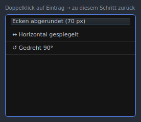

[Deutsch](../../../ANLEITUNG.md) · **English** · [Español](../es/ANLEITUNG.md) · [Français](../fr/ANLEITUNG.md) · [Українська](../uk/ANLEITUNG.md) · [简体中文](../zh/ANLEITUNG.md)

> **Note:** A PDF version of this guide is only generated for the German original
> (`ANLEITUNG.pdf`). No PDF is produced for this translation.

# BgRemover – User Guide

This guide walks you step by step through how to use **BgRemover** — from
opening your first image to saving the finished result. It is aimed at users
with no prior image-editing experience.

> Notes on **installation** are intentionally not included here; see
> [INSTALL_MAC.md](INSTALL_MAC.md) (macOS) or
> [INSTALL_LINUX.md](INSTALL_LINUX.md) (Linux). This guide assumes the
> application can already be launched.

---

## Table of Contents

1. [What can BgRemover do?](#1-what-can-bgremover-do)
2. [The application window at a glance](#2-the-application-window-at-a-glance)
3. [Quick start in 5 steps](#3-quick-start-in-5-steps)
4. [Opening an image](#4-opening-an-image)
5. [The toolbar (left)](#5-the-toolbar-left)
6. [Making a selection](#6-making-a-selection)
7. [Tab "Selection"](#7-tab-selection)
8. [Tab "Background"](#8-tab-background)
9. [Tab "Adjust" – Colour correction](#9-tab-adjust--colour-correction)
10. [Tab "Rotate/Flip"](#10-tab-rotateflip)
11. [Tab "Shape" – Corners & Crop](#11-tab-shape--corners--crop)
12. [Resize & physical dimensions](#12-resize--physical-dimensions)
13. [Layers & projects](#13-layers--projects)
14. [Height-map workspace](#14-height-map-workspace)
15. [2D preview (colour, relief, height, gloss)](#15-2d-preview-colour-relief-height-gloss)
16. [Saving & exporting](#16-saving--exporting)
17. [Settings](#17-settings)
18. [Keyboard shortcuts](#18-keyboard-shortcuts)
19. [Typical workflows](#19-typical-workflows)
20. [Tips & tricks](#20-tips--tricks)
21. [Known limitations](#21-known-limitations)
22. [Troubleshooting & log file](#22-troubleshooting--log-file)
23. [License](#23-license)

---

## 1. What can BgRemover do?

BgRemover is an image-editing tool for **removing, replacing, and editing
backgrounds** — with additional features for simple image optimisation,
layers/projects, and preparing UV-print assets. The key features:

- **AI background removal** – remove the background automatically with a
  single click.
- **Manual selection** with magic wand, brush, eraser, and polygon lasso.
- **Replace background** – make the selection transparent or fill it with any
  colour.
- **Transform** – rotate (in 90° steps or a free angle) and flip.
- **Shape & crop** – round corners, crop to circle or a fixed aspect ratio.
- **Image optimisation** – adjust brightness, contrast, and saturation, and
  soften the alpha edge (feather).
- **Size & physical dimensions** – change the pixel size or set a print size
  via millimetres and DPI (with a print-area hint).
- **Layers & projects** – manage several layers (colour/height/gloss/generic)
  and save and open the whole thing as a `.bgrproj` project.
- **Height maps** – generate a height map from an image, then edit and
  optimise it.
- **2D preview** – check colour, relief, height, and gloss on screen.
- **EufyMake Studio export** – generate import assets for UV printing.
- **History** with undo/redo and jump to any earlier editing step.
- **Save** as PNG, JPEG, WebP, or TIFF.

---

## 2. The application window at a glance


*The main window right after launch: the toolbar on the left, the canvas with
the transparency checkerboard in the centre, the tab panel on the right (here
the "Selection" tab), and the status bar at the bottom. The screenshots show
the German interface — the labels correspond to the terms used in this guide.*

The window is divided into four areas:

```
┌──────────┬───────────────────────────────┬──────────────────┐
│          │                               │                  │
│ Tool-    │        Canvas                 │   Tab panel      │
│  bar     │      (image + selection)      │  (settings)      │
│  (left)  │                               │   (right)        │
│          │                               │                  │
├──────────┴───────────────────────────────┴──────────────────┤
│ Status bar (hints & messages)                                │
└──────────────────────────────────────────────────────────────┘
```

| Area | Purpose |
|---|---|
| **Menu bar** (top) | File, Project, Edit, View, Extras |
| **Toolbar** (left) | Selection tools, AI, history, open/save |
| **Canvas** (centre) | Displays the image and the current selection |
| **Tab panel** (right) | Eight tabs: Preview, Selection, Background, Adjust, Rotate/Flip, Shape, Layers, Height |
| **Status bar** (bottom) | Hints and feedback from the application |

### Menus "Edit", "View" & "Project"

Many actions are also available from the menu bar:

- **Edit** – undo/redo, rotate (90° left/right), flip horizontally/vertically,
  *Resize…*, as well as deselect/invert selection and *Restore original*. Handy
  when you prefer the menu over the toolbar or a tab.
- **View** – *Fit to view* (⌘0) and the *Preview mode* submenu (see
  [section 15](#15-2d-preview-colour-relief-height-gloss)); see also
  "Zooming & view" below.
- **Project** – *New project*, *Open project…*, *Save project* / *…as…*
  (`.bgrproj`), and *Export assets for EufyMake Studio…* (see
  [section 13](#13-layers--projects) and [section 16](#16-saving--exporting)).


*The "Edit" menu groups undo/redo, rotate, flip, and the selection actions.*

### Zooming & view

- **Zoom:** use the **mouse wheel** over the canvas to zoom in and out.
- **Pan:** when the image is larger than the window, navigate with the
  **scroll bars** on the right and bottom edges.
- **Fit:** `View → Fit to view` (⌘0) scales the image fully back into the
  window. This also happens automatically when you load an image.

---

## 3. Quick start in 5 steps

Remove a background in under a minute:

1. **Open an image** – `File → Open` (⌘O / Ctrl+O) or drag & drop the image
   into the window.
2. **Run AI** – click the **AI icon** in the left toolbar. The background is
   removed automatically.
3. **Touch up (optional)** – use the **eraser** to remove leftover selection
   or the **brush** to add to it.
4. **Check** – press **Undo** (⌘Z) if needed to go back a step.
5. **Save** – `File → Save` (⌘S), choose **PNG** format (preserves
   transparency).


*After one click on the AI icon the background is cut out automatically; the
status bar confirms the AI background removal is complete, and the checkerboard
pattern marks the transparent areas.*

The following sections explain each step in detail.

---

## 4. Opening an image

There are several ways to load an image:

- **Menu:** `File → Open…` (⌘O / Ctrl+O).
- **Drag & Drop:** drag an image file from the file manager directly onto the
  canvas. If you drag several files, only the first image is loaded.
- **Recent files:** `File → Recent files` lists the last 10 opened entries.
  These are both images and `.bgrproj` **projects** (see
  [section 13](#13-layers--projects)); on click, the application detects the
  type and opens it accordingly.
- **Start with an image path:** when the program is started with an image path
  — via the **command line** (`bgremover image.png`) or a **Linux desktop
  launcher** (file association) — it loads that image directly on startup.
- **macOS Finder open:** on macOS an image can also be handed to BgRemover by
  **double-click**, via "Open with…", or through a **file association** in the
  Finder.

All of these paths use the same **validated, asynchronous load path**: the same
format and size checks apply, and large images are loaded in the background —
the status bar shows progress.


*The "File" menu groups Open (⌘O), "Recent files", Save (⌘S), and
Save as… (⇧⌘S).*

**Supported input formats** are, bindingly, **PNG, JPEG, WebP, TIFF, BMP, and
GIF**. This list is the current input contract, not an example: other formats
are rejected in a controlled way. In particular, **HEIC/HEIF is currently not
supported by design** — a HEIC/HEIF file is rejected as an unsupported format.
Saving is to PNG, JPEG, WebP, or TIFF (see
[section 16](#16-saving--exporting)).

> **Maximum image size: 40 megapixels.** Larger images are rejected with a
> message in the status bar.

---

## 5. The toolbar (left)

The vertical bar on the left edge contains, from top to bottom:

### Selection tools

| Icon | Tool | Function |
|---|---|---|
| 🪄 | **Magic wand** | Selects a contiguous area of similar colour with a single click (flood fill). Adjustable via *Tolerance*. |
| 🖌 | **Brush** | Paint a selection manually. |
| 🧽 | **Eraser** | Remove painted selection. |
| ⬡ | **Polygon lasso** | Click points one by one; **double-click** closes the polygon. **Esc** cancels. |

Quick keyboard switching: **W** magic wand, **B** brush,
**E** eraser, **L** lasso.

For all selection tools:

- **Shift + click** → **add** to selection
- **Ctrl/Cmd + click** → **subtract** from selection

### AI background removal

| Icon | Function |
|---|---|
| ✨ | **AI** – removes the background fully automatically. The AI model is loaded on first use, which may take a moment. |

> If the AI component (`rembg`) is not installed, the button is greyed out.
> See the installation guide for setting up the AI feature.

### History

| Icon | Function |
|---|---|
| ↩ | **Undo** (⌘Z) – revert the last step |
| ↪ | **Redo** (⇧⌘Z) – reapply the undone step |
| ⟲ | **Restore original** – discard all edits |
| 🕘 | **Edit history** – list of all steps; **double-click** an entry to jump to that state |



*The edit history lists every editing step; double-clicking an entry jumps back
to exactly that state.*

### File

| Icon | Function |
|---|---|
| 📂 | **Open image** (⌘O) |
| 💾 | **Save image** (⌘S) |

> **Tip:** Hover over an icon to show a brief tooltip.

---

## 6. Making a selection

Almost all edits (make transparent, replace colour) act on the **currently
selected area**. The selection is highlighted on the image in colour.


*A loaded image with an active selection: the selected background area is
highlighted in colour on the canvas.*

### With the magic wand (recommended for solid-colour backgrounds)

1. Choose the magic wand in the toolbar.
2. Click on the background – all similar, contiguous colours are selected.
3. Not enough? Use **Shift+click** to add more areas or increase the
   **Tolerance** (tab *Selection*).

### With brush & eraser (for fine corrections)

- **Brush:** paint over the desired area to add it to the selection.
- **Eraser:** paint over incorrectly selected areas to remove them.
- Set the **brush size** in the *Selection* tab.

### With the polygon lasso (for straight edges)

1. Choose the lasso.
2. Click corner by corner around the object.
3. **Double-click** closes the polygon and creates the selection.
4. **Esc** cancels the operation.

---

## 7. Tab "Selection"

The first editing tab in the right panel controls selection behaviour – it can
already be seen in the overview above ([section 2](#2-the-application-window-at-a-glance)) and in the figure in [section 6](#6-making-a-selection).

### Tool hints

At the top, the four selection tools are listed with a short description and
the modifier keys (Shift = add, Ctrl/Cmd = subtract).

### Settings

| Slider | Range | Effect |
|---|---|---|
| **Tolerance (magic wand)** | 0 – 255 (default: 30) | How similar colours must be to be selected together. **Low** = only very similar colours · **High** = many shades. |
| **Brush size** | 4 – 200 px (default: 30 px) | Diameter of brush and eraser. |

### Selection actions

- **Deselect** – clears the current selection. **Esc** first cancels an active
  crop or pending polygon lasso and only clears the selection when neither is
  active.
- **Invert selection** (⌘⇧I) – swaps selected and unselected areas. Useful:
  first select the *object*, then invert to edit the *background*.
- **Expand / Shrink** – grows or shrinks the selection by the adjacent radius
  (1 – 20 px, default: 2 px). Useful for removing a thin colour fringe after cutting out.

---

## 8. Tab "Background"

Here the current selection is actually changed.


*The "Background" tab: "Remove (transparent)" makes the selection see-through;
the colour swatch and "Replace colour" fill it with a colour.*

| Action | Description |
|---|---|
| **Remove (transparent)** | Makes the selected area completely transparent. Tip: first select the background with the magic wand. |
| **Pick colour** | Opens a colour picker. The small coloured button shows the currently chosen replacement colour. |
| **Replace colour** | Fills the selected area with the chosen colour. |


*"Pick colour" opens the colour picker; the chosen colour appears in the swatch
and is applied to the selection with "Replace colour".*

**Typical workflow:** select background with magic wand/AI →
*Remove (transparent)* for a cut-out PNG, **or** pick a colour and
*Replace colour* for a solid background (e.g. white for ID photos).

### Soften edge (feather)

In the *Soften edge* section of the same tab you can soften the **alpha edge** —
useful against hard, "cut-out"-looking borders after a removal.

- **Radius:** 0 – 20 px (default: 2 px) sets the width of the soft transition.
- **Soften edge** applies the smoothing. It affects only the **transparency
  channel** (colours stay unchanged) and — when a selection is active — only
  within the selection.

---

## 9. Tab "Adjust" – Colour correction

The *Adjust* tab contains a simple **colour correction**. It acts on the
**active colour layer** (see [section 13](#13-layers--projects)) and leaves
transparency unchanged.

| Slider | Range | Effect |
|---|---|---|
| **Brightness** | 0 – 200 % (default: 100 %) | Brighten or darken the image. |
| **Contrast** | 0 – 200 % (default: 100 %) | Difference between light and dark areas. |
| **Saturation** | 0 – 200 % (default: 100 %) | Colour intensity; 0 % gives grayscale. |

- While you drag the sliders, the canvas shows a **live preview**.
- **Apply** commits the correction (undoable/redoable in the history).
- **Reset** returns all three sliders to 100 % and discards the preview.

---

## 10. Tab "Rotate/Flip"


*The "Rotate/Flip" tab with quick rotation (90°/180°/270°), a free angle, and
the buttons for horizontal and vertical flipping.*

### Rotate

- **Quick rotation:** buttons for *90° left*, *90° right*, *180°*, and *270°*.
- **Free angle:** slider or input field from **−180° to +180°**, then click
  **Apply angle**. Oblique angles produce transparent corners.

### Flip

- **Horizontal** – flip left ↔ right.
- **Vertical** – flip top ↕ bottom.

> Quick rotation is also available via keyboard: ⌘← (90° left) and
> ⌘→ (90° right). At the bottom of the tab, **Resize…** leads to the dialog
> in [section 12](#12-resize--physical-dimensions).

---

## 11. Tab "Shape" – Corners & Crop


*The "Shape" tab: "Round corners" with a radius slider at the top, the crop
formats (special, landscape, and portrait) below.*

### Round corners

1. Use the **Radius** slider to set the rounding (0 = no rounding,
   up to 500 px = maximum).
2. Click **Round corners**.

The result is saved with transparent corners — best as PNG.

### Output format & crop

1. Choose a format – a **frame** appears on the image:
   - **Special formats:** ⬤ Circle, ■ 1:1 (Square)
   - **Landscape:** 16:9, 4:3, 3:2, 2:1, 7:4.5 (14:9)
   - **Portrait:** 9:16, 3:4
2. **Move frame:** click in the centre and drag.
3. **Resize:** drag the corners – the aspect ratio is preserved.
4. A bar appears above the canvas:
   - **✓ Apply crop** – crops the image.
   - **✗ Cancel** – discards the frame.


*"Circle" example: the crop frame sits over the image with drag handles.
"✓ Apply crop" crops the image, "✗ Cancel" discards the frame.*

---

## 12. Resize & physical dimensions

Via `Edit → Resize…` (Ctrl+R) or the **Resize…** button in the *Rotate/Flip*
tab, you scale the image to a new target size. The dialog supports two units:

### Resize in pixels

In **Pixel** mode you enter **Width** and **Height** directly in pixels. With
**Link aspect ratio** the ratio is preserved. The resampling method determines
the quality:

| Method | Suitability |
|---|---|
| **Lanczos** | Best quality (default), ideal for downscaling. |
| **Bicubic** | Smooth results, a good all-rounder. |
| **Bilinear** | Faster, slightly softer. |
| **Nearest neighbor** | Keeps hard edges/pixels, no smoothing. |

The dialog shows the resulting megapixel count and respects the limit of
**40 megapixels**.

### Physical dimensions (mm/DPI) & print area

In **Millimeters (mm + DPI)** mode you set **width/height in millimetres** and
a **resolution (DPI)**; the pixel size follows from these. This physical size
is the authoritative print size and is stored in the `.bgrproj` project.

Via **Target medium** you choose a common print medium (e.g. A4 or A3). If the
motif fits, the dialog confirms this; if it is larger than the medium, a hint
points out that the print area is exceeded.

---

## 13. Layers & projects

BgRemover can manage several **layers** in a **project** and save the whole
thing as a `.bgrproj` file. For classic background editing you do not need to
deal with this — a single image behaves like a single colour layer.

### Layer kinds and roles

Each layer has a **kind** and optionally a **role**. Only **colour layers** feed
into the visible colour image; the other kinds are data layers for print
preparation.

| Kind / role | Meaning |
|---|---|
| **Colour** (colour motif) | The visible image. Several colour layers together form the composite, which is also exported. |
| **Height** (height map) | A grayscale height map for relief/UV printing (see [section 14](#14-height-map-workspace)). |
| **Gloss** (gloss mask) | A mask for gloss effects (experimental). |
| **Generic** | A neutral data layer without a fixed role. |

### The "Layers" tab

In the *Layers* tab you manage the layer list:

| Action | Description |
|---|---|
| **New layer / Duplicate / Delete** | Add a layer, copy the active layer, or remove it. |
| **Move up / down** | Change the stacking order of the layers. |
| **Rename** | Rename the active layer. |
| **Role** | Assign a role to the active layer (only matching combinations are allowed). |
| **Visibility** | Show or hide a layer. |
| **Select** | Choose a layer as the **active** layer – tools act on it. |
| **Opacity** | Layer opacity (applied on release). |

### Project files (.bgrproj)

Via the **Project** menu you work with project files:

- **New project** (Ctrl+N), **Open project…** (Ctrl+Shift+O).
- **Save project** (Ctrl+Alt+S) and **Save project as…**
  (Ctrl+Alt+Shift+S).

A `.bgrproj` file is an archive of a **manifest** (order, kinds, roles, names,
physical dimensions) and **one PNG per layer**. This preserves all layers
losslessly, including transparency. Projects also appear under "Recent files"
(see [section 4](#4-opening-an-image)).

---

## 14. Height-map workspace

A **height map** is a grayscale layer in which brightness represents a height:
**light = high, dark = low**. It is the basis for relief and UV printing. The
*Height* tab is divided into three sections and works on the active **height
layer**; the editing and optimisation functions are only active when a height
layer is active.

### Acquire

- **Generate from image** – deterministically converts the current colour image
  into a height map and creates it as a new height layer.
- **Import grayscale…** – loads a grayscale image as a height map and scales it
  to the project size.

### Edit

- **Lighten / Darken** – raises or lowers the height; the **Strength** controls
  how strong.
- **Set height** – sets the height to a fixed **value**.
- **Invert** – swaps high and low.

When a selection is active, these actions affect only within the selection,
otherwise the whole layer.

### Optimise

The optimise operations show a **live preview**; **Apply** commits it
(undoable/redoable), **Discard preview** discards it.

| Operation | Effect |
|---|---|
| **Levels (black/white)** | Set the black and white point of the height. |
| **Gamma** | Pull mid heights brighter/darker. |
| **Gaussian blur (radius)** | Soft, uniform smoothing. |
| **Median blur (radius)** | Smooths while preserving edges. |
| **Threshold** | Split the height into two levels. |
| **Steps** | Quantise the height to a number of levels. |
| **Range (min/max)** | Clamp the height to a value range. |

---

## 15. 2D preview (colour, relief, height, gloss)

The **2D preview** shows different views of the same motif directly on the
canvas. It is a **pure on-screen display** and changes neither the image nor the
export. Choose the mode in the *Preview* tab or via `View → Preview mode`.

| Mode | Display |
|---|---|
| **Colour** | The normal colour image. |
| **Relief over colour** | A hillshade relief from the height map, multiplied over the colour image. |
| **Height (grayscale)** | The height map as a grayscale image. |
| **Gloss** | The gloss mask as a glossy sheen. |
| **Combined** | Colour, relief, and gloss together. |

- With **Relief strength** you set the intensity of the relief; at 0 % the
  relief is skipped.
- **Show gloss** toggles the gloss layer on or off.

The preview tab and the View submenu stay in sync. Hidden data layers are
ignored in the preview.

---

## 16. Saving & exporting

- **Save:** `File → Save` (⌘S / Ctrl+S)
- **Save as…:** `File → Save as…` (⇧⌘S)

On save, the **colour composite** is always written (regardless of which layer
is currently active or which preview mode is set). Choose the desired **file
format** in the dialog:

| Format | Properties | Recommendation |
|---|---|---|
| **PNG** | With transparency | For cut-out objects – **recommended default** |
| **JPEG** | No alpha channel; transparent areas become white | For photos with an opaque background |
| **WebP** | Modern web format, transparency supported | For use on the web |
| **TIFF** | Lossless, transparency supported | For archiving/printing |

> To preserve the cut-out, **always choose PNG, WebP, or TIFF** — JPEG fills
> transparent areas with white.

### Export for EufyMake Studio

Via `Project → Export assets for EufyMake Studio…` (Ctrl+Alt+E), BgRemover writes
**import assets** for EufyMake Studio – **not** a finished `.empf` file:

- **Color motif** (required) as an RGBA PNG – from a layer with the *Color motif*
  role, or from the color composite if none exists.
- **Height map** (optional) as grayscale with **light = high, dark = low** –
  available only when a layer carries the *Height map* role (e.g. a height layer
  created via "Generate from image"; a plain height layer without this role is
  not exported).
- **Gloss mask** (optional, experimental) as a helper asset – available only when
  a layer carries the *Gloss* role.

In the dialog you choose the export folder, the optional assets, and the **bit
depth** of the height map (8-bit default, 16-bit experimental). A **pre-export
check** runs continuously and reports findings by severity:

- **Errors** (⛔) block the export until they are fixed – e.g. a missing colour
  motif or mismatching sizes.
- **Warnings** (⚠️) must be confirmed deliberately – e.g. empty height/gloss
  data or the unconfirmed 16-bit output.

Afterwards you import and position the assets in EufyMake Studio, assign ink
modes/layers there, and save the Studio project itself as `.empf`.

---

## 17. Settings

Via `Extras → Settings…` (⌘, / Ctrl+,) you can manage the following settings:


*The settings dialog: language, default open/save directories, preferred image
format, and the path to the log file with the "Open folder" button.*

| Setting | Description |
|---|---|
| **Default open directory** | Start folder for the open dialog (empty = last used) |
| **Default export/save directory** | Start folder for the save dialog (empty = last used) |
| **Preferred image format** | PNG, JPEG, WebP, or TIFF – appears as the first option in the save dialog |
| **Language** | German or English; the change takes effect after a restart |
| **Log file** | Shows the path of the log file; the "Open folder" button opens the directory in the file manager |

The directories, preferred format, and language are remembered across
application restarts.

---

## 18. Keyboard shortcuts

On macOS the modifier key is **⌘ (Cmd)**, on Linux/Windows **Ctrl**.

| Action | Shortcut |
|---|---|
| Select magic wand | W |
| Select brush | B |
| Select eraser | E |
| Select polygon lasso | L |
| Open image | ⌘O |
| Save image | ⌘S |
| Save image as… | ⇧⌘S |
| New project | ⌘N |
| Open project… | ⇧⌘O |
| Save project | ⌥⌘S |
| Save project as… | ⇧⌥⌘S |
| Export assets for EufyMake Studio… | ⌥⌘E |
| Undo | ⌘Z |
| Redo | ⇧⌘Z |
| Resize… | ⌘R |
| Rotate 90° left | ⌘← |
| Rotate 90° right | ⌘→ |
| Deselect (when no crop/lasso is active) | Esc |
| Invert selection | ⌘⇧I |
| Fit to view | ⌘0 |
| Open settings | ⌘, |

---

## 19. Typical workflows

### A) Cut out a product photo (transparent background)

1. Open the image.
2. Click **AI** in the toolbar.
3. Refine edges with **eraser**/**brush**.
4. In the *Selection* tab, optionally **Shrink** (1–2 px) to remove the colour
   fringe.
5. Save as **PNG**.

### B) ID photo with white background

1. Open the image.
2. Click the **magic wand** on the background (adjust tolerance).
3. *Background* tab → **Pick colour** (white) → **Replace colour**.
4. *Shape* tab → choose format **1:1**, position the frame, click
   **✓ Apply crop**.
5. Save as **JPEG** or **PNG**.

### C) Round profile picture

1. Open the image.
2. Remove the background with **AI** (optional).
3. *Shape* tab → choose **⬤ Circle**, drag the frame over the face.
4. Click **✓ Apply crop**.
5. Save as **PNG** (transparent outside the circle).

### D) Keep object, replace only the background

1. Open the image, click the **magic wand** on the **object**.
2. *Selection* tab → **Invert selection** (⌘⇧I) → the background is now
   selected.
3. *Background* tab → pick a colour → **Replace colour**.
4. Save.

### E) Height-relief asset for EufyMake Studio

1. Open and cut out the image.
2. *Height* tab → **Generate from image**.
3. Refine the height in the *Optimise* section (e.g. *Levels*, *Blur*) and
   **Apply**.
4. In the *2D preview*, choose **Relief over colour** or **Combined** to check.
5. `Project → Export assets for EufyMake Studio…`, review the findings, and
   export.

---

## 20. Tips & tricks

- **Rough first, then fine:** cut out roughly with AI or magic wand, then
  correct with brush/eraser.
- **Adjust tolerance:** if too much is selected → lower tolerance. If too
  little → raise tolerance or use Shift+click.
- **Remove colour fringe:** after cutting out, apply "Shrink" by 1–2 px in
  the *Selection* tab before removing the background.
- **Soft edges:** with *Soften edge* (tab *Background*), cut-out borders look
  less harsh.
- **Step back:** every step is recorded in the history — double-click any
  entry in the **Edit history** (🕘) to jump back to that state.
- **Stuck?** **Restore original** resets the image to its loaded state.

---

## 21. Known limitations

- **Maximum image size: 40 megapixels.** Larger images are rejected.
- **Input formats:** PNG, JPEG, WebP, TIFF, BMP, and GIF are supported.
  **HEIC/HEIF is currently not supported** and is rejected in a controlled way.
- The **AI feature** requires the optional component `rembg`. Without it the
  AI button is disabled; all manual tools continue to work.
- The **2D preview** is a pure on-screen display; the image export
  unchangedly writes the colour composite.
- The **EufyMake export** only produces import assets, **not** a native
  `.empf` file; the 16-bit height output is experimental.
- The **app bundle** (`BgRemover.app`) is macOS-specific; on Linux the
  application is launched directly. Windows is currently not part of
  the officially tested matrix.

---

## 22. Troubleshooting & log file

If problems arise, check the internal **log file** `bgremover.log`. It is
stored in the app data directory determined by Qt and is created with the
first log entry. The exact path can vary by platform and Qt configuration:

- **macOS (current configuration):**
  `~/Library/Application Support/BgRemover/BgRemover/bgremover.log`
- **Linux:** below `~/.local/share/`

The macOS app bundle launcher additionally writes startup diagnostics to
`~/Library/Application Support/BgRemover/bgremover.log`.

The internal file contains runtime messages and error details (stack traces)
and is the first port of call for support requests.

The easiest way to find the file is via `Extras → Settings… → Log file`:
the full path is shown there, and the **"Open folder"** button opens the
directory directly in the file manager — ideal for attaching the log file
to a support email.

| Problem | Possible solution |
|---|---|
| AI button greyed out | `rembg` is not installed – see installation guide |
| Image cannot be opened | Over 40 megapixels? Format supported (no HEIC/HEIF)? Read the status bar |
| AI takes very long | First call loads the model – one-time only, faster afterwards |
| Transparency gone after saving | Saved as JPEG → choose PNG/WebP/TIFF instead |
| Project cannot be opened | Corrupt/incomplete `.bgrproj` file? Read the status bar |

---

## 23. License

BgRemover is released under the **GNU General Public License v3.0 or later**
(`GPL-3.0-or-later`) – see [LICENSE](../../../LICENSE). A complete list of
all libraries used and their licences is in [RESOURCES.md](RESOURCES.md).

---

*This guide is part of the BgRemover project. For questions or suggestions,
please open an issue in the GitHub repository.*
