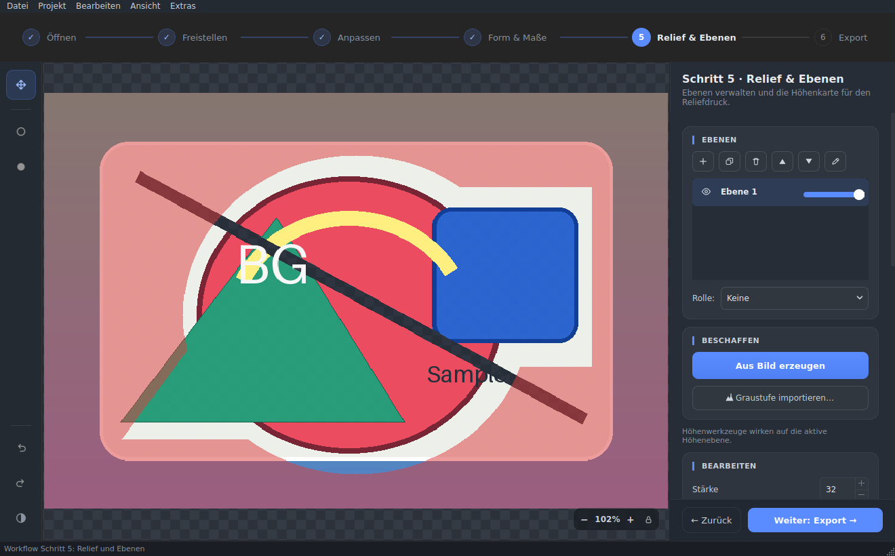
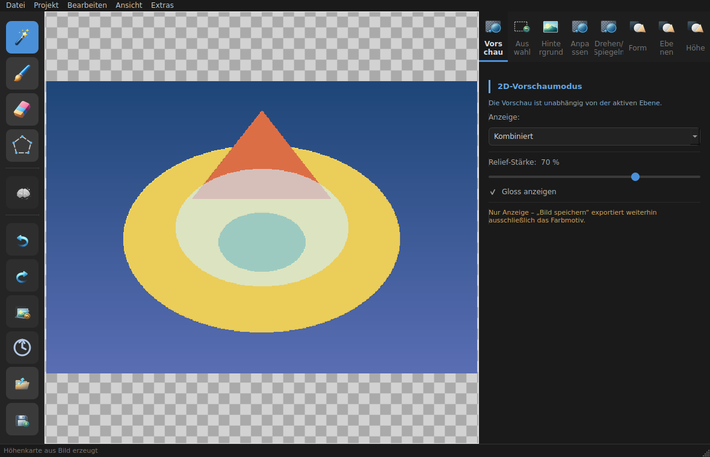
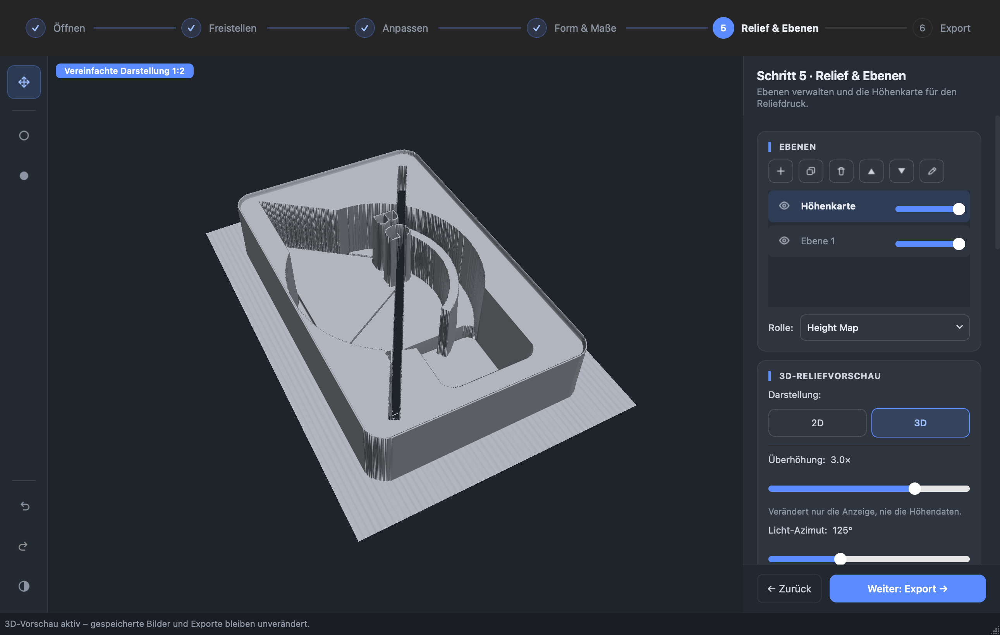
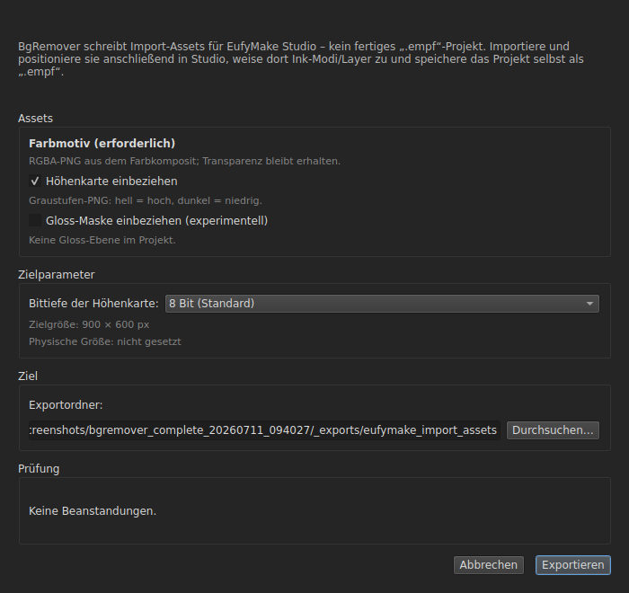

[Deutsch](../../../README.md) · **English** · [Español](../es/README.md) · [Français](../fr/README.md) · [Українська](../uk/README.md) · [简体中文](../zh/README.md)

# BgRemover

[](https://github.com/NikolayDA/picture_helper/actions/workflows/ci.yml)
[](https://codecov.io/gh/NikolayDA/picture_helper)
[](https://github.com/NikolayDA/picture_helper/actions/workflows/license-check.yml)
[](https://github.com/NikolayDA/picture_helper/releases/latest)
[](https://www.python.org/)
[](https://github.com/NikolayDA/picture_helper/blob/main/LICENSE)
[](https://github.com/NikolayDA/picture_helper)
[](https://github.com/astral-sh/ruff)
[](https://mypy-lang.org/)

An image-editing tool for macOS and Linux for **cutting out, editing, and print-preparing motifs** — from AI background removal through layers, projects, and height maps to **asset export for UV printing (EufyMake Studio)**. With magic wand, brush/eraser, polygon lasso, cropping in various formats, rotating, flipping, corner rounding, and color correction.

## Features

- **🤖 AI background removal** via [rembg](https://github.com/danielgatis/rembg) – one click, done.
- **🪄 Magic wand** – selects contiguous color areas via flood fill (with a tolerance slider).
- **🖌 Brush / eraser** – paint or remove a selection manually.
- **➰ Polygon lasso** – precisely narrow a selection by placing corner points.
- **🎨 Replace background** – fill the selection with any color or set it to transparent.
- **✂ Crop** with a rule-of-thirds grid: circle, 1:1, 16:9, 4:3, 9:16, 3:4.
- **⟲ Rotate** in 90° steps or by any angle; **↔ flip** horizontally/vertically.
- **⬤ Round corners** with an adjustable radius.
- **📐 Resize & physical dimensions** – scale to a target resolution in pixels **or** via millimeters and DPI (link aspect ratio, selectable resampling method); including a print-area check against a target medium (e.g. A4/A3).
- **🎚 Color correction** – brightness, contrast and saturation of the active layer with a live preview (alpha-preserving).
- **🪶 Smooth edge** – soft cut-out edge (alpha feather), selection-bounded, after AI or manual cut-out.
- **🗂 Layers & projects** – manage several layers (color, height, gloss, generic) with roles and save and open the whole thing losslessly as a `.bgrproj` project.
- **🏔 Height maps** – generate, edit, and optimize a grayscale height map from an image (light = high) – the basis for relief and UV printing.
- **👁 2D preview** – check color, relief over color, height, and gloss on screen; display only, the image export stays the color motif.
- **🧊 3D relief preview** – inspect the active height map as a rotatable surface with orbit, pan, zoom, exaggeration, lighting, and selectable quality; display only, with no change to height data or exports. If OpenGL 2.1 is unavailable, the 2D preview remains available.
- **↩ History** with undo and jumping to any earlier step.
- **📥 Drag & drop** for images directly onto the window.
- **📂 Input formats** – opens **PNG, JPEG, WebP, TIFF, BMP, and GIF**. **HEIC/HEIF is currently not supported.**
- Save as **PNG** (with transparency), **JPEG** (on a white background), **WebP**, or **TIFF**.
- **⚙ Persistent settings** – default directories and preferred file format are remembered; the log file can be located directly from the settings and its folder can be opened.
- **🖨 Export for EufyMake Studio** – writes import assets (color motif as an RGBA PNG, optional height map with light = high, optional gloss mask) with a pre-flight check and next Studio steps. BgRemover does **not** create a native `.empf` file – import, positioning and ink-mode assignment happen in EufyMake Studio.

## Screenshots


*The guided "Relief & Layers" step: the layers card (right) shows a project
made of a color-motif and a height layer, including role assignment.*



*The same step with the "Acquire" and "Edit" cards: generate a height map from
the image or import one, then adjust it – the height semantics are light =
high.*



*"Export" step: the combined 2D preview lays relief and gloss over the color
motif – display only, the export stays unchanged.*



*"Relief & Layers" step: inspect the active height map as a rotatable 3D
surface. Exaggeration, lighting, and quality affect the display only; for large
images a badge indicates the simplified representation.*



*The export dialog produces import assets (color motif, optional height map and
gloss mask) with a pre-flight check – **not** a native `.empf` file.*

## Requirements

- **macOS** or a **Linux desktop environment** (the optional app bundle uses
  macOS-specific tools such as `iconutil`)
- **Python 3.10 or newer** (the code uses PEP 604 type annotations
  like `QThread | None` directly in signatures — Python 3.9 fails)
- Dependencies (`PyQt6`, `Pillow`, `numpy`, optionally `rembg` for the
  AI feature) are installed via `pyproject.toml`.

**Python 3.11 or newer** is recommended for the reproducible AI/app
snapshot: some current transitive AI dependencies are no longer available
under Python 3.10. The base app without AI continues to support Python 3.10.

## Installation

**Fastest way – ready-made downloads:** The
[Releases page](https://github.com/NikolayDA/picture_helper/releases/latest)
offers ready-to-run artifacts with **AI already bundled** – no local Python
installation required:

- **macOS** (Apple Silicon/arm64): download the `.dmg` and drag `BgRemover.app`
  into *Applications*. The bundle is currently **unsigned** – on first launch,
  confirm via **right-click → “Open”** ([INSTALL_MAC.md](INSTALL_MAC.md)).
- **Linux / Raspberry Pi OS** (x86_64 and aarch64): a portable **AppImage** or
  an installable **`.deb`** ([INSTALL_LINUX.md](INSTALL_LINUX.md)).

To build from source or for development, continue below.

**From source (macOS): build the app bundle.** The script automatically
creates an isolated app venv, attempts to install the AI dependencies
including `onnxruntime`, handles Apple Silicon correctly, and produces a
`BgRemover.app` launcher:

```bash
git clone https://github.com/NikolayDA/picture_helper.git
cd picture_helper
bash create_BgRemover_app.sh
```

If the app venv is newly created, confirm the prompt with **Enter**.
Afterwards, double-click `BgRemover.app` (under `~/Applications`) to start
it — functionally identical to the bundled **`BgRemover.command`**. The
launcher uses the separately installed venv under
`~/Library/Application Support/BgRemover/venv`, so the project may stay in
`~/Documents`. However, the app and its venv belong together: the `.app`
is not portable as a single file. If the AI dependency installation
fails, the script builds a usable app without AI.

After an update or branch switch, run `bash create_BgRemover_app.sh`
again. The script installs the current checkout non-editably over the
existing app venv and rebuilds the launcher.

**Alternatively, directly in the terminal** — on modern macOS in a venv,
since system Python blocks `pip install` via PEP 668:

```bash
python3 -m venv .venv && source .venv/bin/activate
python3 -m pip install --upgrade "pip>=26.1.2"
python3 -m pip install -c requirements/constraints.txt -e ".[ai]"
python3 -m bgremover
```

`.[ai]` pulls in the AI dependencies (`rembg[cpu]` including `onnxruntime`);
without the AI feature, `python3 -m pip install -c requirements/constraints.txt -e .` is sufficient.

**Linux:** For end users, the recommended path is the release artifacts:
a portable **AppImage** and an installable **`.deb`** (both for x86_64 and
aarch64/Raspberry Pi OS). See **[INSTALL_LINUX.md](INSTALL_LINUX.md)** for
installation details and **[packaging/linux/README.md](../../../packaging/linux/README.md)**
for build/packaging details. Such artifacts are available from **v2.4.0**
onwards; **macOS** adds a **`.dmg`** (Apple Silicon/arm64) — see
**[INSTALL_MAC.md](INSTALL_MAC.md)**.

Starting directly from a venv remains the best path for development,
branch testing, and local changes:

```bash
git clone https://github.com/NikolayDA/picture_helper.git
cd picture_helper
python3 -m venv .venv && source .venv/bin/activate
python3 -m pip install --upgrade "pip>=26.1.2"
python3 -m pip install -c requirements/constraints.txt -e ".[ai]"
python3 -m bgremover
```

Before the venv start, a few Qt system libraries are required — see
**[INSTALL_LINUX.md](INSTALL_LINUX.md)**. On **Raspberry Pi OS (Desktop)**
it is also possible entirely without venv/pip (PyQt6, Pillow, numpy as
system packages via `apt`); see **[INSTALL_LINUX.md](INSTALL_LINUX.md)** as well.

> Detailed instructions — including **installation from a branch**
> (to test open pull requests) and **troubleshooting** — are available in
> **[INSTALL_MAC.md](INSTALL_MAC.md)** (macOS) and
> **[INSTALL_LINUX.md](INSTALL_LINUX.md)** (Linux).

## Usage

A **guided 6-step workflow** (step bar above the canvas + card inspector on
the right) walks you through editing:

1. **Open** – load an image by dragging it onto the drop zone, via `File → Open` (⌘O), by dragging and dropping it onto the window, or with a startup path (CLI / Finder).
2. **Cut out** – the **AI** button in the card inspector, or the magic wand, brush, eraser, or polygon lasso; then make it transparent, replace the color, or smooth the edge.
   - `Shift+Click` adds to the selection; `⌘+Click` (macOS) or `Ctrl+Click` (Linux) subtracts.
   - Switch tools from the keyboard: `W` magic wand, `B` brush, `E` eraser, `L` lasso (only active in this step).
3. **Adjust** – brightness/contrast/saturation with a live preview.
4. **Shape & Size** – rotate, flip, round corners, pick a crop format (move/resize the frame, then ✓ Apply), and resize.
5. **Relief & Layers** – manage project layers and generate/edit/optimize a height map. With a valid height map, switch between **2D** and **3D** under **Display**; in 3D, drag with the left mouse button to orbit, use the middle button or `Alt`+drag to pan, and the wheel to zoom. Without OpenGL 2.1, the 2D relief preview remains available.
6. **Export** – check the result as color/relief/height/gloss/combined, save via `File → Save` (⌘S) as PNG, JPEG, WebP, or TIFF — or `Project → Export assets for EufyMake Studio…` for UV printing.

### Settings

Via `Tools → Settings…` (⌘,), the following settings can be managed:

| Setting | Description |
|---|---|
| Default directory for opening | Start directory of the open dialog; empty = last used directory |
| Default directory for export/save | Start directory of the save dialog; empty = last used directory |
| Preferred image file format | PNG, JPEG, WebP, or TIFF – appears as the first option in the save dialog |
| Language | German or English; the change takes effect after a restart |
| Log file | Shows the log-file path; the "Open Folder" button opens the directory in the file manager |
| Automatically check for updates on startup | Off by default; when enabled, a silent update check runs shortly after startup (see below) |

The directories, preferred file format, language, and automatic update
check are stored persistently via **QSettings** and automatically restored
the next time the program starts.

### App update & AI model management

The `Tools` menu offers three more entries:

- **"Check for updates…"** queries the latest GitHub release non-blocking
  and shows a dialog depending on the result: current version, a new
  version with a link to the release page, or an understandable error
  message. If "Automatically check for updates on startup" is enabled, a
  new version also shows a discreet, clickable hint in the status bar that
  opens the same dialog – without another network request.
- **"Manage AI model…"** shows whether `rembg` is available and whether the
  rembg default model is already cached locally, and allows an explicit
  download/retry with a progress indicator and a cancel button – as an
  alternative to the automatic download on app startup (see the install
  guide, e.g. `INSTALL_MAC.md`).
- **"Install AI background removal…"** shows the matching command for adding
  the rembg backend, with a copy-to-clipboard button. The app deliberately
  does not install anything automatically; after installation, restart the
  app so the running process can see the new package.

### Keyboard shortcuts

On macOS the modifier key is **⌘ (Cmd)**, on Linux **Ctrl**. The tool
shortcuts (W/B/E/L) only work while the *Cut out* step is active.

| Action | Shortcut |
|--------|----------|
| Select magic wand | W |
| Select brush | B |
| Select eraser | E |
| Select polygon lasso | L |
| Open image | ⌘O |
| Save image | ⌘S |
| Save image as… | ⇧⌘S |
| New project | ⌘N |
| Open project… | ⇧⌘O |
| Save project | ⌥⌘S |
| Resize… | ⌘R |
| Export assets for EufyMake Studio… | ⌥⌘E |
| Undo | ⌘Z |
| Redo | ⇧⌘Z |
| Rotate 90° left | ⌘← |
| Rotate 90° right | ⌘→ |
| Clear selection (when no crop/lasso is active) | Esc |
| Invert selection | ⌘⇧I |
| Fit to View | ⌘0 |
| Open settings | ⌘, |

The File menu additionally has a submenu **"Open Recent"** with the
10 most recently loaded images — the state is persisted via QSettings
together with the other settings.

## Development & tests

```bash
git clone https://github.com/NikolayDA/picture_helper.git
cd picture_helper
python3 -m venv .venv
source .venv/bin/activate
make pr-check
```

The test suite runs headless (Qt platform `offscreen`) and checks the
image operations, the crop geometry, and the save logic. Pull requests
run a lightweight GitHub PR CI job (Ubuntu, Python 3.12, `make pr-check`).
The full Linux/macOS matrix under Python 3.10, 3.11, 3.12, and 3.13 runs as the
release gate: on a version-tag push the release workflow calls it before
publishing; it also runs weekly (Sundays) and manually. All
local/CI test installs use
`requirements/constraints.txt`; override it with
`make PIP_CONSTRAINT=/path/to/file pr-check` when needed. See
[TESTING.md](../../../TESTING.md) for the full testing workflow.

Code-style check and static type checking:

```bash
make lint
make type
```

### Regenerating UI screenshots

The full screenshot set for review and docs can be reproduced headlessly:

```bash
make screenshots
```

The generator writes to `app_screenshots/bgremover_complete_<timestamp>/`,
uses Qt `offscreen`, replaces QSettings with in-memory storage, and
simulates the AI result view without a real `rembg` model run. The transient
`_runtime/` and `_exports/` subdirectories stay local via `.gitignore`; the
numbered PNG files and `manifest.md` are the committable artifacts.

For acceptance runs of the real 3D relief preview on local graphics hardware,
the hybrid target first creates the same headless set and then overlays the
3D ready/display states from the native Qt/OpenGL viewer:

```bash
make screenshots-live-3d
```

That run intentionally fails when no OpenGL 2.1 capable renderer is available;
the regular CI/docs path `make screenshots` is unchanged.

### Regenerating the guide PDF

`ANLEITUNG.pdf` is generated from `ANLEITUNG.md` (Markdown to HTML to
PDF via WeasyPrint). After changing the Markdown source, rebuild the PDF
reproducibly. On Linux this requires DejaVu fonts and the
Pango/Cairo/GDK-Pixbuf distribution packages. On macOS the generator
uses the Arial/Courier New system fonts; install Pango with
`brew install pango`:

```bash
pip install -e ".[docs]"
python scripts/generate_anleitung_pdf.py
```

## Architecture (brief overview)

BgRemover is an installable package (`bgremover/`, launched via
`python -m bgremover` or the `bgremover` console script):

- **`ImageCanvas`** (QGraphicsView) holds the image state, the selection mask,
  undo/redo stacks, and the tools (magic wand, brush, lasso, crop).
- **`MainWindow`** builds the toolbar, status/crop bar, and connects the canvas,
  menus, right panel, and workers; `_apply_toolbar_for_step` switches the
  contextual toolbar to match the active step.
- **`stepper`** is the stateless 6-step bar (Open/Cut out/Adjust/Shape &
  Size/Relief & Layers/Export); **`right_panel`** builds the card inspector
  from it (header, a `QStackedWidget` with one page per step, navigation
  footer) and assigns it the eight existing tab building blocks from
  `right_panel_tabs` (Preview, Selection, Background, Adjust, Rotate/Flip,
  Shape, Layers, Height); `project_model`/`height_map` provide the Qt-free
  layer and height model.
- **`menu_actions`** builds the menu bar, actions, and shortcuts; `MainWindow`
  only supplies callbacks for it.
- **`RecentFiles`** encapsulates persistence, de-duplication, and the menu
  adapter for "Open Recent", so `MainWindow` only delegates the load path.
- **Workers** (`ImageLoadWorker`, `AIWorker`, `RembgWarmupWorker`,
  `FloodFillWorker`) run in
  their own `QThread`s; `WorkerController` encapsulates start, strong worker
  references, `deleteLater`, and shutdown.
- A monotonic **version counter** in the canvas discards stale AI and
  flood-fill results if another image was loaded or the image state
  changed in the meantime.
- Undo and redo share a **memory limit** (`_HISTORY_MEMORY_LIMIT`); running
  byte totals evict the oldest history entries. The original image and current
  canvas state intentionally remain outside this budget.

## Known limitations

- **Input formats:** **PNG, JPEG, WebP, TIFF, BMP, and GIF** are supported.
  **HEIC/HEIF is currently not supported** (no `pillow-heif`); such files are
  rejected in a controlled way as an unsupported format.
- **Maximum image size: 40 megapixels.** Larger images are rejected with a
  status message to limit memory use and processing time. The magic-wand
  selection (flood fill) runs asynchronously in its own `QThread`, keeping
  the UI responsive during calculation. Pillow is additionally protected
  against "decompression bomb" images.
- The **app bundle build** is macOS-specific; on Linux the application
  runs by starting `python -m bgremover` directly. Windows is currently
  not part of the officially tested matrix.

## Log file

The internal app logger uses a `bgremover.log` file in the app-data
directory determined by Qt. The exact path depends on the platform and Qt
configuration; with the current macOS configuration it is
`~/Library/Application Support/BgRemover/BgRemover/bgremover.log`, while
on Linux the file is located below `~/.local/share/`. It contains runtime
messages and stack traces for logged errors and is created with the first
log entry.

The macOS app-bundle launcher additionally writes startup diagnostics to
`~/Library/Application Support/BgRemover/bgremover.log`.

The exact internal path is displayed under `Tools → Settings… → Log file`;
the "Open Folder" button opens the directory directly in the file manager.

## License

BgRemover is licensed under the **GNU General Public License v3.0 or
later** (`GPL-3.0-or-later`) — see [LICENSE](../../../LICENSE).

A complete list of all libraries, tools, and assets used, along with
their licenses, is available in **[RESOURCES.md](RESOURCES.md)**.

> **Note on PyQt6:** The GUI dependency PyQt6 (Riverbank) is itself
> licensed under GPL v3 (or commercially). GPL-3.0 was deliberately
> chosen so that the distributed application — in particular the
> bundled `BgRemover.app` — is license-compliant. Anyone aiming for a
> permissive model (MIT/Apache-2.0) would have to replace PyQt6 with the
> LGPL-licensed **PySide6**.
