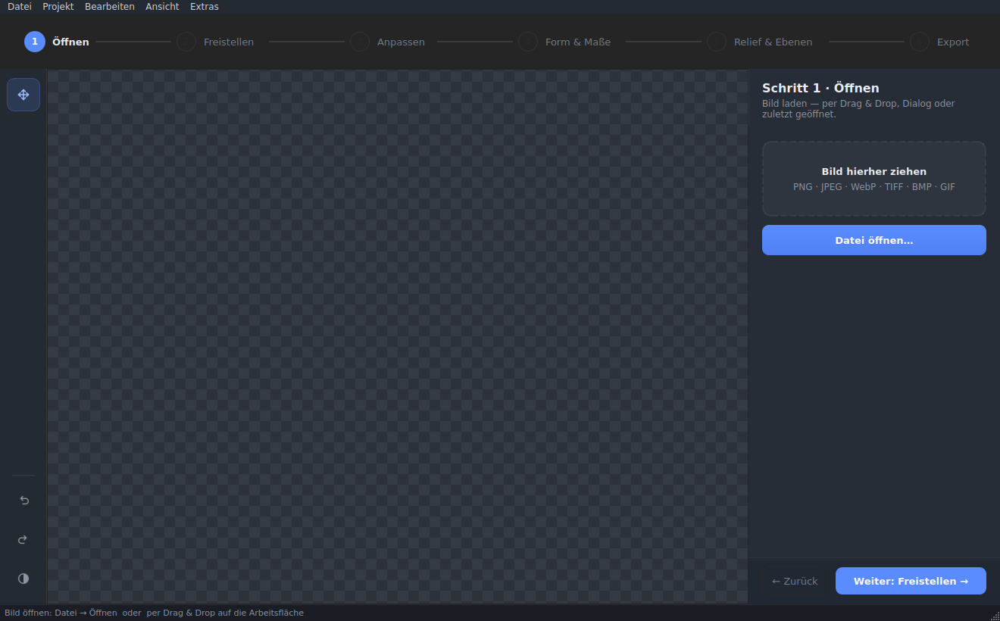
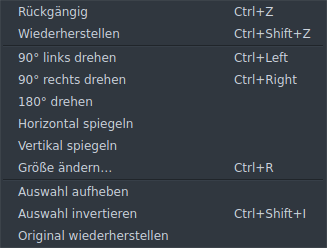
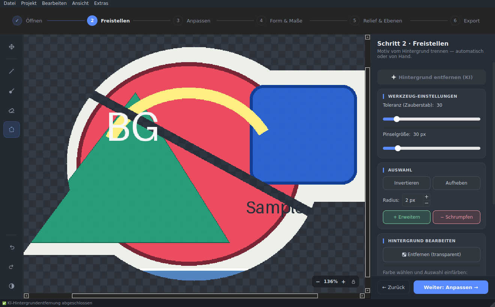
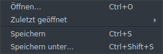
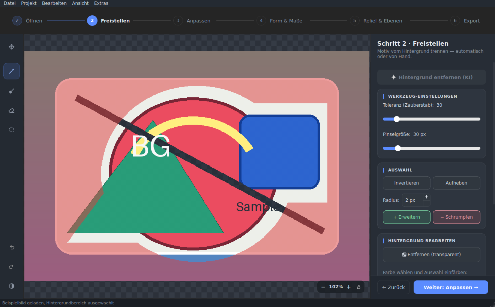
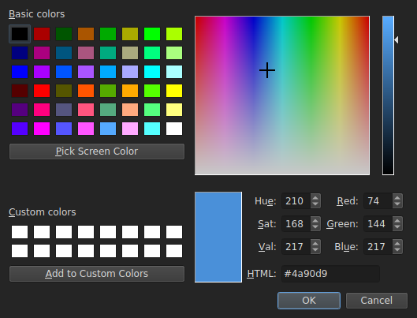
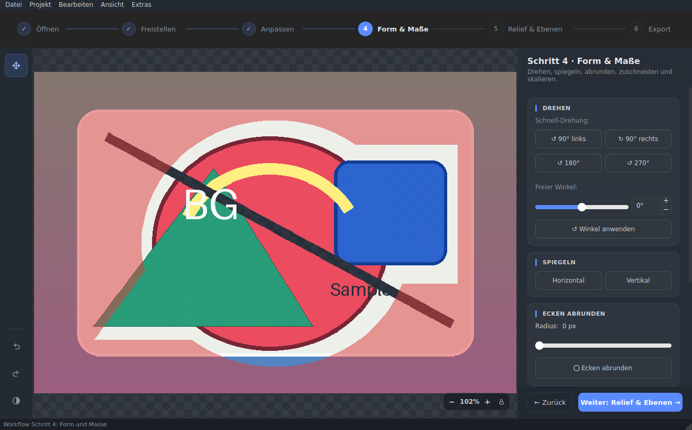
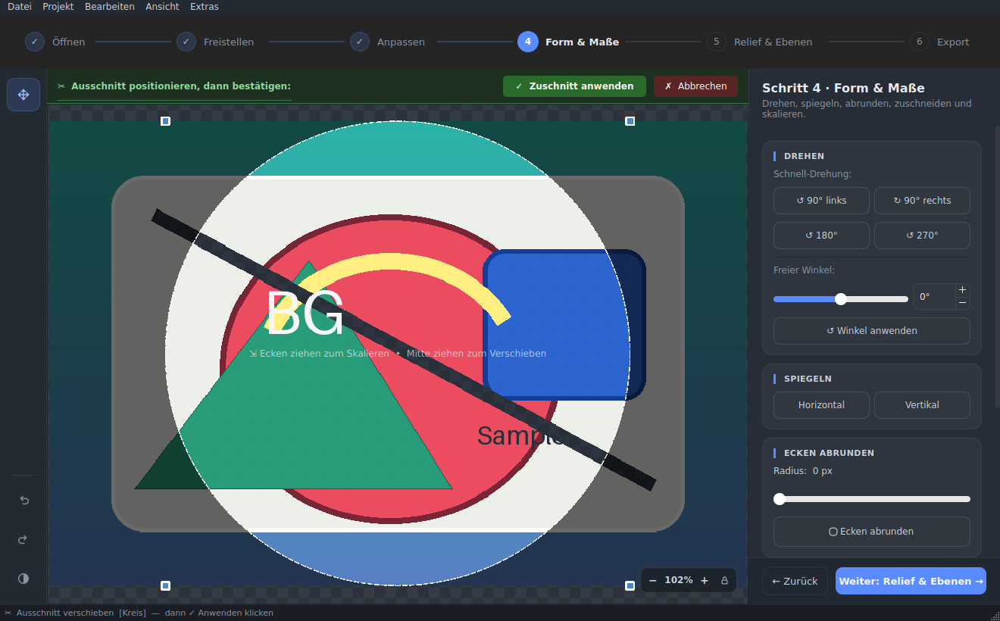
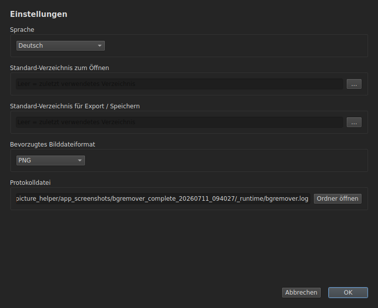

[Deutsch](../../../ANLEITUNG.md) · [English](../en/ANLEITUNG.md) · [Español](../es/ANLEITUNG.md) · **Français** · [Українська](../uk/ANLEITUNG.md) · [简体中文](../zh/ANLEITUNG.md)

> **Remarque :** La version PDF de ce guide n'est générée que pour l'original
> en allemand (`ANLEITUNG.pdf`). Aucun PDF n'est produit pour cette traduction.

# BgRemover – Guide d'utilisation

Ce guide explique étape par étape comment utiliser **BgRemover** — de
l'ouverture de la première image à l'enregistrement du résultat final. Il
s'adresse aux utilisateurs sans expérience préalable en retouche d'image.

> Les notes sur l'**installation** ne sont pas incluses ici intentionnellement ;
> consultez [INSTALL_MAC.md](INSTALL_MAC.md) (macOS) ou
> [INSTALL_LINUX.md](INSTALL_LINUX.md) (Linux). Ce guide suppose que
> l'application peut déjà être lancée.

---

## Table des matières

1. [Que peut faire BgRemover ?](#1-que-peut-faire-bgremover-)
2. [La fenêtre de l'application en un coup d'œil](#2-la-fenêtre-de-lapplication-en-un-coup-dœil)
3. [Démarrage rapide en 5 étapes](#3-démarrage-rapide-en-5-étapes)
4. [Étape 1 – Ouvrir une image](#4-étape-1--ouvrir-une-image)
5. [La barre d'outils (gauche)](#5-la-barre-doutils-gauche)
6. [Faire une sélection](#6-faire-une-sélection)
7. [Étape 2 – Détourer](#7-étape-2--détourer)
8. [Étape 3 – Ajuster (correction des couleurs)](#8-étape-3--ajuster-correction-des-couleurs)
9. [Étape 4 – Forme & dimensions](#9-étape-4--forme--dimensions)
10. [Redimensionner et dimensions physiques](#10-redimensionner-et-dimensions-physiques)
11. [Étape 5 – Relief & calques](#11-étape-5--relief--calques)
12. [Étape 6 – Export](#12-étape-6--export)
13. [Paramètres](#13-paramètres)
14. [Raccourcis clavier](#14-raccourcis-clavier)
15. [Flux de travail typiques](#15-flux-de-travail-typiques)
16. [Conseils et astuces](#16-conseils-et-astuces)
17. [Limitations connues](#17-limitations-connues)
18. [Résolution de problèmes et fichier journal](#18-résolution-de-problèmes-et-fichier-journal)
19. [Licence](#19-licence)

---

## 1. Que peut faire BgRemover ?

BgRemover est un outil de retouche d'image pour **supprimer, remplacer et
modifier les arrière-plans** — avec des fonctionnalités supplémentaires pour
l'optimisation d'image simple, les calques/projets et la préparation d'assets
d'impression UV. Un **flux de travail guidé en 6 étapes** (Ouvrir → Détourer
→ Ajuster → Forme & dimensions → Relief & calques → Export) vous accompagne
tout au long de l'édition. Les fonctionnalités principales :

- **Suppression d'arrière-plan par IA** – supprimez l'arrière-plan
  automatiquement en un seul clic.
- **Sélection manuelle** avec baguette magique, pinceau, gomme et lasso
  polygonal.
- **Remplacer l'arrière-plan** – rendre la sélection transparente ou la
  remplir avec n'importe quelle couleur.
- **Transformer** – faire pivoter (par paliers de 90° ou angle libre) et
  retourner.
- **Forme et recadrage** – arrondir les coins, recadrer en cercle ou selon
  un rapport d'aspect fixe.
- **Optimisation d'image** – ajuster la luminosité, le contraste et la
  saturation, et adoucir le bord alpha (feather).
- **Taille et dimensions physiques** – modifier la taille en pixels ou définir
  une taille d'impression via les millimètres et les DPI (avec indication de
  la zone d'impression).
- **Calques et projets** – gérer plusieurs calques (couleur/hauteur/gloss/
  générique) et enregistrer et ouvrir l'ensemble en tant que projet
  `.bgrproj`.
- **Cartes de hauteur** – générer une carte de hauteur à partir d'une image,
  la modifier au curseur ou directement au pinceau, puis l'optimiser.
- **Aperçu 2D** – vérifier la couleur, le relief, la hauteur et le gloss à
  l'écran.
- **Export EufyMake Studio** – générer des assets d'import pour l'impression
  UV.
- **Historique** avec annuler/rétablir et saut vers n'importe quelle étape
  d'édition précédente.
- **Enregistrer** en PNG, JPEG, WebP ou TIFF.

---

## 2. La fenêtre de l'application en un coup d'œil



*La fenêtre principale juste après le lancement : la barre de menus en haut,
la barre d'outils à gauche, la zone de travail avec le damier de transparence
au centre, la barre d'étapes au-dessus de la zone de travail, l'inspecteur de
cartes à droite (ici l'étape 1 « Ouvrir ») et la barre d'état en bas.*

La fenêtre est divisée en cinq zones :

```
┌─────────────────────────────────────────────────────────────┐
│ Barre de menus                                                │
├──────────┬───────────────────────────────┬──────────────────┤
│          │      Barre d'étapes (6 étapes)                    │
│ Barre    ├───────────────────────────────┼──────────────────┤
│ d'outils │                               │  Inspecteur      │
│ (gauche) │        Zone de travail        │  de cartes       │
│          │      (image + sélection)      │  (droite)        │
│          │                               │                  │
├──────────┴───────────────────────────────┴──────────────────┤
│ Barre d'état (conseils et messages)                          │
└──────────────────────────────────────────────────────────────┘
```

| Zone | Rôle |
|---|---|
| **Barre de menus** (haut) | Fichier, Projet, Édition, Affichage, Outils |
| **Barre d'étapes** (au-dessus de la zone de travail) | Six étapes : Ouvrir, Détourer, Ajuster, Forme & dimensions, Relief & calques, Export |
| **Barre d'outils** (gauche) | Déplacer/Zoom, outils de sélection/hauteur contextuels, Annuler/Rétablir/Thème |
| **Zone de travail** (centre) | Affiche l'image et la sélection actuelle ; la pilule de zoom en bas à droite affiche et contrôle l'agrandissement |
| **Inspecteur de cartes** (droite) | En-tête avec le titre/la description de l'étape, les cartes de l'étape active, pied de page avec « Retour »/« Suivant » |
| **Barre d'état** (bas) | Conseils et retours de l'application |

### Menus « Édition », « Affichage », « Projet » et « Outils »

De nombreuses actions sont aussi accessibles depuis la barre de menus :

- **Édition** – annuler/rétablir, rotation (90° gauche/droite/180°),
  retournement horizontal/vertical, *Redimensionner…*, ainsi que
  désélectionner/inverser la sélection et *Restaurer l'original*. Pratique
  si vous préférez appeler une fonction depuis le menu plutôt que depuis la
  barre d'outils ou l'inspecteur de cartes.
- **Affichage** – *Ajuster à la vue* (⌘0), *Historique* (ouvre le même
  historique de modifications que le bouton de la barre d'outils
  auparavant), le sous-menu *Mode d'aperçu* (voir la
  [section 12](#12-étape-6--export)) ainsi que *Thème clair* pour basculer
  le jeu de couleurs.
- **Projet** – *Nouveau projet*, *Ouvrir un projet…*, *Enregistrer le
  projet* / *…sous…* (`.bgrproj`) ainsi que *Exporter des assets pour
  EufyMake Studio…* (voir la [section 11](#11-étape-5--relief--calques) et
  la [section 12](#12-étape-6--export)).
- **Outils** – *Réglages…* (voir la [section 13](#13-paramètres)),
  *Rechercher des mises à jour…*, *Gérer le modèle d'IA…* ainsi
  qu'*Installer la suppression d'arrière-plan par IA…* (voir la
  [section 7](#7-étape-2--détourer) et la
  [section 18](#18-résolution-de-problèmes-et-fichier-journal)).



*Le menu « Édition » regroupe annuler/rétablir, rotation, retournement et
les actions de sélection.*

### La barre d'étapes

Au-dessus de la zone de travail, la **barre d'étapes** guide à travers six
stations : **Ouvrir → Détourer → Ajuster → Forme & dimensions → Relief &
calques → Export**. Un clic sur une étape déjà atteinte ou débloquée y
saute directement ; sans image chargée, les étapes 2 à 6 restent verrouillées
(seule l'étape 1 est libre). Les étapes terminées affichent une coche, l'étape
active est mise en évidence. En bas de l'inspecteur de cartes, **« ← Retour »**
et **« Suivant : … »** guident le déroulement ; à la dernière étape, le
bouton déclenche plutôt **« Exporter ✓ »** (enregistrer).

### Zoom et affichage

- **Zoomer :** la **molette de la souris** au-dessus de la zone de travail
  agrandit ou réduit l'affichage, ou utilisez la **pilule de zoom**
  flottante en bas à droite de la zone de travail (**−** / valeur en
  pourcentage / **+** / cadenas pour verrouiller le niveau de zoom).
- **Déplacer :** si l'image est plus grande que la fenêtre, déplacez-la
  avec l'outil **Déplacer/Zoom** (glisser avec le clic gauche) ou via les
  barres de défilement.
- **Ajuster :** `Affichage → Ajuster à la vue` (⌘0) remet l'image
  entièrement à l'échelle dans la fenêtre. Cela se produit automatiquement
  au chargement d'une image.

---

## 3. Démarrage rapide en 5 étapes

Voici comment supprimer un arrière-plan en moins d'une minute :

1. **Ouvrir une image** – à l'étape *Ouvrir*, glissez l'image dans la zone
   de dépôt, utilisez `Fichier → Ouvrir` (⌘O / Ctrl+O) ou déposez-la
   directement sur la zone de travail.
2. **Lancer l'IA** – à l'étape *Détourer*, cliquez en haut sur **« Supprimer
   le fond (IA) »**. L'arrière-plan est supprimé automatiquement.
3. **Retoucher (facultatif)** – utilisez la **gomme** pour supprimer les
   restes de la sélection ou le **pinceau** pour l'agrandir.
4. **Vérifier** – si nécessaire, appuyez sur **Annuler** (⌘Z) pour revenir
   en arrière d'une étape.
5. **Enregistrer** – à l'étape *Export*, choisissez le format **PNG**
   (conserve la transparence) et cliquez sur **Enregistrer**, ou utilisez
   `Fichier → Enregistrer` (⌘S).



*Après un clic sur « Supprimer le fond (IA) », l'arrière-plan est détouré
automatiquement — la barre d'état confirme que la suppression d'arrière-plan
par IA est terminée, et le damier indique les zones libres.*

Les chapitres suivants expliquent chaque étape en détail.

---

## 4. Étape 1 – Ouvrir une image

Il existe plusieurs façons de charger une image :

- **Zone de dépôt (étape 1) :** faites glisser une image depuis le
  gestionnaire de fichiers directement sur le champ en pointillés de
  l'inspecteur de cartes, ou cliquez dessus pour ouvrir la boîte de
  dialogue de fichiers.
- **Menu :** `Fichier → Ouvrir…` (⌘O / Ctrl+O).
- **Glisser-déposer sur la zone de travail :** faites glisser un fichier
  image directement sur la zone de travail. Si vous glissez plusieurs
  fichiers, seule la première image est chargée.
- **Récemment ouverts :** `Fichier → Récemment ouverts` ainsi que la carte
  « Récemment ouverts » de l'étape *Ouvrir* (jusqu'à trois entrées avec
  vignette) listent les entrées utilisées récemment. Il s'agit aussi bien
  d'images que de **projets** `.bgrproj` (voir la
  [section 11](#11-étape-5--relief--calques)) ; au clic, l'application
  détecte le type et l'ouvre en conséquence.
- **Démarrer avec un chemin d'image :** lorsque le programme est démarré
  avec un chemin d'image — via la **ligne de commande**
  (`bgremover image.png`) ou un **lanceur de bureau Linux** (association de
  fichiers) —, il charge cette image directement au démarrage.
- **Ouverture via le Finder macOS :** sur macOS, une image peut aussi être
  transmise à BgRemover par **double-clic**, via « Ouvrir avec… » ou par
  une **association de fichiers** dans le Finder.

Toutes ces voies utilisent le même **chemin de chargement validé et
asynchrone** : les mêmes contrôles de format et de taille s'appliquent, et
les grandes images sont chargées en arrière-plan — la barre d'état affiche la
progression. Une fois le chargement terminé, la barre d'étapes passe
automatiquement à l'étape suivante.



*Le menu « Fichier » regroupe Ouvrir (⌘O), « Récemment ouverts »,
Enregistrer (⌘S) et Enregistrer sous… (⇧⌘S).*

**Les formats d'entrée pris en charge** sont, de manière contraignante,
**PNG, JPEG, WebP, TIFF, BMP et GIF**. Cette liste est le contrat d'entrée
actuel, pas un exemple : les autres formats sont rejetés de façon contrôlée.
En particulier, **HEIC/HEIF n'est actuellement pas pris en charge à
dessein** — un fichier HEIC/HEIF est rejeté comme format non pris en charge.
L'enregistrement se fait en PNG, JPEG, WebP ou TIFF (voir la
[section 12](#12-étape-6--export)).

> **Taille maximale de l'image : 40 mégapixels.** Les images plus grandes
> sont rejetées avec un message dans la barre d'état.

---

## 5. La barre d'outils (gauche)

La barre verticale sur le bord gauche est **contextuelle** : elle n'affiche
que les outils de l'étape actuellement active. De haut en bas :

### Déplacer / Zoom (toujours disponible)

| Icône | Outil | Fonction |
|---|---|---|
| ✥ | **Déplacer / Zoom** | Glisser avec le clic gauche déplace la vue, la molette zoome. Actif dans toutes les étapes sauf *Détourer* et *Relief & calques*. |

### Outils de sélection (uniquement à l'étape « Détourer »)

| Icône | Outil | Fonction |
|---|---|---|
| 🪄 | **Baguette magique** | Sélectionne une zone continue de couleur similaire en un clic (remplissage par diffusion). Ajustable via la *Tolérance*. |
| 🖌 | **Pinceau** | Peindre une sélection manuellement. |
| 🧽 | **Gomme** | Supprimer la sélection peinte. |
| ⬡ | **Lasso polygonal** | Cliquez sur les points un par un ; **double-clic** ferme le polygone. **Échap** annule. |

Changement rapide au clavier : **W** baguette magique, **B** pinceau,
**E** gomme, **L** lasso — ces raccourcis n'agissent que tant que l'étape
*Détourer* est active.

Pour tous les outils de sélection :

- **Shift + clic** → **ajouter** à la sélection
- **Ctrl/Cmd + clic** → **soustraire** de la sélection

### Outils de hauteur (uniquement à l'étape « Relief & calques »)

| Icône | Outil | Fonction |
|---|---|---|
| ▲ | **Éclaircir (rehausser)** | Le coup de pinceau augmente la hauteur du calque de hauteur actif. |
| ▼ | **Assombrir (abaisser)** | Le coup de pinceau diminue la hauteur du calque de hauteur actif. |

Les deux outils sont désactivés tant qu'aucun calque de hauteur n'est actif
(voir la [section 11](#11-étape-5--relief--calques)) ; l'infobulle en donne
alors la raison. Ils complètent les actions Éclaircir/Assombrir basées sur
des curseurs dans l'inspecteur de cartes par un outil de peinture à main
levée.

### Bas de la barre : annuler, rétablir, thème

En bas de la barre d'outils, trois boutons restent visibles — quelle que
soit l'étape :

| Icône | Fonction |
|---|---|
| ↩ | **Annuler** (⌘Z) – revenir sur la dernière étape |
| ↪ | **Rétablir** (⇧⌘Z) – réappliquer l'étape annulée |
| ◐ | **Basculer thème clair/sombre** – change le jeu de couleurs (même action que `Affichage → Thème clair`) |

> La suppression d'arrière-plan par IA, l'historique des modifications
> ainsi qu'ouvrir/enregistrer une image ne se trouvent plus dans la barre
> d'outils : ils sont accessibles depuis l'inspecteur de cartes des étapes
> concernées, le menu ou leurs raccourcis clavier (voir la
> [section 7](#7-étape-2--détourer) et la
> [section 12](#12-étape-6--export)).

> **Astuce :** Survolez une icône avec la souris pour afficher une brève
> infobulle.

---

## 6. Faire une sélection

Presque toutes les modifications (rendre transparent, remplacer la
couleur) s'appliquent à la **zone actuellement sélectionnée**. La sélection
est mise en surbrillance en couleur sur l'image. Les outils de sélection
sont actifs à l'étape *Détourer*.



*Une image chargée avec une sélection active : la zone d'arrière-plan
sélectionnée est mise en surbrillance en couleur sur la zone de travail.*

### Avec la baguette magique (recommandé pour les arrière-plans unis)

1. Choisissez la baguette magique dans la barre d'outils.
2. Cliquez sur l'arrière-plan – toutes les couleurs similaires et
   contiguës sont sélectionnées.
3. Pas assez ? Utilisez **Shift+clic** pour ajouter d'autres zones ou
   augmentez la **Tolérance** (carte *Réglages de l'outil* de l'étape
   *Détourer*).

### Avec le pinceau et la gomme (pour des corrections fines)

- **Pinceau :** peignez sur la zone souhaitée pour l'ajouter à la
  sélection.
- **Gomme :** peignez sur les zones incorrectement sélectionnées pour les
  supprimer.
- Réglez la **taille du pinceau** dans la carte *Réglages de l'outil*.

### Avec le lasso polygonal (pour les bords droits)

1. Choisissez le lasso.
2. Cliquez coin par coin autour de l'objet.
3. **Double-clic** ferme le polygone et crée la sélection.
4. **Échap** annule l'opération.

---

## 7. Étape 2 – Détourer

À l'étape *Détourer*, vous séparez le sujet de l'arrière-plan — de façon
automatique par IA ou à la main. L'inspecteur de cartes regroupe quatre
cartes à cet effet.


*L'étape 2 « Détourer » : en haut le bouton IA, en dessous les réglages de
l'outil, les actions de sélection et « Modifier l'arrière-plan ».*

### Suppression d'arrière-plan par IA

En haut de l'inspecteur de cartes, le bouton **« Supprimer le fond (IA) »**
supprime l'arrière-plan de façon entièrement automatique. Au premier appel,
le modèle d'IA est chargé, ce qui peut prendre un moment.

> Si le composant IA (`rembg`) n'est pas installé, le bouton est grisé.
> `Outils → Installer la suppression d'arrière-plan par IA…` affiche
> directement dans l'application la commande d'installation adaptée à
> votre plateforme (avec un bouton de copie) ; sinon, consultez le guide
> d'installation pour configurer la fonctionnalité IA.

Via `Outils → Gérer le modèle d'IA…`, vous pouvez à tout moment vérifier
si le modèle d'IA a déjà été téléchargé, et démarrer ou annuler le
téléchargement.

### Réglages de l'outil (tolérance et taille du pinceau)

| Curseur | Plage | Effet |
|---|---|---|
| **Tolérance (baguette magique)** | 0 – 255 (par défaut : 30) | Degré de similitude que doivent avoir les couleurs pour être sélectionnées ensemble par la baguette magique. **Bas** = uniquement les couleurs très similaires · **Haut** = de nombreuses nuances. |
| **Taille du pinceau** | 4 – 200 px (par défaut : 30 px) | Diamètre du pinceau et de la gomme. |

### Actions de sélection

- **Désélectionner** – efface la sélection actuelle. **Échap** annule
  d'abord un recadrage actif ou un lasso polygonal commencé, et n'efface
  la sélection que si aucune de ces interactions n'est active.
- **Inverser la sélection** (⌘⇧I) – échange les zones sélectionnées et non
  sélectionnées. Utile : sélectionnez d'abord l'*objet*, puis inversez pour
  modifier l'*arrière-plan*.
- **Développer / Réduire** – agrandit ou réduit la sélection du rayon réglé
  à côté (1 – 20 px, par défaut : 2 px). Utile pour supprimer un fin liseré
  coloré après le détourage.

### Modifier l'arrière-plan

| Action | Description |
|---|---|
| **Supprimer (transparent)** | Rend la zone sélectionnée complètement transparente. Astuce : sélectionnez d'abord l'arrière-plan avec la baguette magique. |
| **Choisir une couleur** | Ouvre un sélecteur de couleur. Le petit bouton coloré affiche la couleur de remplacement actuellement choisie. |
| **Remplacer la couleur** | Remplit la zone sélectionnée avec la couleur choisie. |



*Via « Choisir une couleur » s'ouvre le sélecteur de couleur ; la couleur
choisie apparaît dans le carré et s'applique à la sélection avec
« Remplacer la couleur ».*

**Flux de travail typique :** sélectionner l'arrière-plan avec la baguette
magique/l'IA → *Supprimer (transparent)* pour un fichier PNG détouré, **ou**
choisir une couleur et *Remplacer la couleur* pour un arrière-plan uni
(p. ex. blanc pour des photos d'identité).

### Lisser le bord (feather)

Dans la section *Lisser le bord* de la même carte, vous pouvez adoucir le
**bord alpha** — utile contre les bordures dures à l'aspect « découpé »
après un détourage.

- **Rayon :** 0 – 20 px (par défaut : 2 px) règle la largeur de la
  transition douce.
- **Lisser le bord** applique le lissage. Il n'affecte que le **canal de
  transparence** (les couleurs restent inchangées) et — lorsqu'une
  sélection est active — n'agit qu'à l'intérieur de la sélection.

---

## 8. Étape 3 – Ajuster (correction des couleurs)

L'étape *Ajuster* contient une **correction des couleurs** simple. Elle
agit sur le **calque de couleur actif** (voir la
[section 11](#11-étape-5--relief--calques)) et laisse la transparence
inchangée.

| Curseur | Plage | Effet |
|---|---|---|
| **Luminosité** | 0 – 200 % (par défaut : 100 %) | Éclaircir ou assombrir l'image. |
| **Contraste** | 0 – 200 % (par défaut : 100 %) | Différence entre les zones claires et sombres. |
| **Saturation** | 0 – 200 % (par défaut : 100 %) | Intensité des couleurs ; 0 % donne des niveaux de gris. |

- Pendant que vous déplacez les curseurs, la zone de travail affiche un
  **aperçu en direct**.
- **Appliquer** valide la correction (annulable/rétablissable dans
  l'historique).
- **Réinitialiser** ramène les trois curseurs à 100 % et abandonne
  l'aperçu.

---

## 9. Étape 4 – Forme & dimensions

L'étape *Forme & dimensions* regroupe pivoter/retourner ainsi qu'arrondir
les coins, le recadrage et un redimensionnement rapide en pixels.



*L'étape 4 « Forme & dimensions » : rotation (rotation rapide/angle libre),
retournement, arrondi des coins et, en bas, les formats de recadrage.*

### Pivoter

- **Rotation rapide :** boutons pour *90° à gauche*, *90° à droite*,
  *180°* et *270°*.
- **Angle libre :** curseur ou champ de saisie de **−180° à +180°**, puis
  cliquez sur **Appliquer l'angle**. Les angles obliques produisent des
  coins transparents.

> La rotation rapide est également disponible au clavier : ⌘← (90° à
> gauche) et ⌘→ (90° à droite).

### Retourner

- **Horizontal** – retourner gauche ↔ droite.
- **Vertical** – retourner haut ↕ bas.

### Arrondir les coins

1. Utilisez le curseur **Rayon** pour régler le degré d'arrondi (0 = aucun
   arrondi, jusqu'à 500 px = arrondi maximal).
2. Cliquez sur **Arrondir les coins**.

Le résultat est enregistré avec des coins transparents — de préférence en
PNG.

### Redimensionner (pixels, directement dans l'étape)

La carte « Redimensionner » propose **largeur × hauteur en pixels**
directement dans l'étape : saisissez les valeurs et cliquez sur
**Appliquer**. Pour le rapport d'aspect lié, la méthode de
rééchantillonnage et les dimensions physiques (mm/DPI), utilisez la boîte
de dialogue complète de la
[section 10](#10-redimensionner-et-dimensions-physiques).

### Format de sortie et recadrage

1. Choisissez un format – un **cadre** apparaît sur l'image :
   - **Format spécial :** ⬤ Cercle
   - **Carré :** 1:1
   - **Paysage :** 16:9, 4:3
   - **Portrait :** 9:16, 3:4
2. **Déplacer le cadre :** cliquez au centre et faites glisser.
3. **Redimensionner :** faites glisser les coins – le rapport d'aspect est
   préservé.
4. Une barre apparaît au-dessus de la zone de travail :
   - **✓ Appliquer le recadrage** – recadre l'image.
   - **✗ Annuler** – abandonne le cadre.



*Exemple « Cercle » : le cadre de recadrage se place sur l'image avec des
poignées. « ✓ Appliquer le recadrage » recadre l'image, « ✗ Annuler »
abandonne le cadre.*

---

## 10. Redimensionner et dimensions physiques

Via `Édition → Redimensionner…` (Ctrl+R), ouvrez la boîte de dialogue
complète de redimensionnement — avec rapport d'aspect lié, méthode de
rééchantillonnage et dimensions physiques. Pour un redimensionnement rapide
en pixels sans boîte de dialogue, la carte en ligne de la
[section 9](#9-étape-4--forme--dimensions) est disponible à l'étape *Forme
& dimensions*. La boîte de dialogue connaît deux unités :

### Redimensionner en pixels

En mode **Pixels**, vous saisissez la **Largeur** et la **Hauteur**
directement en pixels. Avec **Lier le rapport d'aspect**, le rapport est
préservé. La méthode de rééchantillonnage détermine la qualité :

| Méthode | Adaptée à |
|---|---|
| **Lanczos** | Meilleure qualité (par défaut), idéale pour réduire. |
| **Bicubique** | Résultats lisses, bon polyvalent. |
| **Bilinéaire** | Plus rapide, un peu plus doux. |
| **Plus proche voisin** | Conserve les bords/pixels nets, sans lissage. |

La boîte de dialogue affiche le nombre de mégapixels obtenu et respecte la
limite de **40 mégapixels**.

### Dimensions physiques (mm/DPI) et zone d'impression

En mode **Millimètres (mm + DPI)**, vous définissez la **largeur/hauteur en
millimètres** et une **résolution (DPI)** ; la taille en pixels en découle.
Cette taille physique est la taille d'impression de référence et est
enregistrée dans le projet `.bgrproj`.

Via **Support cible**, vous choisissez un support d'impression courant
(p. ex. A4 ou A3). Si le motif y tient, la boîte de dialogue le confirme ;
s'il est plus grand que le support, une indication signale que la zone
d'impression est dépassée.

---

## 11. Étape 5 – Relief & calques

L'étape *Relief & calques* regroupe la gestion des calques et l'espace de
travail des cartes de hauteur dans deux cartes.

### Types et rôles de calque

BgRemover peut gérer plusieurs **calques** dans un **projet** et enregistrer
l'ensemble en tant que fichier `.bgrproj`. Pour l'édition d'arrière-plan
classique, vous n'avez pas à vous en soucier — une seule image se comporte
comme un unique calque couleur. Chaque calque a un **type** et,
éventuellement, un **rôle**. Seuls les **calques couleur** alimentent
l'image couleur visible ; les autres types sont des calques de données pour
la préparation de l'impression.

| Type / rôle | Signification |
|---|---|
| **Couleur** (motif couleur) | L'image visible. Plusieurs calques couleur forment ensemble le composite, qui est aussi exporté. |
| **Hauteur** (carte de hauteur) | Une carte de hauteur en niveaux de gris pour le relief/l'impression UV. |
| **Gloss** (masque de gloss) | Un masque pour les effets de brillance (expérimental). |
| **Générique** | Un calque de données neutre sans rôle fixe. |

### Gérer les calques

Dans la carte *Calques*, vous gérez la liste des calques :

| Action | Description |
|---|---|
| **Nouveau calque / Dupliquer / Supprimer** | Ajouter un calque, copier le calque actif ou le supprimer. |
| **Monter / Descendre** | Modifier l'ordre d'empilement des calques. |
| **Renommer** | Renommer le calque actif. |
| **Rôle** | Attribuer un rôle au calque actif (seules les combinaisons compatibles sont autorisées). |
| **Visibilité** | Afficher ou masquer un calque. |
| **Sélectionner** | Choisir un calque comme calque **actif** – les outils agissent dessus. |
| **Opacité** | Opacité du calque (appliquée au relâchement). |

### Fichiers de projet (.bgrproj)

Via le menu **Projet**, vous travaillez avec des fichiers de projet :

- **Nouveau projet** (Ctrl+N), **Ouvrir un projet…** (Ctrl+Maj+O).
- **Enregistrer le projet** (Ctrl+Alt+S) et **Enregistrer le projet
  sous…** (Ctrl+Alt+Maj+S).

Un fichier `.bgrproj` est une archive comprenant un **manifeste** (ordre,
types, rôles, noms, dimensions physiques) et **un PNG par calque** ; les
calques de hauteur enregistrent en plus leurs valeurs de hauteur 16 bits
dans un fichier dédié (version de format 2). Ainsi, tous les calques sont
conservés sans perte – transparence comprise et hauteurs en pleine
précision. Les anciens projets sont repris automatiquement à l'ouverture
et convertis au nouveau format au prochain enregistrement. Les anciennes
versions de BgRemover (jusqu'à 2.6.0) ne peuvent pas ouvrir les fichiers
de projet v2 et signalent une entrée inattendue – le fichier reste
intact. Les projets
apparaissent aussi sous « Récemment ouverts » (voir la
[section 4](#4-étape-1--ouvrir-une-image)).

### Cartes de hauteur : obtenir

Une **carte de hauteur** est un calque en niveaux de gris où la luminosité
représente une hauteur : **clair = haut, sombre = bas**. Elle est la base du
relief et de l'impression UV. La carte *Hauteur* agit sur le **calque de
hauteur** actif ; les sections Modifier et Optimiser ne sont actives que
lorsqu'un calque de hauteur est actif.

- **Générer depuis l'image** – convertit de façon déterministe l'image
  couleur actuelle en carte de hauteur et la crée comme nouveau calque de
  hauteur.
- **Importer niveaux de gris…** – charge une image en niveaux de gris comme
  carte de hauteur et la met à l'échelle de la taille du projet. Les
  fichiers en niveaux de gris 16 bits (PNG/TIFF) sont importés
  **nativement avec les 65536 niveaux** ; les images couleur et 8 bits
  sont converties selon leur luminosité. Les images 16 bits avec canal
  alpha et les images float ne peuvent pas être lues sans perte et sont
  refusées avec un message. Lors de l'export EufyMake, BgRemover avertit
  quand une cible 8 bits quantifierait les hauteurs internes 16 bits.

### Cartes de hauteur : modifier

- **Éclaircir / Assombrir** – augmente ou diminue la hauteur ; l'**Intensité**
  contrôle l'ampleur. Pour peindre à main levée, l'étape *Relief & calques*
  propose en plus les outils pinceau de même nom dans la barre d'outils
  (voir la [section 5](#5-la-barre-doutils-gauche)).
- **Définir la hauteur** – fixe la hauteur à une **valeur** déterminée.
- **Inverser** – échange haut et bas.

Lorsqu'une sélection est active, les actions basées sur des curseurs
n'agissent qu'à l'intérieur de la sélection, sinon sur tout le calque.

### Cartes de hauteur : optimiser

Les opérations d'optimisation affichent un **aperçu en direct** ;
**Appliquer** les valide (annulable/rétablissable), **Abandonner l'aperçu**
les abandonne.

| Opération | Effet |
|---|---|
| **Niveaux (noir/blanc)** | Définir le point noir et blanc de la hauteur. |
| **Gamma** | Tirer les hauteurs moyennes vers le clair/sombre. |
| **Flou gaussien (rayon)** | Lissage doux et uniforme. |
| **Flou médian (rayon)** | Lisse tout en préservant les bords. |
| **Seuil** | Diviser la hauteur en deux niveaux. |
| **Paliers** | Quantifier la hauteur en un nombre de niveaux. |
| **Plage (min/max)** | Limiter la hauteur à une plage de valeurs. |

---

## 12. Étape 6 – Export

La dernière étape *Export* regroupe l'aperçu 2D, l'enregistrement de
l'image et l'export pour l'impression UV dans trois cartes.

### Aperçu 2D (couleur, relief, hauteur, gloss, combiné)

L'**aperçu 2D** montre différentes vues du même motif directement sur la
zone de travail. C'est un **affichage à l'écran pur** qui ne modifie ni
l'image ni l'export. La carte *Aperçu* propose un contrôle segmenté à
quatre modes ; le cinquième mode « Combiné » est accessible via
`Affichage → Mode d'aperçu`.

| Mode | Affichage |
|---|---|
| **Couleur** | L'image couleur normale. |
| **Relief** | Un relief ombré issu de la carte de hauteur, multiplié par-dessus l'image couleur. |
| **Hauteur** | La carte de hauteur en image en niveaux de gris. |
| **Gloss** | Le masque de gloss sous forme de reflet satiné. |
| **Combiné** (uniquement via `Affichage → Mode d'aperçu`) | Couleur, relief et gloss ensemble. |

- Avec **Intensité du relief** (0 – 100 %, par défaut 70 %), vous réglez
  l'intensité du relief ; à 0 %, le relief est ignoré.
- **Afficher le gloss** active ou désactive la part de brillance.

La carte d'aperçu et le sous-menu Affichage restent synchronisés. Les
calques de données masqués sont ignorés dans l'aperçu.

### Enregistrer

La carte *Enregistrer* propose une sélection de format (PNG/JPEG/WebP/TIFF)
et le bouton d'enregistrement directement dans l'étape ; vous pouvez aussi
enregistrer via le menu :

- **Enregistrer :** `Fichier → Enregistrer` (⌘S / Ctrl+S)
- **Enregistrer sous… :** `Fichier → Enregistrer sous…` (⇧⌘S)

À l'enregistrement, c'est toujours le **composite couleur** qui est écrit
(quel que soit le calque actif ou le mode d'aperçu défini).

| Format | Propriétés | Recommandation |
|---|---|---|
| **PNG** | Avec transparence | Pour les objets détourés – **recommandation par défaut** |
| **JPEG** | Sans canal alpha ; les zones transparentes deviennent blanches | Pour les photos avec arrière-plan opaque |
| **WebP** | Format web moderne, transparence possible | Pour une utilisation sur le web |
| **TIFF** | Sans perte, transparence possible | Pour l'archivage/l'impression |

> Pour conserver le détourage, **choisissez toujours PNG, WebP ou TIFF** —
> JPEG remplit les zones transparentes de blanc.

### Export pour EufyMake Studio

Via la carte *Impression UV* de l'étape *Export* ou
`Projet → Exporter des assets pour EufyMake Studio…` (Ctrl+Alt+E),
BgRemover écrit des **assets d'import** pour EufyMake Studio – **pas** un
fichier `.empf` fini :

- **Motif couleur** (obligatoire) en PNG RGBA – à partir d'un calque ayant
  le rôle *Motif couleur*, ou du composite couleur si aucun n'existe.
- **Carte de hauteur** (facultative) en niveaux de gris avec **clair =
  haut, sombre = bas** – disponible uniquement lorsqu'un calque porte le
  rôle *Carte de hauteur* (p. ex. un calque de hauteur créé via « Générer
  depuis l'image » ; un simple calque de hauteur sans ce rôle n'est pas
  exporté).
- **Masque de gloss** (facultatif, expérimental) comme asset auxiliaire –
  disponible uniquement lorsqu'un calque porte le rôle *Gloss*.

Dans la boîte de dialogue, vous choisissez le dossier d'export, les assets
facultatifs et la **profondeur de bits** de la carte de hauteur (8 bits par
défaut, 16 bits expérimental). Une **vérification de pré-export** s'exécute
en continu et signale les constats par gravité :

- **Erreurs** (⛔) bloquent l'export jusqu'à correction – p. ex. un motif
  couleur manquant ou des tailles non concordantes.
- **Avertissements** (⚠️) doivent être confirmés délibérément – p. ex. des
  données de hauteur/gloss vides ou la sortie 16 bits non confirmée.

Ensuite, vous importez et positionnez les assets dans EufyMake Studio, y
attribuez les modes d'encre/calques et enregistrez le projet Studio
lui-même en `.empf`.

---

## 13. Paramètres

Via `Outils → Réglages…` (⌘, / Ctrl+,), vous pouvez gérer les paramètres
suivants :



*La boîte de dialogue des paramètres : langue, répertoires d'ouverture et
d'enregistrement par défaut, format d'image préféré ainsi que le chemin du
fichier journal avec le bouton « Ouvrir le dossier ».*

| Paramètre | Description |
|---|---|
| **Répertoire par défaut pour l'ouverture** | Dossier de départ de la boîte de dialogue d'ouverture (vide = dernier utilisé) |
| **Répertoire par défaut pour l'export/l'enregistrement** | Dossier de départ de la boîte de dialogue d'enregistrement (vide = dernier utilisé) |
| **Format d'image préféré** | PNG, JPEG, WebP ou TIFF – apparaît comme première option dans la boîte de dialogue d'enregistrement |
| **Langue** | Allemand, anglais, espagnol, français, ukrainien ou chinois ; le changement prend effet après un redémarrage |
| **Fichier journal** | Affiche le chemin du fichier journal ; le bouton « Ouvrir le dossier » ouvre le répertoire dans le gestionnaire de fichiers |
| **Rechercher automatiquement des mises à jour au démarrage** | Case à cocher, désactivée par défaut ; vérifie silencieusement en arrière-plan et n'affiche qu'un indice discret et cliquable dans la barre d'état si une mise à jour est disponible |

Les répertoires, le format préféré, la langue ainsi que le réglage de
vérification automatique des mises à jour sont mémorisés entre les
démarrages du programme.

Via `Outils → Rechercher des mises à jour…`, vous pouvez aussi déclencher
la vérification manuellement à tout moment ; le résultat s'affiche sous
forme de boîte de dialogue avec un lien vers la page de version (si une
mise à jour est disponible).

---

## 14. Raccourcis clavier

Sur macOS, la touche modificatrice est **⌘ (Cmd)**, sur Linux/Windows
**Ctrl**. Les raccourcis d'outils (W/B/E/L) n'agissent que tant que l'étape
*Détourer* est active ; les actions sans raccourci dans le tableau ne sont
accessibles que via le menu ou l'inspecteur de cartes.

| Action | Raccourci |
|---|---|
| Sélectionner la baguette magique (uniquement à l'étape « Détourer ») | W |
| Sélectionner le pinceau (uniquement à l'étape « Détourer ») | B |
| Sélectionner la gomme (uniquement à l'étape « Détourer ») | E |
| Sélectionner le lasso polygonal (uniquement à l'étape « Détourer ») | L |
| Ouvrir une image | ⌘O |
| Enregistrer l'image | ⌘S |
| Enregistrer l'image sous… | ⇧⌘S |
| Nouveau projet | ⌘N |
| Ouvrir un projet… | ⇧⌘O |
| Enregistrer le projet | ⌥⌘S |
| Enregistrer le projet sous… | ⇧⌥⌘S |
| Exporter des assets pour EufyMake Studio… | ⌥⌘E |
| Annuler | ⌘Z |
| Rétablir | ⇧⌘Z |
| Redimensionner… | ⌘R |
| Pivoter de 90° à gauche | ⌘← |
| Pivoter de 90° à droite | ⌘→ |
| Désélectionner (si aucun recadrage/lasso n'est actif) | Échap |
| Inverser la sélection | ⌘⇧I |
| Ajuster à la vue (Fit to View) | ⌘0 |
| Ouvrir les paramètres | ⌘, |

---

## 15. Flux de travail typiques

### A) Détourer une photo de produit (arrière-plan transparent)

1. Ouvrez l'image.
2. À l'étape *Détourer*, cliquez sur **« Supprimer le fond (IA) »**.
3. Affinez les bords avec la **gomme**/le **pinceau**.
4. Le cas échéant, appliquez **Réduire** (1–2 px) pour supprimer le liseré
   coloré.
5. À l'étape *Export*, enregistrez en **PNG**.

### B) Photo d'identité avec fond blanc

1. Ouvrez l'image.
2. À l'étape *Détourer*, cliquez avec la **baguette magique** sur
   l'arrière-plan (ajustez la tolérance).
3. **Choisir une couleur** (blanc) → **Remplacer la couleur**.
4. À l'étape *Forme & dimensions*, choisissez le format **1:1**,
   positionnez le cadre, **✓ Appliquer le recadrage**.
5. À l'étape *Export*, enregistrez en **JPEG** ou **PNG**.

### C) Photo de profil ronde

1. Ouvrez l'image.
2. Supprimez l'arrière-plan par **IA** (facultatif).
3. À l'étape *Forme & dimensions*, choisissez **⬤ Cercle**, faites glisser
   le cadre sur le visage.
4. **✓ Appliquer le recadrage**.
5. À l'étape *Export*, enregistrez en **PNG** (transparence en dehors du
   cercle).

### D) Conserver l'objet, remplacer uniquement l'arrière-plan

1. Ouvrez l'image, à l'étape *Détourer*, cliquez avec la **baguette
   magique** sur l'**objet**.
2. **Inverser la sélection** (⌘⇧I) → l'arrière-plan est maintenant
   sélectionné.
3. Choisissez une couleur → **Remplacer la couleur**.
4. Enregistrez à l'étape *Export*.

### E) Asset de relief de hauteur pour EufyMake Studio

1. Ouvrez et détourez l'image.
2. À l'étape *Relief & calques*, **Générer depuis l'image**.
3. Affinez la hauteur dans la section *Optimiser* (p. ex. *Niveaux*,
   *Lissage*) et **Appliquer**.
4. À l'étape *Export*, choisissez le mode d'aperçu **Relief** ou, via
   `Affichage → Mode d'aperçu`, **Combiné** pour vérifier.
5. Carte *Impression UV* → vérifiez les constats et exportez.

---

## 16. Conseils et astuces

- **D'abord grossier, puis fin :** détourez grossièrement avec l'IA ou la
  baguette magique, puis corrigez avec le pinceau/la gomme.
- **Ajustez la tolérance :** si trop est sélectionné → réduisez la
  tolérance. Si trop peu est capturé → augmentez la tolérance ou utilisez
  Shift+clic.
- **Supprimer le liseré coloré :** après le détourage, à l'étape
  *Détourer*, appliquez « Réduire » de 1–2 px avant de supprimer
  l'arrière-plan.
- **Bords doux :** avec *Lisser le bord* (étape *Détourer*), les bordures
  détourées paraissent moins dures.
- **Revenir en arrière :** chaque étape est enregistrée dans l'historique —
  via `Affichage → Historique`, double-cliquez pour revenir à n'importe
  quel état précédent.
- **Plus rien ne va ?** `Édition → Restaurer l'original` remet l'image à
  son état de chargement.

---

## 17. Limitations connues

- **Taille maximale de l'image : 40 mégapixels.** Les images plus grandes
  sont rejetées.
- **Formats d'entrée :** PNG, JPEG, WebP, TIFF, BMP et GIF sont pris en
  charge. **HEIC/HEIF n'est actuellement pas pris en charge** et est
  rejeté de façon contrôlée.
- La **fonctionnalité IA** nécessite le composant facultatif `rembg`. Sans
  lui, le bouton IA est désactivé ; tous les outils manuels continuent de
  fonctionner.
- L'**aperçu 2D** est un affichage à l'écran pur ; l'export d'image écrit
  sans changement le composite couleur.
- L'**export EufyMake** ne produit que des assets d'import, **pas** un
  fichier `.empf` natif ; la sortie de hauteur 16 bits est expérimentale.
- Le **bundle d'application** (`BgRemover.app`) est spécifique à macOS ;
  sous Linux, l'application se lance directement. Windows ne fait
  actuellement pas partie de la matrice officiellement testée.

---

## 18. Résolution de problèmes et fichier journal

En cas de problème, consultez le **fichier journal** interne
`bgremover.log`. Il se trouve dans le répertoire de données déterminé par
Qt et est créé lors de la première entrée de journal. Le chemin exact peut
varier selon la plateforme et la configuration de Qt :

- **macOS (configuration actuelle) :**
  `~/Library/Application Support/BgRemover/BgRemover/bgremover.log`
- **Linux :** sous `~/.local/share/`

Le lanceur du bundle d'application macOS écrit en plus ses diagnostics de
démarrage dans `~/Library/Application Support/BgRemover/bgremover.log`.

Le fichier interne contient des messages d'exécution et des détails
d'erreurs (traces de pile) et constitue le premier point de contact en cas
de demande d'assistance.

Le moyen le plus simple de trouver le fichier est via
`Outils → Réglages… → Fichier journal` : le chemin complet y est affiché,
et le bouton **« Ouvrir le dossier »** ouvre le répertoire directement dans
le gestionnaire de fichiers — idéal pour joindre le fichier journal à un
e-mail d'assistance.

| Problème | Solution possible |
|---|---|
| Bouton IA grisé | `rembg` n'est pas installé – `Outils → Installer la suppression d'arrière-plan par IA…` affiche la commande d'installation, ou consultez le guide d'installation |
| L'image ne peut pas être ouverte | Plus de 40 mégapixels ? Format pris en charge (pas de HEIC/HEIF) ? Lisez la barre d'état |
| L'IA prend très longtemps | Le premier appel charge le modèle – une seule fois, plus rapide ensuite |
| Transparence perdue après enregistrement | Enregistré en JPEG → choisissez PNG/WebP/TIFF à la place |
| Le projet ne peut pas être ouvert | Fichier `.bgrproj` endommagé/incomplet ? Lisez la barre d'état |

---

## 19. Licence

BgRemover est distribué sous la **Licence Publique Générale GNU v3.0 ou
ultérieure** (`GPL-3.0-or-later`) – consultez [LICENSE](../../../LICENSE). Une liste
complète de toutes les bibliothèques utilisées et de leurs licences se
trouve dans [RESOURCES.md](RESOURCES.md).

---

*Ce guide fait partie du projet BgRemover. Pour toute question ou
suggestion d'amélioration, veuillez ouvrir un ticket dans le dépôt
GitHub.*
