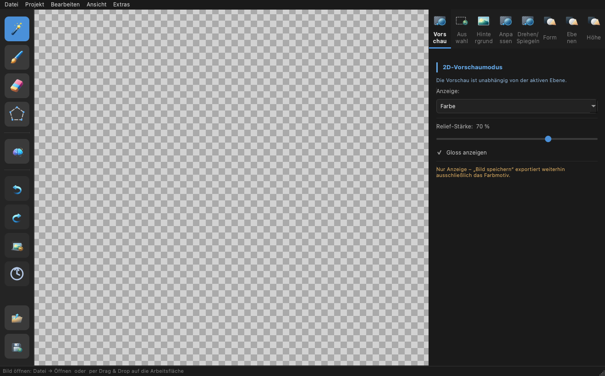
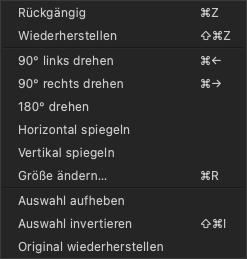
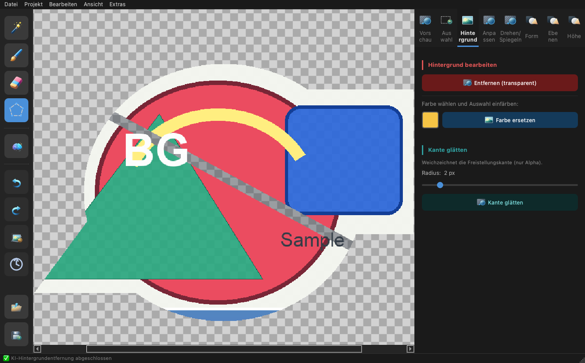
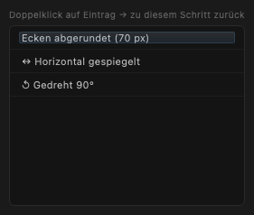
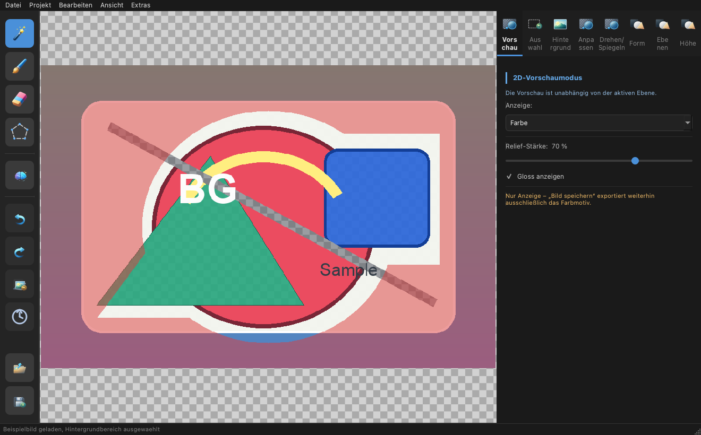
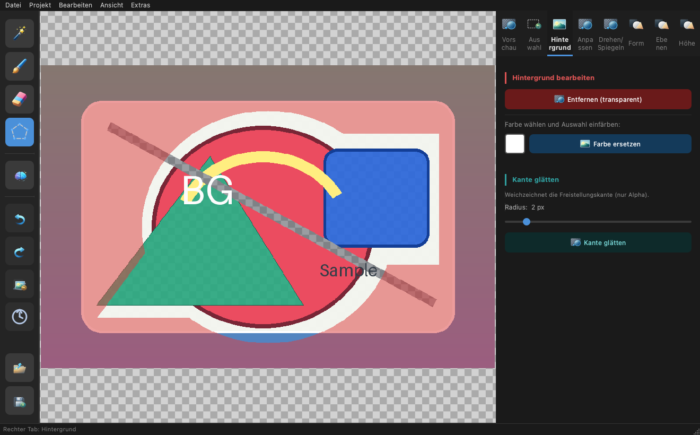
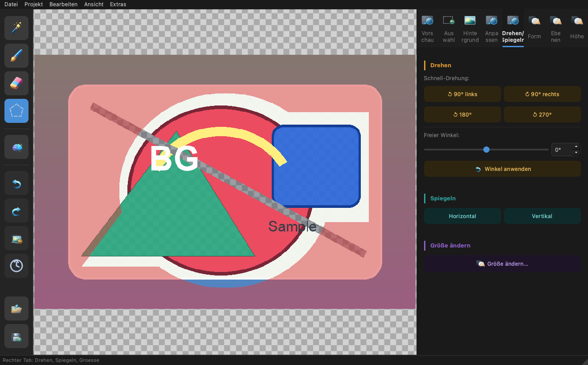
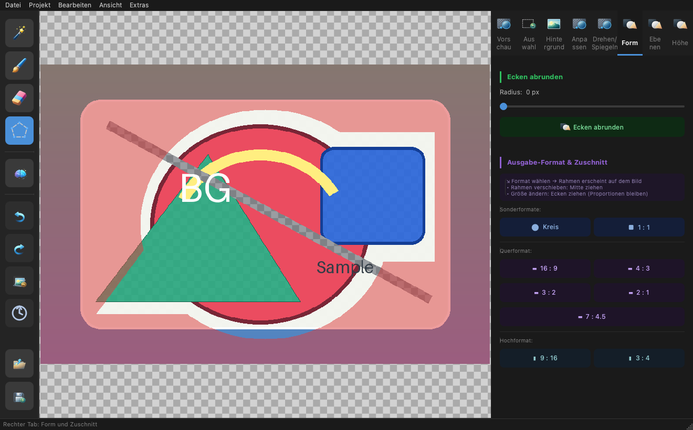
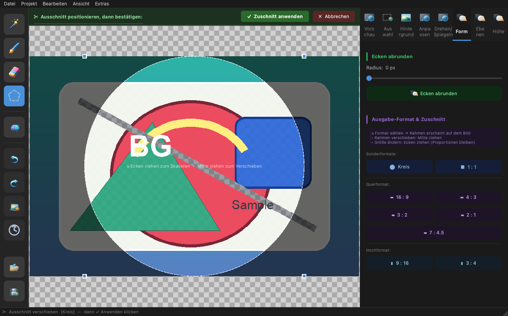
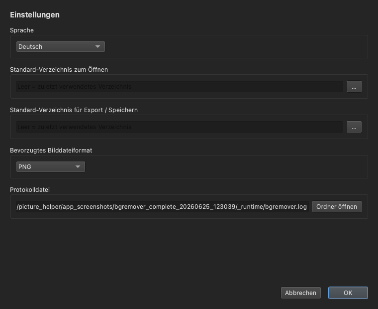

[Deutsch](../../../ANLEITUNG.md) · [English](../en/ANLEITUNG.md) · [Español](../es/ANLEITUNG.md) · [Français](../fr/ANLEITUNG.md) · **Українська** · [简体中文](../zh/ANLEITUNG.md)

> **Примітка:** PDF-версія цього посібника генерується лише для оригіналу
> німецькою мовою (`ANLEITUNG.pdf`). Для цього перекладу PDF не створюється.

# BgRemover – Посібник користувача

Цей посібник крок за кроком описує, як користуватися **BgRemover** — від
відкриття першого зображення до збереження готового результату. Він розрахований
на користувачів без попереднього досвіду редагування зображень.

> Примітки щодо **встановлення** навмисно не включено сюди; дивіться
> [INSTALL_MAC.md](INSTALL_MAC.md) (macOS) або
> [INSTALL_LINUX.md](INSTALL_LINUX.md) (Linux). Цей посібник передбачає, що
> програму вже можна запустити.

---

## Зміст

1. [Що вміє BgRemover?](#1-що-вміє-bgremover)
2. [Вікно програми — огляд](#2-вікно-програми--огляд)
3. [Швидкий старт за 5 кроків](#3-швидкий-старт-за-5-кроків)
4. [Відкриття зображення](#4-відкриття-зображення)
5. [Панель інструментів (ліворуч)](#5-панель-інструментів-ліворуч)
6. [Виділення](#6-виділення)
7. [Вкладка «Виділення»](#7-вкладка-виділення)
8. [Вкладка «Фон»](#8-вкладка-фон)
9. [Вкладка «Корекція» – Корекція кольору](#9-вкладка-корекція--корекція-кольору)
10. [Вкладка «Поворот/Дзеркало»](#10-вкладка-поворотдзеркало)
11. [Вкладка «Форма» – Кути та обрізання](#11-вкладка-форма--кути-та-обрізання)
12. [Зміна розміру та фізичні розміри](#12-зміна-розміру-та-фізичні-розміри)
13. [Шари та проєкти](#13-шари-та-проєкти)
14. [Робоча область карти висот](#14-робоча-область-карти-висот)
15. [2D-перегляд (колір, рельєф, висота, глянець)](#15-2d-перегляд-колір-рельєф-висота-глянець)
16. [Збереження та експорт](#16-збереження-та-експорт)
17. [Налаштування](#17-налаштування)
18. [Гарячі клавіші](#18-гарячі-клавіші)
19. [Типові робочі процеси](#19-типові-робочі-процеси)
20. [Поради та хитрощі](#20-поради-та-хитрощі)
21. [Відомі обмеження](#21-відомі-обмеження)
22. [Усунення неполадок і файл журналу](#22-усунення-неполадок-і-файл-журналу)
23. [Ліцензія](#23-ліцензія)

---

## 1. Що вміє BgRemover?

BgRemover — інструмент редагування зображень для **видалення, заміни та
редагування фонів** — з додатковими функціями для простої оптимізації
зображень, шарів/проєктів і підготовки ресурсів для UV-друку. Основні функції:

- **Видалення фону за допомогою ШІ** – автоматичне видалення фону одним
  кліком.
- **Ручне виділення** за допомогою чарівної палички, пензля, гумки та
  полігонального ласо.
- **Замінити фон** – зробити виділення прозорим або заповнити будь-яким
  кольором.
- **Трансформація** – обертання (кроками по 90° або вільним кутом) і
  дзеркалення.
- **Форма та обрізання** – заокруглення кутів, обрізання до кола або
  фіксованого співвідношення сторін.
- **Оптимізація зображення** – налаштування яскравості, контрасту й
  насиченості, а також згладжування альфа-краю (feather).
- **Розмір і фізичні розміри** – зміна розміру в пікселях або задання розміру
  друку через міліметри й DPI (з підказкою про площу друку).
- **Шари та проєкти** – керування кількома шарами (колір/висота/глянець/
  загальний) і збереження та відкриття всього як проєкту `.bgrproj`.
- **Карти висот** – створення карти висот із зображення, її редагування й
  оптимізація.
- **2D-перегляд** – перевірка кольору, рельєфу, висоти та глянцю на екрані.
- **Експорт для EufyMake Studio** – створення ресурсів імпорту для UV-друку.
- **Історія** зі скасуванням/повторенням і переходом до будь-якого
  попереднього кроку.
- **Збереження** у форматах PNG, JPEG, WebP або TIFF.

---

## 2. Вікно програми — огляд



*Головне вікно одразу після запуску: панель інструментів ліворуч, полотно з
шаховим візерунком прозорості по центру, панель вкладок праворуч (тут вкладка
«Виділення») та рядок стану внизу. Знімки екрана показують німецький інтерфейс;
підписи відповідають термінам, ужитим у цьому посібнику.*

Вікно поділено на чотири зони:

```
┌──────────┬───────────────────────────────┬──────────────────┐
│          │                               │                  │
│  Панель  │          Полотно              │  Панель          │
│  інстр.  │    (зображення + виділення)   │  вкладок         │
│ (ліворуч)│                               │ (налаштування)   │
│          │                               │                  │
├──────────┴───────────────────────────────┴──────────────────┤
│ Рядок стану (підказки та повідомлення)                       │
└──────────────────────────────────────────────────────────────┘
```

| Зона | Призначення |
|---|---|
| **Рядок меню** (вгорі) | Файл, Проєкт, Редагування, Вигляд, Додатково |
| **Панель інструментів** (ліворуч) | Інструменти виділення, ШІ, історія, відкрити/зберегти |
| **Полотно** (по центру) | Показує зображення та поточне виділення |
| **Панель вкладок** (праворуч) | Вісім вкладок: Перегляд, Виділення, Фон, Корекція, Поворот/Дзеркало, Форма, Шари, Висота |
| **Рядок стану** (внизу) | Підказки та повідомлення програми |

### Меню «Редагування», «Вигляд» та «Проєкт»

Багато дій також доступні через рядок меню:

- **Редагування** – скасувати/повторити, поворот (90° ліворуч/праворуч),
  горизонтальне/вертикальне дзеркалення, *Змінити розмір…*, а також зняти/
  інвертувати виділення та *Відновити оригінал*. Зручно, коли ви віддаєте
  перевагу меню перед панеллю інструментів або вкладкою.
- **Вигляд** – *Вписати у вікно* (⌘0) та підменю *Режим перегляду* (див.
  [розділ 15](#15-2d-перегляд-колір-рельєф-висота-глянець)); див. також «Масштаб
  і вигляд» нижче.
- **Проєкт** – *Новий проєкт*, *Відкрити проєкт…*, *Зберегти проєкт* /
  *…як…* (`.bgrproj`) та *Експортувати ресурси для EufyMake Studio…* (див.
  [розділ 13](#13-шари-та-проєкти) і [розділ 16](#16-збереження-та-експорт)).



*Меню «Редагування» об'єднує скасувати/повторити, поворот, дзеркалення та
дії з виділенням.*

### Масштаб і вигляд

- **Масштабування:** **колесом миші** над полотном збільшуйте або
  зменшуйте вигляд.
- **Прокручування:** якщо зображення більше за вікно, орієнтуйтеся за
  допомогою **смуг прокручування** праворуч і знизу.
- **Вписати:** `Вигляд → Вписати у вікно` (⌘0) знову масштабує зображення
  повністю у вікно. Це також відбувається автоматично під час
  завантаження зображення.

---

## 3. Швидкий старт за 5 кроків

Видаліть фон менш ніж за хвилину:

1. **Відкрити зображення** – `Файл → Відкрити` (⌘O / Ctrl+O) або перетягніть
   зображення у вікно.
2. **Запустити ШІ** – натисніть **значок ШІ** на лівій панелі інструментів.
   Фон видаляється автоматично.
3. **Доопрацювання (необов'язково)** – використовуйте **гумку** для видалення
   залишків виділення або **пензель** для додавання.
4. **Перевірка** – якщо потрібно, натисніть **Скасувати** (⌘Z) щоб відступити
   на крок назад.
5. **Зберегти** – `Файл → Зберегти` (⌘S), виберіть формат **PNG** (зберігає
   прозорість).



*Після одного кліку на значку ШІ фон вирізається автоматично; рядок стану
підтверджує завершення видалення фону за допомогою ШІ, а шаховий візерунок
позначає прозорі зони.*

Наступні розділи пояснюють кожен крок докладно.

---

## 4. Відкриття зображення

Є кілька способів завантажити зображення:

- **Меню:** `Файл → Відкрити…` (⌘O / Ctrl+O).
- **Перетягування:** перетягніть файл зображення з менеджера файлів безпосередньо
  на полотно. Якщо перетягнути кілька файлів, завантажується лише перше
  зображення.
- **Останні файли:** `Файл → Останні файли` — список із 10 останніх відкритих
  записів. Це як зображення, так і **проєкти** `.bgrproj` (див.
  [розділ 13](#13-шари-та-проєкти)); після кліку програма визначає тип і
  відкриває його відповідно.
- **Запуск зі шляхом до зображення:** якщо програму запущено зі шляхом до
  зображення — через **командний рядок** (`bgremover image.png`) або
  **Linux-ярлик робочого столу** (асоціація файлів) — вона завантажує це
  зображення безпосередньо під час запуску.
- **Відкриття через macOS Finder:** на macOS зображення також можна передати
  BgRemover **подвійним кліком**, через «Відкрити за допомогою…» або
  **асоціацію файлів** у Finder.

Усі ці шляхи використовують той самий **перевірений асинхронний шлях
завантаження**: застосовуються однакові перевірки формату й розміру, а великі
зображення завантажуються у фоновому режимі — рядок стану показує прогрес.


*Меню «Файл» містить Відкрити (⌘O), «Останні файли», Зберегти (⌘S) та
Зберегти як… (⇧⌘S).*

**Підтримувані вхідні формати** — обов'язково **PNG, JPEG, WebP, TIFF, BMP і
GIF**. Цей список є чинним вхідним контрактом, а не прикладом: інші формати
відхиляються контрольовано. Зокрема, **HEIC/HEIF наразі навмисно не
підтримується** — файл HEIC/HEIF відхиляється як непідтримуваний формат.
Збереження — у PNG, JPEG, WebP або TIFF (див. [розділ 16](#16-збереження-та-експорт)).

> **Максимальний розмір зображення: 40 мегапікселів.** Більші зображення
> відхиляються з повідомленням у рядку стану.

---

## 5. Панель інструментів (ліворуч)

Вертикальна панель уздовж лівого краю містить зверху вниз:

### Інструменти виділення

| Значок | Інструмент | Функція |
|---|---|---|
| 🪄 | **Чарівна паличка** | Виділяє суцільну область схожого кольору одним кліком (заливка). Регулюється через *Допуск*. |
| 🖌 | **Пензель** | Намалювати виділення вручну. |
| 🧽 | **Гумка** | Видалити намальоване виділення. |
| ⬡ | **Полігональне ласо** | Клацайте точки по одній; **подвійний клік** замикає полігон. **Esc** скасовує. |

Швидке перемикання з клавіатури: **W** паличка, **B** пензель,
**E** гумка, **L** ласо.

Для всіх інструментів виділення:

- **Shift + клік** → **додати** до виділення
- **Ctrl/Cmd + клік** → **вирахувати** з виділення

### Видалення фону за допомогою ШІ

| Значок | Функція |
|---|---|
| ✨ | **ШІ** – видаляє фон повністю автоматично. Модель ШІ завантажується при першому використанні — це може зайняти мить. |

> Якщо компонент ШІ (`rembg`) не встановлено, кнопка неактивна. Зверніться
> до посібника зі встановлення для налаштування функції ШІ.

### Історія

| Значок | Функція |
|---|---|
| ↩ | **Скасувати** (⌘Z) – повернутися до попереднього кроку |
| ↪ | **Повторити** (⇧⌘Z) – застосувати скасований крок знову |
| ⟲ | **Відновити оригінал** – відкинути всі зміни |
| 🕘 | **Історія змін** – список усіх кроків; **подвійний клік** на записі повертає до цього стану |



*Історія змін перелічує кожен крок редагування; подвійний клік на записі
повертає саме до цього стану.*

### Файл

| Значок | Функція |
|---|---|
| 📂 | **Відкрити зображення** (⌘O) |
| 💾 | **Зберегти зображення** (⌘S) |

> **Порада:** Наведіть курсор на значок, щоб побачити короткий підказковий
> текст (tooltip).

---

## 6. Виділення

Майже всі операції редагування (зробити прозорим, замінити колір) застосовуються
до **поточно виділеної зони**. Виділення підсвічується кольором на зображенні.



*Завантажене зображення з активним виділенням: виділена зона фону підсвічена
кольором на полотні.*

### За допомогою чарівної палички (рекомендовано для одноколірних фонів)

1. Виберіть чарівну паличку на панелі інструментів.
2. Клацніть по фону — всі схожі суміжні кольори буде виділено.
3. Недостатньо? Використовуйте **Shift+клік** для додавання зон або збільшіть
   **Допуск** (вкладка *Виділення*).

### За допомогою пензля та гумки (для точних коригувань)

- **Пензель:** малюйте по бажаній зоні, щоб додати її до виділення.
- **Гумка:** малюйте по неправильно виділених зонах, щоб видалити їх.
- Встановіть **розмір пензля** у вкладці *Виділення*.

### За допомогою полігонального ласо (для прямих країв)

1. Виберіть ласо.
2. Клацайте кут за кутом навколо об'єкта.
3. **Подвійний клік** замикає полігон і створює виділення.
4. **Esc** скасовує операцію.

---

## 7. Вкладка «Виділення»

Перша вкладка редагування правої панелі керує поведінкою виділення; її вже видно
в огляді вище ([розділ 2](#2-вікно-програми--огляд)) і на ілюстрації в [розділі 6](#6-виділення).

### Підказки щодо інструментів

Угорі перелічено чотири інструменти виділення з коротким описом і клавішами-
модифікаторами (Shift = додати, Ctrl/Cmd = вирахувати).

### Налаштування

| Повзунок | Діапазон | Ефект |
|---|---|---|
| **Допуск (чарівна паличка)** | 0 – 255 (за замовчуванням: 30) | Наскільки схожими мають бути кольори для спільного виділення. **Низько** = лише дуже схожі кольори · **Висо­ко** = багато відтінків. |
| **Розмір пензля** | 4 – 200 пкс (за замовчуванням: 30 пкс) | Діаметр пензля та гумки. |

### Дії з виділенням

- **Зняти виділення** – скасовує поточне виділення. **Esc** спочатку скасовує
  активний crop або розпочате полігональне ласо й лише потім знімає виділення,
  якщо жодна з цих взаємодій не активна.
- **Інвертувати виділення** (⌘⇧I) – міняє виділені та невиділені зони
  місцями. Корисно: спочатку виділіть *об'єкт*, потім інвертуйте для
  редагування *фону*.
- **Розширити / Звузити** – збільшує або зменшує виділення на зазначений
  радіус (1 – 20 пкс, за замовчуванням: 2 пкс). Корисно для видалення тонкої кольорової смуги після
  вирізання.

---

## 8. Вкладка «Фон»

Тут поточне виділення безпосередньо змінюється.



*Вкладка «Фон»: «Видалити (прозорий)» робить виділення прозорим; кольорове поле
та «Замінити колір» заповнюють його кольором.*

| Дія | Опис |
|---|---|
| **Видалити (прозорий)** | Робить виділену зону повністю прозорою. Порада: спочатку виділіть фон чарівною паличкою. |
| **Вибрати колір** | Відкриває палітру кольорів. Маленька кольорова кнопка показує поточний колір заміни. |
| **Замінити колір** | Заповнює виділену зону вибраним кольором. |


*«Вибрати колір» відкриває палітру; вибраний колір з'являється в полі та
застосовується до виділення кнопкою «Замінити колір».*

**Типовий робочий процес:** виділити фон за допомогою чарівної палички/ШІ →
*Видалити (прозорий)* для вирізаного PNG, **або** вибрати колір і
*Замінити колір* для суцільного фону (наприклад, білого для фото на
документи).

### Згладити край (feather)

У розділі *Згладити край* тієї самої вкладки можна згладити **альфа-край** —
корисно проти жорстких країв із виглядом «вирізаного» після видалення.

- **Радіус:** 0 – 20 пкс (за замовчуванням: 2 пкс) задає ширину м'якого
  переходу.
- **Згладити край** застосовує згладжування. Воно зачіпає лише **канал
  прозорості** (кольори не змінюються) і — коли активне виділення — лише
  всередині виділення.

---

## 9. Вкладка «Корекція» – Корекція кольору

Вкладка *Корекція* містить просту **корекцію кольору**. Вона діє на **активний
кольоровий шар** (див. [розділ 13](#13-шари-та-проєкти)) і залишає прозорість
незмінною.

| Повзунок | Діапазон | Ефект |
|---|---|---|
| **Яскравість** | 0 – 200 % (за замовчуванням: 100 %) | Освітлити або затемнити зображення. |
| **Контраст** | 0 – 200 % (за замовчуванням: 100 %) | Різниця між світлими та темними зонами. |
| **Насиченість** | 0 – 200 % (за замовчуванням: 100 %) | Інтенсивність кольору; 0 % дає відтінки сірого. |

- Поки ви рухаєте повзунки, полотно показує **живий перегляд**.
- **Застосувати** фіксує корекцію (зі скасуванням/повторенням в історії).
- **Скинути** повертає всі три повзунки до 100 % і відкидає перегляд.

---

## 10. Вкладка «Поворот/Дзеркало»



*Вкладка «Поворот/Дзеркало» зі швидким поворотом (90°/180°/270°), вільним кутом
і кнопками горизонтального та вертикального дзеркалення.*

### Поворот

- **Швидкий поворот:** кнопки для *90° ліворуч*, *90° праворуч*, *180°* і
  *270°*.
- **Вільний кут:** повзунок або поле введення від **−180° до +180°**, потім
  натисніть **Застосувати кут**. Косі кути створюють прозорі кути.

### Дзеркало

- **Горизонтально** – відобразити ліворуч ↔ праворуч.
- **Вертикально** – відобразити вгорі ↕ внизу.

> Швидкий поворот також доступний за допомогою клавіатури: ⌘← (90°
> ліворуч) і ⌘→ (90° праворуч). У самому низу вкладки **Змінити розмір…**
> веде до діалогу з [розділу 12](#12-зміна-розміру-та-фізичні-розміри).

---

## 11. Вкладка «Форма» – Кути та обрізання



*Вкладка «Форма»: угорі «Заокруглити кути» з повзунком радіуса; нижче — формати
обрізання (спеціальні, альбомні та книжкові).*

### Заокруглення кутів

1. Використовуйте повзунок **Радіус** для налаштування заокруглення (0 = без
   заокруглення, до 500 пкс = максимум).
2. Натисніть **Заокруглити кути**.

Результат зберігається з прозорими кутами — найкраще у форматі PNG.

### Вихідний формат і обрізання

1. Виберіть формат — на зображенні з'явиться **рамка**:
   - **Спеціальні формати:** ⬤ Коло, ■ 1:1 (квадрат)
   - **Альбомна орієнтація:** 16:9, 4:3, 3:2, 2:1, 7:4.5 (14:9)
   - **Книжкова орієнтація:** 9:16, 3:4
2. **Перемістити рамку:** клацніть по центру та перетягніть.
3. **Змінити розмір:** перетягніть кути — співвідношення сторін зберігається.
4. Над полотном з'являється панель:
   - **✓ Застосувати обрізання** – обрізає зображення.
   - **✗ Скасувати** – відкидає рамку.



*Приклад «Коло»: рамка обрізання лежить над зображенням із маркерами.
«✓ Застосувати обрізання» обрізає зображення, «✗ Скасувати» відкидає рамку.*

---

## 12. Зміна розміру та фізичні розміри

Через `Редагування → Змінити розмір…` (Ctrl+R) або кнопку **Змінити розмір…**
у вкладці *Поворот/Дзеркало* ви масштабуєте зображення до нового цільового
розміру. Діалог підтримує дві одиниці виміру:

### Зміна розміру в пікселях

У режимі **Пікселі** ви вводите **Ширину** та **Висоту** безпосередньо в
пікселях. З **Зв'язати співвідношення сторін** пропорція зберігається. Метод
передискретизації визначає якість:

| Метод | Придатність |
|---|---|
| **Lanczos** | Найкраща якість (за замовчуванням), ідеально для зменшення. |
| **Бікубічний** | Гладкі результати, добрий універсал. |
| **Білінійний** | Швидший, дещо м'якший. |
| **Найближчий сусід** | Зберігає жорсткі краї/пікселі, без згладжування. |

Діалог показує підсумкову кількість мегапікселів і дотримується ліміту в
**40 мегапікселів**.

### Фізичні розміри (мм/DPI) і площа друку

У режимі **Міліметри (мм + DPI)** ви задаєте **ширину/висоту в міліметрах** і
**роздільність (DPI)**; з них випливає розмір у пікселях. Цей фізичний розмір є
визначальним розміром друку й зберігається в проєкті `.bgrproj`.

Через **Цільовий носій** ви вибираєте поширений носій друку (наприклад, A4 або
A3). Якщо мотив на ньому вміщується, діалог це підтверджує; якщо він більший за
носій, підказка вказує на перевищення площі друку.

---

## 13. Шари та проєкти

BgRemover може керувати кількома **шарами** в **проєкті** й зберігати все як
файл `.bgrproj`. Для класичного редагування фону вам не потрібно цим займатися —
одне зображення поводиться як єдиний кольоровий шар.

### Типи та ролі шарів

Кожен шар має **тип** і за бажанням **роль**. Лише **кольорові шари** формують
видиме кольорове зображення; інші типи — це шари даних для підготовки друку.

| Тип / роль | Значення |
|---|---|
| **Колір** (кольоровий мотив) | Видиме зображення. Кілька кольорових шарів разом утворюють композит, який також експортується. |
| **Висота** (карта висот) | Карта висот у відтінках сірого для рельєфу/UV-друку (див. [розділ 14](#14-робоча-область-карти-висот)). |
| **Глянець** (маска глянцю) | Маска для ефектів глянцю (експериментально). |
| **Загальний** | Нейтральний шар даних без фіксованої ролі. |

### Вкладка «Шари»

У вкладці *Шари* ви керуєте списком шарів:

| Дія | Опис |
|---|---|
| **Новий шар / Дублювати / Видалити** | Додати шар, скопіювати активний шар або видалити його. |
| **Вгору / Вниз** | Змінити порядок розташування шарів. |
| **Перейменувати** | Перейменувати активний шар. |
| **Роль** | Призначити роль активному шару (дозволені лише сумісні комбінації). |
| **Видимість** | Показати або сховати шар. |
| **Вибрати** | Вибрати шар як **активний** – інструменти діють на нього. |
| **Непрозорість** | Непрозорість шару (застосовується при відпусканні). |

### Файли проєктів (.bgrproj)

Через меню **Проєкт** ви працюєте з файлами проєктів:

- **Новий проєкт** (Ctrl+N), **Відкрити проєкт…** (Ctrl+Shift+O).
- **Зберегти проєкт** (Ctrl+Alt+S) та **Зберегти проєкт як…**
  (Ctrl+Alt+Shift+S).

Файл `.bgrproj` — це архів із **маніфесту** (порядок, типи, ролі, назви, фізичні
розміри) та **по одному PNG на шар**. Так усі шари зберігаються без втрат,
включно з прозорістю. Проєкти також з'являються в «Останніх файлах» (див.
[розділ 4](#4-відкриття-зображення)).

---

## 14. Робоча область карти висот

**Карта висот** — шар у відтінках сірого, де яскравість представляє висоту:
**світле = високе, темне = низьке**. Вона є основою для рельєфу та UV-друку.
Вкладка *Висота* поділена на три розділи й працює на активному **шарі висоти**;
функції редагування та оптимізації активні лише тоді, коли активний шар висоти.

### Отримати

- **Створити із зображення** – детерміновано перетворює поточне кольорове
  зображення на карту висот і створює її як новий шар висоти.
- **Імпортувати відтінки сірого…** – завантажує зображення у відтінках сірого
  як карту висот і масштабує його до розміру проєкту.

### Редагувати

- **Освітлити / Затемнити** – підіймає або опускає висоту; **Інтенсивність**
  керує силою.
- **Задати висоту** – встановлює висоту на фіксоване **значення**.
- **Інвертувати** – міняє місцями високе й низьке.

Коли активне виділення, ці дії діють лише всередині виділення, інакше — на весь
шар.

### Оптимізувати

Операції оптимізації показують **живий перегляд**; **Застосувати** фіксує його
(зі скасуванням/повторенням), **Відкинути перегляд** його відкидає.

| Операція | Ефект |
|---|---|
| **Рівні (чорне/біле)** | Встановити чорну й білу точку висоти. |
| **Гамма** | Підтягнути середні висоти світліше/темніше. |
| **Розмиття за Гаусом (радіус)** | М'яке рівномірне згладжування. |
| **Медіанне розмиття (радіус)** | Згладжує, зберігаючи краї. |
| **Поріг** | Розділити висоту на два рівні. |
| **Сходинки** | Квантувати висоту до певної кількості рівнів. |
| **Діапазон (мін/макс)** | Обмежити висоту діапазоном значень. |

---

## 15. 2D-перегляд (колір, рельєф, висота, глянець)

**2D-перегляд** показує різні вигляди того самого мотиву безпосередньо на
полотні. Це **чисте екранне відображення**, яке не змінює ні зображення, ні
експорт. Виберіть режим у вкладці *Перегляд* або через `Вигляд → Режим
перегляду`.

| Режим | Відображення |
|---|---|
| **Колір** | Звичайне кольорове зображення. |
| **Рельєф над кольором** | Затінений рельєф із карти висот, накладений множенням на кольорове зображення. |
| **Висота (відтінки сірого)** | Карта висот як зображення у відтінках сірого. |
| **Глянець** | Маска глянцю як глянцевий відблиск. |
| **Комбіновано** | Колір, рельєф і глянець разом. |

- За допомогою **Інтенсивності рельєфу** ви задаєте інтенсивність рельєфу; при
  0 % рельєф пропускається.
- **Показати глянець** вмикає або вимикає шар глянцю.

Вкладка перегляду та підменю Вигляд залишаються синхронізованими. Сховані шари
даних у перегляді ігноруються.

---

## 16. Збереження та експорт

- **Зберегти:** `Файл → Зберегти` (⌘S / Ctrl+S)
- **Зберегти як…:** `Файл → Зберегти як…` (⇧⌘S)

Під час збереження завжди записується **кольоровий композит** (незалежно від
того, який шар активний або який режим перегляду встановлено). Виберіть потрібний
**формат файлу** у діалозі:

| Формат | Властивості | Рекомендація |
|---|---|---|
| **PNG** | З прозорістю | Для вирізаних об'єктів – **рекомендований за замовчуванням** |
| **JPEG** | Без альфа-каналу; прозорі зони стають білими | Для фотографій з непрозорим фоном |
| **WebP** | Сучасний веб-формат, підтримує прозорість | Для використання в мережі |
| **TIFF** | Без втрат, підтримує прозорість | Для архівування/друку |

> Щоб зберегти вирізання, **завжди вибирайте PNG, WebP або TIFF** — JPEG
> заповнює прозорі зони білим кольором.

### Експорт для EufyMake Studio

Через `Проєкт → Експортувати ресурси для EufyMake Studio…` (Ctrl+Alt+E) BgRemover
записує **ресурси імпорту** для EufyMake Studio — **не** готовий файл `.empf`:

- **Кольоровий мотив** (обов’язково) як RGBA PNG – із шару з роллю *Кольоровий
  мотив* або, якщо такого немає, із кольорового композиту.
- **Карта висот** (необов’язково) у відтінках сірого зі **світле = високе,
  темне = низьке** – доступна лише тоді, коли шар має роль *Карта висот*
  (наприклад, шар висоти, створений через «Створити із зображення»; звичайний
  шар висоти без цієї ролі не експортується).
- **Маска глянцю** (необов’язково, експериментально) як допоміжний ресурс –
  доступна лише тоді, коли шар має роль *Глянець*.

У діалозі ви вибираєте теку експорту, необов'язкові ресурси та **бітову
глибину** карти висот (8 біт за замовчуванням, 16 біт експериментально).
**Перевірка перед експортом** виконується безперервно й повідомляє про висновки
за рівнем серйозності:

- **Помилки** (⛔) блокують експорт до виправлення – наприклад, відсутній
  кольоровий мотив або невідповідні розміри.
- **Попередження** (⚠️) потрібно свідомо підтвердити – наприклад, порожні дані
  висоти/глянцю або непідтверджений 16-бітний вивід.

Далі ви імпортуєте та розташовуєте ресурси в EufyMake Studio, призначаєте там
режими чорнила/шари й зберігаєте проєкт Studio як `.empf`.

---

## 17. Налаштування

Через `Додатково → Налаштування…` (⌘, / Ctrl+,) можна керувати такими
параметрами:



*Діалог налаштувань: мова, типові теки для відкриття та збереження, бажаний
формат зображення і шлях до файлу журналу з кнопкою «Відкрити теку».*

| Налаштування | Опис |
|---|---|
| **Типова тека для відкриття** | Початкова тека діалогу відкриття (порожньо = остання використана) |
| **Типова тека для експорту/збереження** | Початкова тека діалогу збереження (порожньо = остання використана) |
| **Бажаний формат зображення** | PNG, JPEG, WebP або TIFF – показується першим варіантом у діалозі збереження |
| **Мова** | Німецька або англійська; зміна набуває чинності після перезапуску |
| **Файл журналу** | Показує шлях до файлу журналу; кнопка «Відкрити теку» відкриває директорію у менеджері файлів |

Теки, бажаний формат і мова зберігаються між перезапусками програми.

---

## 18. Гарячі клавіші

На macOS клавіша-модифікатор — **⌘ (Cmd)**, на Linux/Windows — **Ctrl**.

| Дія | Гаряча клавіша |
|---|---|
| Вибрати чарівну паличку | W |
| Вибрати пензель | B |
| Вибрати гумку | E |
| Вибрати полігональне ласо | L |
| Відкрити зображення | ⌘O |
| Зберегти зображення | ⌘S |
| Зберегти зображення як… | ⇧⌘S |
| Новий проєкт | ⌘N |
| Відкрити проєкт… | ⇧⌘O |
| Зберегти проєкт | ⌥⌘S |
| Зберегти проєкт як… | ⇧⌥⌘S |
| Експортувати ресурси для EufyMake Studio… | ⌥⌘E |
| Скасувати | ⌘Z |
| Повторити | ⇧⌘Z |
| Змінити розмір… | ⌘R |
| Поворот на 90° ліворуч | ⌘← |
| Поворот на 90° праворуч | ⌘→ |
| Зняти виділення (якщо crop/ласо не активні) | Esc |
| Інвертувати виділення | ⌘⇧I |
| Вписати у вікно | ⌘0 |
| Відкрити налаштування | ⌘, |

---

## 19. Типові робочі процеси

### A) Вирізати фото товару (прозорий фон)

1. Відкрийте зображення.
2. Натисніть **ШІ** на панелі інструментів.
3. Уточніть краї за допомогою **гумки**/**пензля**.
4. У вкладці *Виділення* за потреби **Звузити** (1–2 пкс) для видалення
   кольорового краю.
5. Збережіть у форматі **PNG**.

### B) Фото на документи з білим фоном

1. Відкрийте зображення.
2. Клацніть **чарівною паличкою** по фону (налаштуйте допуск).
3. Вкладка *Фон* → **Вибрати колір** (білий) → **Замінити колір**.
4. Вкладка *Форма* → виберіть формат **1:1**, розташуйте рамку, натисніть
   **✓ Застосувати обрізання**.
5. Збережіть у форматі **JPEG** або **PNG**.

### C) Кругле фото профілю

1. Відкрийте зображення.
2. Видаліть фон за допомогою **ШІ** (необов'язково).
3. Вкладка *Форма* → виберіть **⬤ Коло**, перетягніть рамку на обличчя.
4. Натисніть **✓ Застосувати обрізання**.
5. Збережіть у форматі **PNG** (прозоре поза колом).

### D) Зберегти об'єкт, замінити лише фон

1. Відкрийте зображення, клацніть **чарівною паличкою** по **об'єкту**.
2. Вкладка *Виділення* → **Інвертувати виділення** (⌘⇧I) → тепер виділено
   фон.
3. Вкладка *Фон* → виберіть колір → **Замінити колір**.
4. Збережіть.

### E) Ресурс рельєфу висоти для EufyMake Studio

1. Відкрийте та виріжте зображення.
2. Вкладка *Висота* → **Створити із зображення**.
3. Доопрацюйте висоту в розділі *Оптимізувати* (наприклад, *Рівні*, *Розмиття*)
   та натисніть **Застосувати**.
4. У *2D-перегляді* виберіть режим **Рельєф над кольором** або **Комбіновано**
   для перевірки.
5. `Проєкт → Експортувати ресурси для EufyMake Studio…`, перегляньте висновки
   й експортуйте.

---

## 20. Поради та хитрощі

- **Спочатку грубо, потім тонко:** вирізайте грубо за допомогою ШІ або
  чарівної палички, потім коригуйте пензлем/гумкою.
- **Налаштовуйте допуск:** якщо виділяється занадто багато → зменшіть допуск.
  Якщо занадто мало → збільшіть допуск або використовуйте Shift+клік.
- **Видалення кольорового краю:** після вирізання застосуйте «Звузити» на
  1–2 пкс у вкладці *Виділення* перед видаленням фону.
- **М'які краї:** за допомогою *Згладити край* (вкладка *Фон*) вирізані краї
  виглядають менш жорсткими.
- **Крок назад:** кожен крок записується в історії — двічі клацніть будь-який
  запис в **Історії змін** (🕘), щоб повернутися до цього стану.
- **Застрягли?** **Відновити оригінал** скидає зображення до стану
  завантаження.

---

## 21. Відомі обмеження

- **Максимальний розмір зображення: 40 мегапікселів.** Більші зображення
  відхиляються.
- **Вхідні формати:** підтримуються PNG, JPEG, WebP, TIFF, BMP і GIF.
  **HEIC/HEIF наразі не підтримується** й відхиляється контрольовано.
- **Функція ШІ** вимагає необов'язкового компонента `rembg`. Без нього кнопка
  ШІ неактивна; всі ручні інструменти продовжують працювати.
- **2D-перегляд** є чистим екранним відображенням; експорт зображення без змін
  записує кольоровий композит.
- **Експорт EufyMake** створює лише ресурси імпорту, **а не** нативний файл
  `.empf`; 16-бітний вивід висоти є експериментальним.
- **Пакет програми** (`BgRemover.app`) є специфічним для macOS; у Linux
  програма запускається безпосередньо. Windows наразі не входить до
  офіційно протестованої матриці.

---

## 22. Усунення неполадок і файл журналу

У разі проблем перевірте внутрішній **файл журналу** `bgremover.log`. Він
зберігається у визначеній Qt директорії даних програми та створюється під
час першого запису в журнал. Точний шлях може відрізнятися залежно від
платформи й конфігурації Qt:

- **macOS (поточна конфігурація):**
  `~/Library/Application Support/BgRemover/BgRemover/bgremover.log`
- **Linux:** під `~/.local/share/`

Лаунчер App-бандла macOS додатково записує діагностику запуску в
`~/Library/Application Support/BgRemover/bgremover.log`.

Внутрішній файл містить повідомлення виконання й деталі помилок
(стек-трейси) та є першим місцем звернення при запитах підтримки.

Найпростіший спосіб знайти файл — через `Додатково → Налаштування… → Файл
журналу`: там відображається повний шлях, а кнопка **«Відкрити теку»**
відкриває директорію безпосередньо в менеджері файлів — зручно для
прикріплення файлу журналу до листа підтримки.

| Проблема | Можливе рішення |
|---|---|
| Кнопка ШІ неактивна | `rembg` не встановлено – дивіться посібник зі встановлення |
| Зображення не відкривається | Понад 40 мегапікселів? Формат підтримується (не HEIC/HEIF)? Читайте рядок стану |
| ШІ працює дуже довго | Перший виклик завантажує модель – один раз, потім швидше |
| Прозорість зникла після збереження | Збережено у форматі JPEG → замість цього виберіть PNG/WebP/TIFF |
| Проєкт не відкривається | Пошкоджений/неповний файл `.bgrproj`? Читайте рядок стану |

---

## 23. Ліцензія

BgRemover поширюється під **GNU General Public License v3.0 або пізнішою
версією** (`GPL-3.0-or-later`) – дивіться [LICENSE](../../../LICENSE). Повний
список усіх використаних бібліотек та їх ліцензій є у
[RESOURCES.md](RESOURCES.md).

---

*Цей посібник є частиною проекту BgRemover. З питаннями або пропозиціями,
будь ласка, відкрийте issue у репозиторії GitHub.*
