[Deutsch](../../../ANLEITUNG.md) · [English](../en/ANLEITUNG.md) · [Español](../es/ANLEITUNG.md) · [Français](../fr/ANLEITUNG.md) · [Українська](../uk/ANLEITUNG.md) · **简体中文**

> **注意：** 本指南的 PDF 版本仅为德语原版（`ANLEITUNG.pdf`）生成。
> 本翻译版本不生成 PDF。

# BgRemover – 用户指南

本指南逐步介绍如何使用 **BgRemover** —— 从打开第一张图片到保存最终结果。
本指南面向没有图像编辑经验的用户。

> 有关**安装**的说明不在此处，请参阅
> [INSTALL_MAC.md](INSTALL_MAC.md)（macOS）或
> [INSTALL_LINUX.md](INSTALL_LINUX.md)（Linux）。本指南假设程序已经可以
> 启动。

---

## 目录

1. [BgRemover 能做什么？](#1-bgremover-能做什么)
2. [程序界面概览](#2-程序界面概览)
3. [5 步快速入门](#3-5-步快速入门)
4. [打开图片](#4-打开图片)
5. [工具栏（左侧）](#5-工具栏左侧)
6. [创建选区](#6-创建选区)
7. ["选区"选项卡](#7-选区选项卡)
8. ["背景"选项卡](#8-背景选项卡)
9. ["调整"选项卡 – 颜色校正](#9-调整选项卡--颜色校正)
10. ["旋转/翻转"选项卡](#10-旋转翻转选项卡)
11. ["形状"选项卡 – 圆角与裁剪](#11-形状选项卡--圆角与裁剪)
12. [调整尺寸与物理尺寸](#12-调整尺寸与物理尺寸)
13. [图层与项目](#13-图层与项目)
14. [高度图工作区](#14-高度图工作区)
15. [2D 预览（颜色、浮雕、高度、光泽）](#15-2d-预览颜色浮雕高度光泽)
16. [保存与导出](#16-保存与导出)
17. [设置](#17-设置)
18. [键盘快捷键](#18-键盘快捷键)
19. [典型工作流程](#19-典型工作流程)
20. [技巧与窍门](#20-技巧与窍门)
21. [已知限制](#21-已知限制)
22. [故障排除和日志文件](#22-故障排除和日志文件)
23. [许可证](#23-许可证)

---

## 1. BgRemover 能做什么？

BgRemover 是一款用于**移除、替换和编辑背景**的图像编辑工具 —— 还提供简单图像
优化、图层/项目以及 UV 打印资源准备等附加功能。主要功能：

- **AI 背景移除** —— 一键自动移除背景。
- **手动选区**，使用魔棒、画笔、橡皮擦和多边形套索。
- **替换背景** —— 将选区设为透明，或用任意颜色填充。
- **变换** —— 旋转（90° 步进或自由角度）和翻转。
- **形状与裁剪** —— 圆角、裁剪为圆形或固定宽高比。
- **图像优化** —— 调整亮度、对比度和饱和度，并柔化 Alpha 边缘（羽化）。
- **尺寸与物理尺寸** —— 更改像素尺寸，或通过毫米和 DPI 设定打印尺寸（带打印
  区域提示）。
- **图层与项目** —— 管理多个图层（颜色/高度/光泽/通用），并将整个内容保存和
  打开为 `.bgrproj` 项目。
- **高度图** —— 从图片生成高度图，然后进行编辑和优化。
- **2D 预览** —— 在屏幕上检查颜色、浮雕、高度和光泽。
- **EufyMake Studio 导出** —— 为 UV 打印生成导入资源。
- **历史记录**，支持撤销/重做，并可跳转到任意之前的编辑步骤。
- **保存**为 PNG、JPEG、WebP 或 TIFF 格式。

---

## 2. 程序界面概览

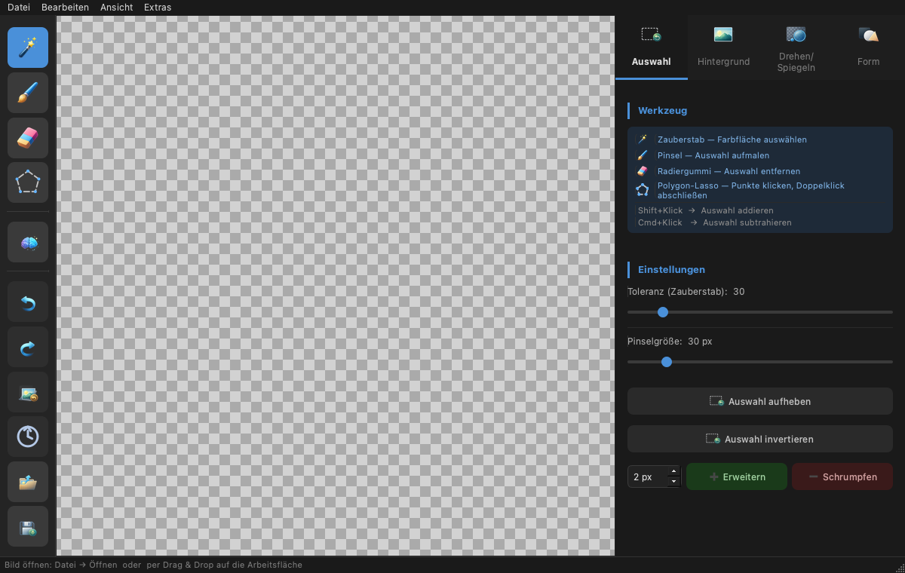

*启动后的主窗口：左侧为工具栏，中间为带透明棋盘格的画布，右侧为选项卡面板
（此处为"选区"选项卡），底部为状态栏。屏幕截图显示的是德语界面；标签与本指南
中使用的术语相对应。*

窗口分为四个区域：

```
┌──────────┬───────────────────────────────┬──────────────────┐
│          │                               │                  │
│  工具栏  │           画布                │   选项卡面板     │
│ （左侧） │      （图片 + 选区）           │   （设置）       │
│          │                               │   （右侧）       │
│          │                               │                  │
├──────────┴───────────────────────────────┴──────────────────┤
│ 状态栏（提示与消息）                                          │
└──────────────────────────────────────────────────────────────┘
```

| 区域 | 用途 |
|---|---|
| **菜单栏**（顶部） | 文件、项目、编辑、视图、扩展 |
| **工具栏**（左侧） | 选区工具、AI、历史记录、打开/保存 |
| **画布**（中央） | 显示图片和当前选区 |
| **选项卡面板**（右侧） | 八个选项卡：预览、选区、背景、调整、旋转/翻转、形状、图层、高度 |
| **状态栏**（底部） | 程序的提示和反馈 |

### "编辑"、"视图"与"项目"菜单

许多操作也可通过菜单栏执行：

- **编辑** —— 撤销/重做、旋转（向左/向右 90°）、水平/垂直翻转、*调整尺寸…*，
  以及取消选区/反选和*还原原图*。当你更习惯使用菜单而非工具栏或选项卡时很方便。
- **视图** —— *适应窗口*（⌘0）和*预览模式*子菜单（参见
  [第 15 节](#15-2d-预览颜色浮雕高度光泽)）；另请参见下文"缩放与视图"。
- **项目** —— *新建项目*、*打开项目…*、*保存项目* / *…为…*（`.bgrproj`），
  以及*导出 EufyMake Studio 资源…*（参见 [第 13 节](#13-图层与项目)和
  [第 16 节](#16-保存与导出)）。

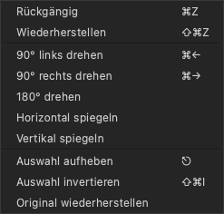

*"编辑"菜单汇集了撤销/重做、旋转、翻转和选区操作。*

### 缩放与视图

- **缩放：** 在画布上滚动**鼠标滚轮**即可放大或缩小视图。
- **平移：** 当图片大于窗口时，使用右侧和底部的**滚动条**进行导航。
- **适应窗口：** `视图 → 适应窗口`（⌘0）可将图片重新完整缩放到窗口内。加载
  图片时也会自动适应窗口。

---

## 3. 5 步快速入门

在一分钟内移除背景：

1. **打开图片** —— `文件 → 打开`（⌘O / Ctrl+O），或将图片拖放到窗口中。
2. **运行 AI** —— 点击左侧工具栏的 **AI 图标**。背景将自动移除。
3. **修整（可选）** —— 使用**橡皮擦**去除选区残留，或用**画笔**添加选区。
4. **检查** —— 如有需要，按**撤销**（⌘Z）后退一步。
5. **保存** —— `文件 → 保存`（⌘S），选择 **PNG** 格式（保留透明度）。

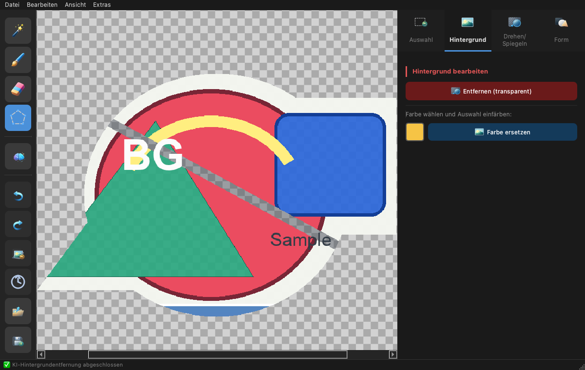

*点击 AI 图标后，背景会自动抠除；状态栏确认 AI 背景移除已完成，棋盘格图案标
示出透明区域。*

以下各节将详细解释每个步骤。

---

## 4. 打开图片

有多种方式加载图片：

- **菜单：** `文件 → 打开…`（⌘O / Ctrl+O）。
- **拖放：** 将图片文件从文件管理器直接拖到画布上。拖放多个文件时，仅加载第一张图片。
- **最近文件：** `文件 → 最近文件` 列出最近打开的 10 个条目。其中既有图片，
  也有 `.bgrproj` **项目**（参见 [第 13 节](#13-图层与项目)）；点击时程序会
  识别类型并相应地打开。
- **使用图片路径启动：** 当程序以图片路径启动时 —— 通过**命令行**
  （`bgremover image.png`）或 **Linux 桌面启动器**（文件关联）—— 它会在启动时
  直接加载该图片。
- **macOS Finder 打开：** 在 macOS 上，还可以通过**双击**、"打开方式…"或
  Finder 中的**文件关联**将图片交给 BgRemover。

所有这些方式都使用同一个**经过验证的异步加载路径**：应用相同的格式和尺寸检查，
大型图片在后台加载 —— 状态栏显示进度。

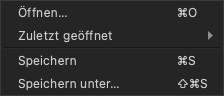

*"文件"菜单汇集了打开（⌘O）、"最近文件"、保存（⌘S）和另存为…（⇧⌘S）。*

**受支持的输入格式**为强制约定的 **PNG、JPEG、WebP、TIFF、BMP 和 GIF**。该列表
是当前的输入约定，而非示例：其他格式会被受控地拒绝。特别地，**HEIC/HEIF 目前
按设计不受支持** —— HEIC/HEIF 文件会作为不受支持的格式被拒绝。保存为 PNG、JPEG、
WebP 或 TIFF（参见 [第 16 节](#16-保存与导出)）。

> **最大图片尺寸：40 兆像素。** 超出此限制的图片将被拒绝，并在状态栏中
> 显示提示信息。

---

## 5. 工具栏（左侧）

左侧边缘的垂直工具栏从上到下包含：

### 选区工具

| 图标 | 工具 | 功能 |
|---|---|---|
| 🪄 | **魔棒** | 单击选择相似颜色的连续区域（洪水填充）。可通过*容差*调节。 |
| 🖌 | **画笔** | 手动涂抹选区。 |
| 🧽 | **橡皮擦** | 删除已涂抹的选区。 |
| ⬡ | **多边形套索** | 逐点单击；**双击**闭合多边形。**Esc** 取消。 |

键盘快速切换：**W** 魔棒、**B** 画笔、
**E** 橡皮擦、**L** 套索。

所有选区工具均适用：

- **Shift + 单击** → **添加**到选区
- **Ctrl/Cmd + 单击** → 从选区**减去**

### AI 背景移除

| 图标 | 功能 |
|---|---|
| ✨ | **AI** —— 全自动移除背景。首次使用时加载 AI 模型，可能需要片刻。 |

> 如果未安装 AI 组件（`rembg`），该按钮将显示为灰色。请参阅安装指南
> 设置 AI 功能。

### 历史记录

| 图标 | 功能 |
|---|---|
| ↩ | **撤销**（⌘Z）—— 撤销最后一步 |
| ↪ | **重做**（⇧⌘Z）—— 重新应用已撤销的步骤 |
| ⟲ | **还原原图** —— 丢弃所有编辑 |
| 🕘 | **编辑历史** —— 所有步骤的列表；**双击**某条记录可跳转到该状态 |


*编辑历史列出每一个编辑步骤；双击某条记录即可精确跳回该状态。*

### 文件

| 图标 | 功能 |
|---|---|
| 📂 | **打开图片**（⌘O） |
| 💾 | **保存图片**（⌘S） |

> **提示：** 将鼠标悬停在图标上可显示简短的提示文字（tooltip）。

---

## 6. 创建选区

几乎所有编辑操作（设为透明、替换颜色）都作用于**当前选区**。选区在图片
上以颜色高亮显示。

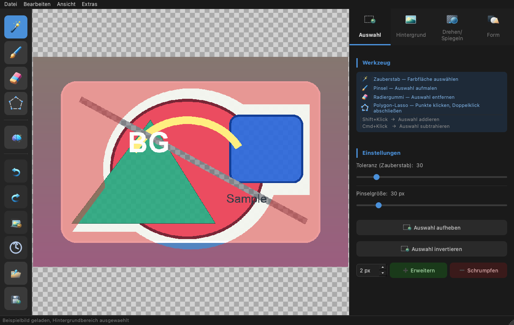

*已加载图片并带有活动选区：选中的背景区域在画布上以颜色高亮显示。*

### 使用魔棒（推荐用于纯色背景）

1. 在工具栏中选择魔棒。
2. 单击背景 —— 所有相似的连续颜色均被选中。
3. 不够？使用 **Shift+单击**添加更多区域，或增大**容差**（*选区*选项卡）。

### 使用画笔和橡皮擦（用于精细调整）

- **画笔：** 在目标区域涂抹，将其添加到选区。
- **橡皮擦：** 在错误选中的区域涂抹，将其从选区中移除。
- 在*选区*选项卡中设置**画笔大小**。

### 使用多边形套索（用于直线边缘）

1. 选择套索工具。
2. 围绕对象逐角单击。
3. **双击**闭合多边形并创建选区。
4. **Esc** 取消操作。

---

## 7. "选区"选项卡

右侧面板的第一个编辑选项卡控制选区行为；它在上方的界面概览（[第 2 节](#2-程序界面概览)）和[第 6 节](#6-创建选区)的
插图中已经可以看到。

### 工具提示

顶部列出四种选区工具及其简短说明和修饰键（Shift = 添加，
Ctrl/Cmd = 减去）。

### 设置

| 滑块 | 范围 | 效果 |
|---|---|---|
| **容差（魔棒）** | 0 – 255（默认：30） | 颜色之间的相似程度。**低** = 仅非常相似的颜色 · **高** = 许多色调。 |
| **画笔大小** | 4 – 200 像素（默认：30 像素） | 画笔和橡皮擦的直径。 |

### 选区操作

- **取消选区** —— 清除当前选区。**Esc** 会优先取消活动裁剪或已开始的多边形套索，
  仅在两者都未激活时清除选区。
- **反选**（⌘⇧I）—— 交换已选区域和未选区域。技巧：先选择*对象*，然后
  反选以编辑*背景*。
- **扩展 / 收缩** —— 按相邻半径（1 – 20 像素，默认：2 像素）扩大或缩小选区。用于去除
  抠图后的细色边。

---

## 8. "背景"选项卡

在此处对当前选区进行实际修改。

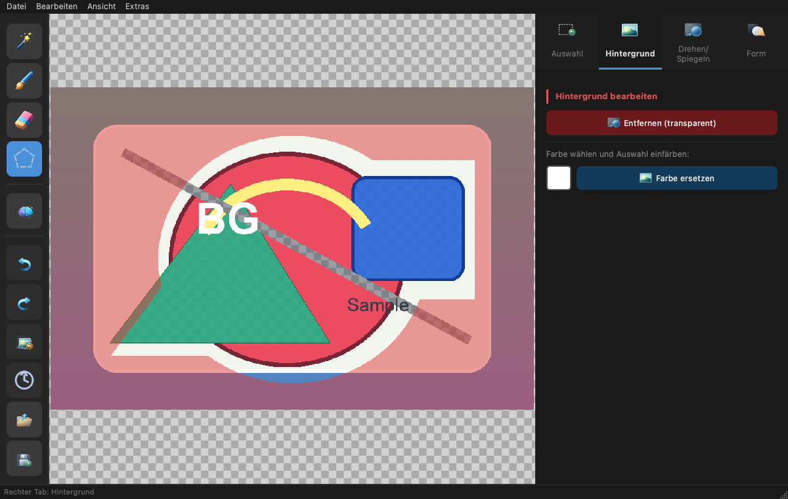

*"背景"选项卡："移除（透明）"使选区变为透明；颜色色块和"替换颜色"用某种颜色填
充选区。*

| 操作 | 说明 |
|---|---|
| **移除（透明）** | 使选区完全透明。提示：先用魔棒选择背景。 |
| **选择颜色** | 打开颜色选择器。小的彩色按钮显示当前选定的替换颜色。 |
| **替换颜色** | 用选定颜色填充选区。 |

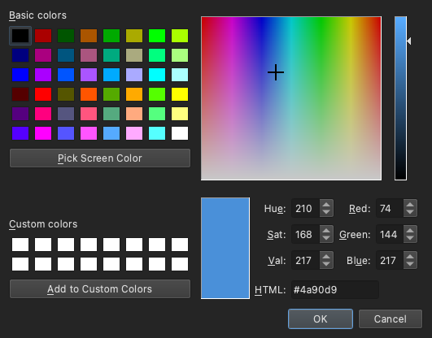

*"选择颜色"会打开颜色选择器；所选颜色显示在色块中，并通过"替换颜色"应用到选区。*

**典型工作流程：** 用魔棒/AI 选择背景 → *移除（透明）* 获得透明 PNG，
**或**选择颜色并*替换颜色*获得纯色背景（例如证件照的白色背景）。

### 柔化边缘（羽化）

在同一选项卡的*柔化边缘*区域，可以柔化 **Alpha 边缘** —— 有助于消除移除背景后
那种生硬的"剪切"边缘。

- **半径：** 0 – 20 像素（默认：2 像素）设置柔和过渡的宽度。
- **柔化边缘** 应用平滑。它仅影响**透明度通道**（颜色保持不变），并且 —— 当存在
  活动选区时 —— 仅作用于选区内部。

---

## 9. "调整"选项卡 – 颜色校正

*调整*选项卡包含简单的**颜色校正**。它作用于**活动颜色图层**（参见
[第 13 节](#13-图层与项目)），并保持透明度不变。

| 滑块 | 范围 | 效果 |
|---|---|---|
| **亮度** | 0 – 200 %（默认：100 %） | 使图片变亮或变暗。 |
| **对比度** | 0 – 200 %（默认：100 %） | 明亮区域与暗部之间的差异。 |
| **饱和度** | 0 – 200 %（默认：100 %） | 颜色强度；0 % 得到灰度。 |

- 拖动滑块时，画布会显示**实时预览**。
- **应用**提交校正（可在历史记录中撤销/重做）。
- **重置**将三个滑块都恢复为 100 % 并丢弃预览。

---

## 10. "旋转/翻转"选项卡

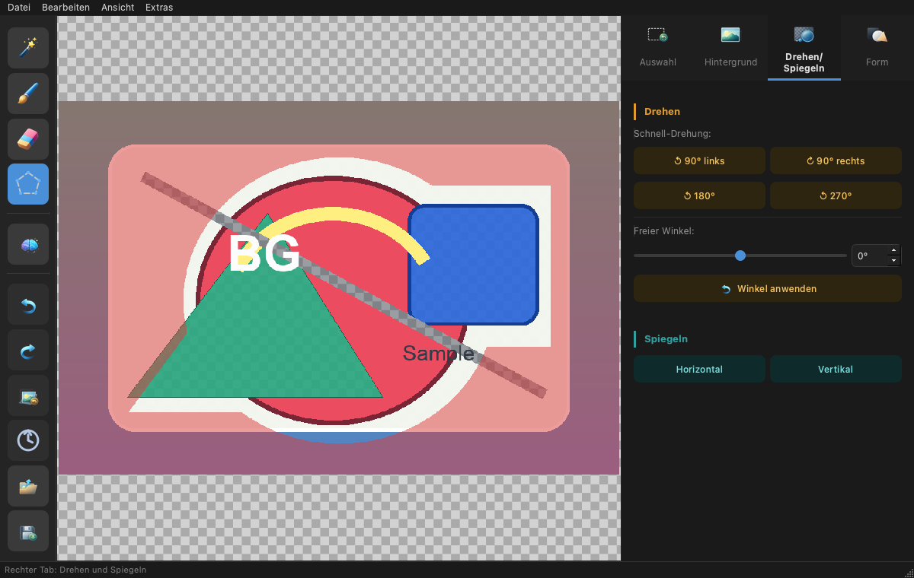

*"旋转/翻转"选项卡，包含快速旋转（90°/180°/270°）、自由角度以及水平和垂直翻转
按钮。*

### 旋转

- **快速旋转：** 提供 *向左 90°*、*向右 90°*、*180°* 和 *270°* 按钮。
- **自由角度：** 滑块或输入框，范围 **−180° 至 +180°**，然后点击
  **应用角度**。斜角会产生透明角落。

### 翻转

- **水平** —— 左右翻转。
- **垂直** —— 上下翻转。

> 快速旋转也可通过键盘操作：⌘←（向左 90°）和 ⌘→（向右 90°）。选项卡最底部的
> **调整尺寸…**会进入 [第 12 节](#12-调整尺寸与物理尺寸)的对话框。

---

## 11. "形状"选项卡 – 圆角与裁剪

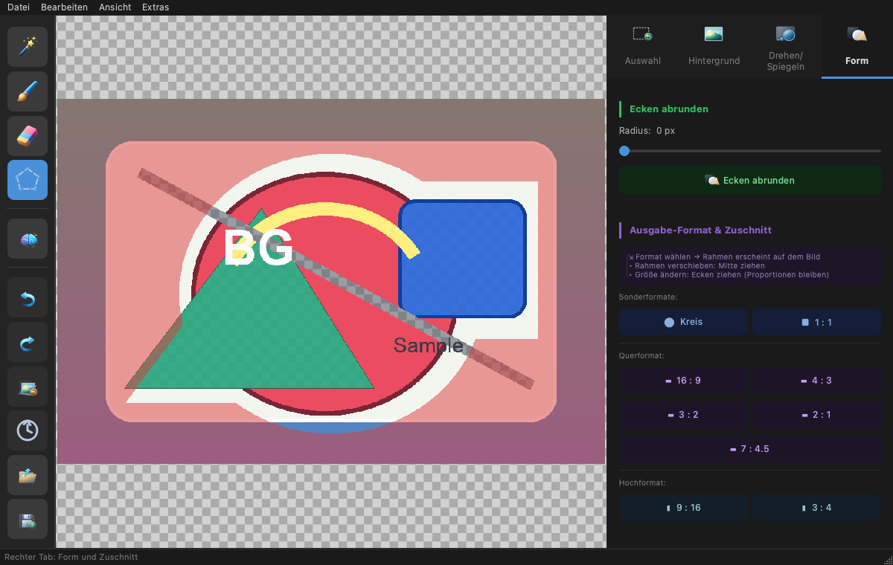

*"形状"选项卡：顶部为带半径滑块的"圆角"，下方为裁剪格式（特殊、横向和纵向）。*

### 圆角

1. 使用**半径**滑块设置圆角程度（0 = 无圆角，最大 500 像素）。
2. 点击**圆角**。

结果将以透明角落保存 —— 最好保存为 PNG。

### 输出格式与裁剪

1. 选择格式 —— 图片上会出现一个**框架**：
   - **特殊格式：** ⬤ 圆形，■ 1:1（正方形）
   - **横向：** 16:9、4:3、3:2、2:1、7:4.5（14:9）
   - **纵向：** 9:16、3:4
2. **移动框架：** 点击中心并拖动。
3. **调整大小：** 拖动角落 —— 宽高比保持不变。
4. 画布上方出现一个操作栏：
   - **✓ 应用裁剪** —— 裁剪图片。
   - **✗ 取消** —— 丢弃框架。

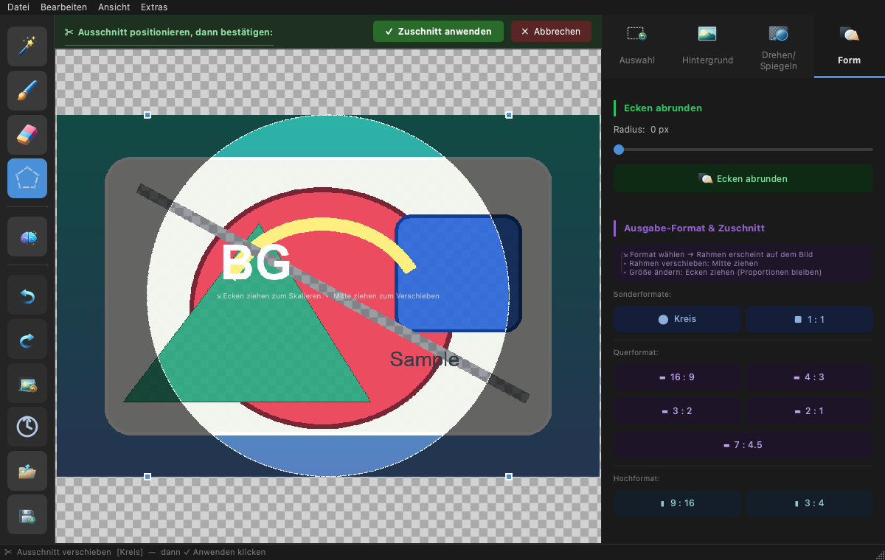

*"圆形"示例：裁剪框带控制手柄叠加在图片上。"✓ 应用裁剪"裁剪图片，"✗ 取消"丢弃
该框架。*

---

## 12. 调整尺寸与物理尺寸

通过 `编辑 → 调整尺寸…`（Ctrl+R）或*旋转/翻转*选项卡中的**调整尺寸…**按钮，
可将图片缩放到新的目标尺寸。该对话框支持两种单位：

### 按像素调整尺寸

在**像素**模式下，直接以像素输入**宽度**和**高度**。启用**关联宽高比**时，比例
保持不变。重采样方法决定质量：

| 方法 | 适用场景 |
|---|---|
| **Lanczos** | 最佳质量（默认），适合缩小。 |
| **双三次** | 结果平滑，通用性好。 |
| **双线性** | 更快，略微更柔和。 |
| **最近邻** | 保留硬边缘/像素，不进行平滑。 |

对话框显示得到的兆像素数，并遵守 **40 兆像素**的限制。

### 物理尺寸（毫米/DPI）与打印区域

在**毫米（mm + DPI）**模式下，设置**以毫米为单位的宽度/高度**和**分辨率
（DPI）**；像素尺寸由此得出。该物理尺寸是权威的打印尺寸，并保存在 `.bgrproj`
项目中。

通过**目标介质**，可选择常见的打印介质（例如 A4 或 A3）。如果图案适合，对话框会
确认；如果图案大于介质，则会有提示指出超出打印区域。

---

## 13. 图层与项目

BgRemover 可在一个**项目**中管理多个**图层**，并将整个内容保存为 `.bgrproj`
文件。对于经典的背景编辑，你无需关心这些 —— 单张图片表现得就像一个颜色图层。

### 图层类型与角色

每个图层都有一个**类型**，并可选一个**角色**。只有**颜色图层**才汇入可见的彩色
图像；其他类型是用于打印准备的数据图层。

| 类型 / 角色 | 含义 |
|---|---|
| **颜色**（彩色图案） | 可见图像。多个颜色图层一起组成合成图，它也会被导出。 |
| **高度**（高度图） | 用于浮雕/UV 打印的灰度高度图（参见 [第 14 节](#14-高度图工作区)）。 |
| **光泽**（光泽蒙版） | 用于光泽效果的蒙版（实验性）。 |
| **通用** | 没有固定角色的中性数据图层。 |

### "图层"选项卡

在*图层*选项卡中，可管理图层列表：

| 操作 | 说明 |
|---|---|
| **新建图层 / 复制 / 删除** | 添加图层、复制活动图层或将其删除。 |
| **上移 / 下移** | 更改图层的堆叠顺序。 |
| **重命名** | 重命名活动图层。 |
| **角色** | 为活动图层分配角色（仅允许兼容的组合）。 |
| **可见性** | 显示或隐藏图层。 |
| **选择** | 将某图层选为**活动**图层 —— 工具将作用于它。 |
| **不透明度** | 图层不透明度（松开时应用）。 |

### 项目文件（.bgrproj）

通过**项目**菜单处理项目文件：

- **新建项目**（Ctrl+N）、**打开项目…**（Ctrl+Shift+O）。
- **保存项目**（Ctrl+Alt+S）和**项目另存为…**（Ctrl+Alt+Shift+S）。

`.bgrproj` 文件是由**清单**（顺序、类型、角色、名称、物理尺寸）和**每个图层一个
PNG** 组成的归档。因此所有图层（包括透明度）都会无损保留。项目也会出现在"最近
文件"中（参见 [第 4 节](#4-打开图片)）。

---

## 14. 高度图工作区

**高度图**是一种灰度图层，其中亮度表示高度：**浅色 = 高，深色 = 低**。它是浮雕和
UV 打印的基础。*高度*选项卡分为三个区域，作用于活动的**高度图层**；编辑和优化
功能仅在高度图层处于活动状态时可用。

### 获取

- **从图片生成** —— 以确定性方式将当前彩色图像转换为高度图，并将其创建为新的
  高度图层。
- **导入灰度…** —— 加载灰度图像作为高度图，并将其缩放到项目尺寸。

### 编辑

- **变亮 / 变暗** —— 升高或降低高度；**强度**控制幅度。
- **设置高度** —— 将高度设为固定**数值**。
- **反转** —— 交换高与低。

当存在活动选区时，这些操作仅作用于选区内部，否则作用于整个图层。

### 优化

优化操作会显示**实时预览**；**应用**提交它（可撤销/重做），**放弃预览**将其
丢弃。

| 操作 | 效果 |
|---|---|
| **色阶（黑/白）** | 设置高度的黑点和白点。 |
| **伽马** | 将中间高度拉向更亮/更暗。 |
| **高斯模糊（半径）** | 柔和、均匀的平滑。 |
| **中值模糊（半径）** | 在保留边缘的同时平滑。 |
| **阈值** | 将高度分为两个级别。 |
| **级数** | 将高度量化为若干级别。 |
| **范围（最小/最大）** | 将高度限制在数值范围内。 |

---

## 15. 2D 预览（颜色、浮雕、高度、光泽）

**2D 预览**直接在画布上显示同一图案的不同视图。它是**纯屏幕显示**，既不改变图像
也不改变导出。在*预览*选项卡中或通过 `视图 → 预览模式` 选择模式。

| 模式 | 显示 |
|---|---|
| **颜色** | 普通彩色图像。 |
| **颜色上的浮雕** | 由高度图生成的山体阴影浮雕，以相乘方式叠加在彩色图像上。 |
| **高度（灰度）** | 高度图作为灰度图像。 |
| **光泽** | 光泽蒙版作为光泽反光。 |
| **组合** | 颜色、浮雕和光泽一起。 |

- 使用**浮雕强度**设置浮雕的强度；为 0 % 时跳过浮雕。
- **显示光泽**可开启或关闭光泽图层。

预览选项卡与视图子菜单保持同步。隐藏的数据图层在预览中被忽略。

---

## 16. 保存与导出

- **保存：** `文件 → 保存`（⌘S / Ctrl+S）
- **另存为…：** `文件 → 另存为…`（⇧⌘S）

保存时始终写入**彩色合成图**（无论当前哪个图层处于活动状态，或设置了哪种预览
模式）。在对话框中选择所需的**文件格式**：

| 格式 | 属性 | 推荐 |
|---|---|---|
| **PNG** | 支持透明度 | 用于抠图对象 —— **默认推荐** |
| **JPEG** | 无 Alpha 通道；透明区域变为白色 | 用于有不透明背景的照片 |
| **WebP** | 现代网络格式，支持透明度 | 用于网络发布 |
| **TIFF** | 无损，支持透明度 | 用于存档/打印 |

> 若要保留抠图效果，**请始终选择 PNG、WebP 或 TIFF** —— JPEG 会将透明区域
> 填充为白色。

### 导出到 EufyMake Studio

通过 `项目 → 导出 EufyMake Studio 资源…`（Ctrl+Alt+E），BgRemover 写出用于 EufyMake
Studio 的**导入资源**，而**不是**完整的 `.empf` 文件：

- **彩色图案**（必选）：RGBA PNG —— 来自带*彩色图案*角色的图层；若没有，则来自彩色合成。
- **高度图**（可选）：灰度，**浅色 = 高，深色 = 低** —— 仅当某图层带有*高度图*角色时
  可用（例如通过“从图片生成”创建的高度图层；仅有高度图层但未设该角色则不会导出）。
- **光泽蒙版**（可选，实验性）：辅助资源 —— 仅当某图层带有*光泽*角色时可用。

在对话框中，可选择导出文件夹、可选资源以及高度图的**位深**（默认 8 位，16 位为
实验性）。**导出前检查**会持续运行，并按严重程度报告结果：

- **错误**（⛔）在修复前会阻止导出 —— 例如缺少彩色图案或尺寸不匹配。
- **警告**（⚠️）需要明确确认 —— 例如空的高度/光泽数据或未确认的 16 位输出。

随后在 EufyMake Studio 中导入并定位这些资源，在那里分配墨水模式/图层，并将
Studio 项目另存为 `.empf`。

---

## 17. 设置

通过 `扩展 → 设置…`（⌘, / Ctrl+,）可管理以下设置：

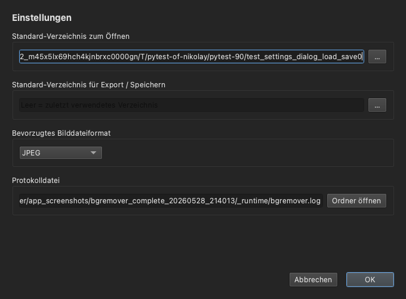

*设置对话框：语言、默认的打开/保存目录、首选图片格式，以及带"打开文件夹"按钮的
日志文件路径。*

| 设置 | 说明 |
|---|---|
| **默认打开目录** | 打开对话框的起始文件夹（空 = 上次使用的） |
| **默认导出/保存目录** | 保存对话框的起始文件夹（空 = 上次使用的） |
| **首选图片格式** | PNG、JPEG、WebP 或 TIFF —— 在保存对话框中作为第一个选项显示 |
| **语言** | 德语或英语；更改在重启后生效 |
| **日志文件** | 显示日志文件路径；"打开文件夹"按钮在文件管理器中打开该目录 |

目录、首选格式和语言在重启程序后仍然保留。

---

## 18. 键盘快捷键

在 macOS 上修饰键为 **⌘（Cmd）**，在 Linux/Windows 上为 **Ctrl**。

| 操作 | 快捷键 |
|---|---|
| 选择魔棒 | W |
| 选择画笔 | B |
| 选择橡皮擦 | E |
| 选择多边形套索 | L |
| 打开图片 | ⌘O |
| 保存图片 | ⌘S |
| 图片另存为… | ⇧⌘S |
| 新建项目 | ⌘N |
| 打开项目… | ⇧⌘O |
| 保存项目 | ⌥⌘S |
| 项目另存为… | ⇧⌥⌘S |
| 导出 EufyMake Studio 资源… | ⌥⌘E |
| 撤销 | ⌘Z |
| 重做 | ⇧⌘Z |
| 调整尺寸… | ⌘R |
| 向左旋转 90° | ⌘← |
| 向右旋转 90° | ⌘→ |
| 取消选区（无活动裁剪/套索时） | Esc |
| 反选 | ⌘⇧I |
| 适应窗口 | ⌘0 |
| 打开设置 | ⌘, |

---

## 19. 典型工作流程

### A) 产品照片抠图（透明背景）

1. 打开图片。
2. 点击工具栏中的 **AI**。
3. 使用**橡皮擦**/**画笔**精细调整边缘。
4. 在*选区*选项卡中，根据需要**收缩**（1–2 像素）以去除色边。
5. 保存为 **PNG**。

### B) 带白色背景的证件照

1. 打开图片。
2. 用**魔棒**点击背景（调整容差）。
3. *背景*选项卡 → **选择颜色**（白色）→ **替换颜色**。
4. *形状*选项卡 → 选择 **1:1** 格式，定位框架，点击
   **✓ 应用裁剪**。
5. 保存为 **JPEG** 或 **PNG**。

### C) 圆形头像

1. 打开图片。
2. 用 **AI** 移除背景（可选）。
3. *形状*选项卡 → 选择 **⬤ 圆形**，将框架拖到面部。
4. 点击 **✓ 应用裁剪**。
5. 保存为 **PNG**（圆形外部为透明）。

### D) 保留对象，仅替换背景

1. 打开图片，用**魔棒**点击**对象**。
2. *选区*选项卡 → **反选**（⌘⇧I）→ 背景现在被选中。
3. *背景*选项卡 → 选择颜色 → **替换颜色**。
4. 保存。

### E) 用于 EufyMake Studio 的高度浮雕资源

1. 打开并抠出图片。
2. *高度*选项卡 → **从图片生成**。
3. 在*优化*区域细化高度（例如*色阶*、*模糊*），然后**应用**。
4. 在 *2D 预览*中选择**颜色上的浮雕**或**组合**模式进行检查。
5. `项目 → 导出 EufyMake Studio 资源…`，查看检查结果并导出。

---

## 20. 技巧与窍门

- **先粗后细：** 用 AI 或魔棒粗略抠图，再用画笔/橡皮擦精细调整。
- **调整容差：** 选中太多 → 降低容差。选中太少 → 提高容差或使用
  Shift+单击。
- **去除色边：** 抠图后，在*选区*选项卡中应用"收缩" 1–2 像素，然后
  再移除背景。
- **柔和边缘：** 使用*柔化边缘*（*背景*选项卡），抠出的边缘看起来不那么生硬。
- **后退一步：** 每一步都记录在历史记录中 —— 双击**编辑历史**（🕘）中的
  任意条目即可跳回该状态。
- **无法继续？** **还原原图**将图片重置为加载时的状态。

---

## 21. 已知限制

- **最大图片尺寸：40 兆像素。** 超出限制的图片将被拒绝。
- **输入格式：** 支持 PNG、JPEG、WebP、TIFF、BMP 和 GIF。**HEIC/HEIF 目前
  不受支持**，会被受控地拒绝。
- **AI 功能**需要可选组件 `rembg`。没有它时，AI 按钮被禁用；所有手动
  工具仍可正常使用。
- **2D 预览**是纯屏幕显示；图像导出仍然不变地写入彩色合成图。
- **EufyMake 导出**仅生成导入资源，**而非**原生 `.empf` 文件；16 位高度输出
  为实验性。
- **应用程序包**（`BgRemover.app`）是 macOS 专用的；在 Linux 上，
  应用程序直接启动。Windows 目前不在官方测试矩阵中。

---

## 22. 故障排除和日志文件

遇到问题时，请查看内部**日志文件** `bgremover.log`。它保存在 Qt 确定的
应用数据目录中，并在写入第一条日志时创建。确切路径可能因平台和 Qt
配置而异：

- **macOS（当前配置）：**
  `~/Library/Application Support/BgRemover/BgRemover/bgremover.log`
- **Linux：** 位于 `~/.local/share/` 下

macOS 应用程序包启动器还会将启动诊断信息写入
`~/Library/Application Support/BgRemover/bgremover.log`。

内部文件包含运行时消息和错误详情（堆栈跟踪），是支持请求的第一个参考来源。

查找该文件最简便的方式是通过 `扩展 → 设置… → 日志文件`：那里会显示完整
路径，**"打开文件夹"**按钮会直接在文件管理器中打开该目录 —— 非常适合将
日志文件附加到支持邮件中。

| 问题 | 可能的解决方案 |
|---|---|
| AI 按钮显示为灰色 | `rembg` 未安装 —— 请参阅安装指南 |
| 图片无法打开 | 超过 40 兆像素？格式是否受支持（非 HEIC/HEIF）？请阅读状态栏 |
| AI 处理时间非常长 | 首次调用会加载模型 —— 仅一次，之后会更快 |
| 保存后透明度消失 | 保存为 JPEG 格式 → 请改用 PNG/WebP/TIFF |
| 项目无法打开 | `.bgrproj` 文件损坏/不完整？请阅读状态栏 |

---

## 23. 许可证

BgRemover 依据 **GNU 通用公共许可证 v3.0 或更高版本**（`GPL-3.0-or-later`）
发布 —— 请参阅 [LICENSE](../../../LICENSE)。所有使用的库及其许可证的完整
列表在 [RESOURCES.md](RESOURCES.md) 中。

---

*本指南是 BgRemover 项目的一部分。如有问题或建议，请在 GitHub 仓库中
提交 issue。*
