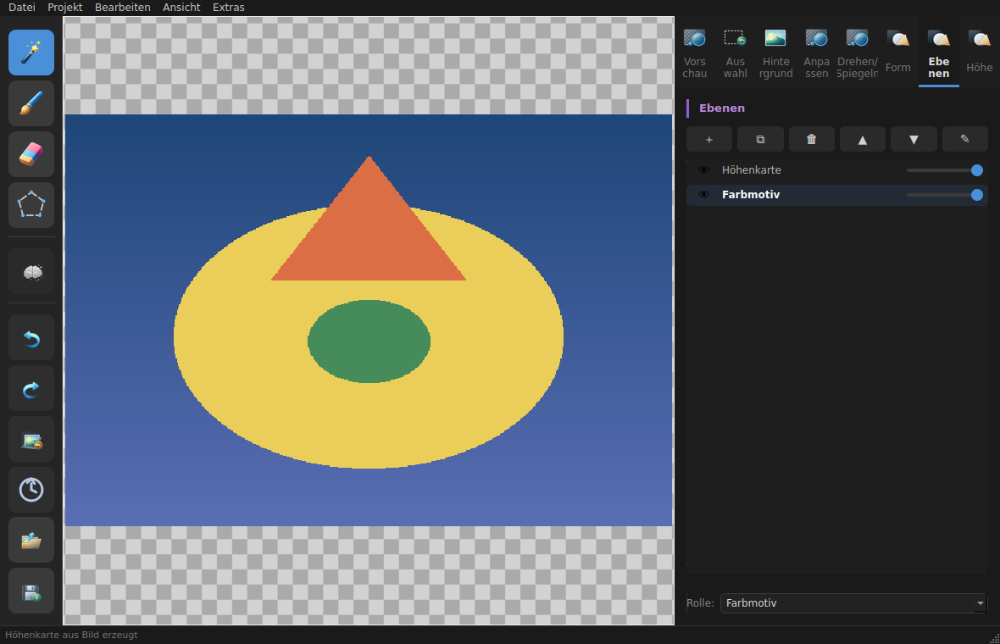

[Deutsch](../../../README.md) · [English](../en/README.md) · [Español](../es/README.md) · [Français](../fr/README.md) · [Українська](../uk/README.md) · **简体中文**

# BgRemover

一款用于 macOS 的图像处理工具，可**移除、替换和编辑背景**——具备基于 AI 的自动抠图、魔棒选区、画笔/橡皮擦、多种比例的裁剪、旋转、镜像翻转以及圆角处理功能。

## 功能

- **🤖 AI 背景移除**：通过 [rembg](https://github.com/danielgatis/rembg) 实现——一键完成。
- **🪄 魔棒**：通过 Flood-Fill 选择相连的色块（带容差滑块）。
- **🖌 画笔 / 橡皮擦**：手动绘制或擦除选区。
- **🎨 替换背景**：用任意颜色填充选区，或将其设置为透明。
- **✂ 裁剪**：带三分法网格：圆形、1:1、16:9、4:3、3:2、2:1、14:9、9:16、3:4。
- **⟲ 旋转**：以 90° 为步长或任意角度旋转；**↔ 镜像翻转**水平/垂直。
- **⬤ 圆角**：圆角半径可调。
- **↩ 历史记录**：支持撤销以及跳转到任意此前的步骤。
- **📥 拖放**：可将图像直接拖到窗口中。
- 保存为 **PNG**（带透明度）、**JPEG**（白色背景）、**WebP** 或 **TIFF**。
- **⚙ 持久化设置**：默认目录和首选文件格式将被保留。

## 截图



## 前提条件

- **macOS**（随附的应用程序包使用了 macOS 专属工具，如 `iconutil`）
- **Python 3.10 或更新版本**（代码在函数签名中直接使用了
  PEP-604 类型注解，如 `QThread | None`——Python 3.9 会失败）
- 依赖项（`PyQt6`、`Pillow`、`numpy`，AI 功能可选用 `rembg`）
  通过 `pyproject.toml` 安装。

## 安装

**推荐（macOS）：构建应用程序包。** 该脚本会自动创建一个
隔离的 venv，安装所有依赖项（包括用于 AI 的
`onnxruntime`），正确处理 Apple Silicon，并生成一个
独立的 `BgRemover.app`：

```bash
git clone https://github.com/NikolayDA/picture_helper.git
cd picture_helper
bash create_BgRemover_app.sh
```

出现 venv 提示时按 **Enter** 确认。之后双击 `BgRemover.app`
（位于 `~/Applications`）即可启动——其功能与随附的
**`BgRemover.command`** 相同。项目可以保留在
`~/Documents` 中（应用程序会被独立构建）。

**或者直接在终端中运行**——在现代 macOS 上需在 venv 中进行，
因为系统 Python 会根据 PEP 668 阻止 `pip install`：

```bash
python3 -m venv .venv && source .venv/bin/activate
python3 -m pip install -c requirements/constraints.txt -e ".[ai]"
python3 -m bgremover
```

`.[ai]` 会一并引入 AI 依赖项（`rembg[cpu]`，含 `onnxruntime`）；
若不需要 AI 功能，`python3 -m pip install -c requirements/constraints.txt -e .` 即可。

**Linux：** 没有应用程序包；应用程序通过从 venv 中
直接启动来运行：

```bash
git clone https://github.com/NikolayDA/picture_helper.git
cd picture_helper
python3 -m venv .venv && source .venv/bin/activate
python3 -m pip install -c requirements/constraints.txt -e ".[ai]"
python3 -m bgremover
```

在此之前需要一些 Qt 系统库——详情参见
**[INSTALL_LINUX.md](INSTALL_LINUX.md)**。

在 **Raspberry Pi OS（桌面版）**上尤其简单——完全无需
venv/pip（PyQt6、Pillow、numpy 作为系统软件包通过 `apt` 安装）；参见
**[INSTALL_LINUX.md](INSTALL_LINUX.md)** 中的 Raspberry Pi 章节。

> 详细的说明——包括**从某个分支安装**
> （用于测试开放的 Pull Request）和**故障排除**——见
> **[INSTALL_MAC.md](INSTALL_MAC.md)**（macOS）或
> **[INSTALL_LINUX.md](INSTALL_LINUX.md)**（Linux）。

## 使用方法

1. 通过 `文件 → 打开`（⌘O）或将图像拖放到窗口中**打开图像**。
2. 用魔棒、画笔或橡皮擦**进行选区**（标签 *🎯 选区*）。
   - `Shift+点击` 添加到选区，`Ctrl+点击` 从选区中减去。
3. **编辑背景**（标签 *🖼 背景*）：设为透明或替换颜色——或直接使用工具栏中的 **AI**。
4. **变换图像**（标签 *⟲ 变换*）：旋转、镜像翻转。
5. **形状与裁剪**（标签 *⬤ 形状*）：圆角处理或按比例裁剪——移动/缩放边框，然后点击 ✓ 应用。
6. 通过 `文件 → 保存`（⌘S）**保存**为 PNG、JPEG、WebP 或 TIFF。

### 设置

通过 `工具 → 设置…`（⌘,）可永久保存三项用户设置：

| 设置 | 说明 |
|---|---|
| 默认打开目录 | 打开对话框的起始目录；留空 = 上次使用的目录 |
| 默认导出/保存目录 | 保存对话框的起始目录；留空 = 上次使用的目录 |
| 首选图像文件格式 | PNG、JPEG、WebP 或 TIFF——在保存对话框中作为第一个选项出现 |

设置通过 **QSettings** 持久化保存，并在下次启动程序时自动恢复。

### 键盘快捷键

| 操作 | 快捷键 |
|--------|----------|
| 打开图像 | ⌘O |
| 保存图像 | ⌘S |
| 图像另存为… | ⇧⌘S |
| 撤销 | ⌘Z |
| 重做 | ⇧⌘Z |
| 向左旋转 90° | ⌘← |
| 向右旋转 90° | ⌘→ |
| 取消选区 | Esc |
| 反转选区 | ⌘⇧I |
| Fit to View | ⌘0 |
| 打开设置 | ⌘, |

文件菜单中还有一个**“最近打开”**子菜单，
列出最近加载的 10 张图像——其状态会与
其余设置一起通过 QSettings 持久化保存。

## 开发与测试

```bash
git clone https://github.com/NikolayDA/picture_helper.git
cd picture_helper
python3 -m venv .venv
source .venv/bin/activate
make pr-check
```

测试套件以无头模式运行（Qt 平台为 `offscreen`），检验
图像操作、裁剪几何和保存逻辑。Pull Request 会运行轻量级
GitHub PR CI（Ubuntu、Python 3.12、`make pr-check`）。完整的
Linux/macOS 矩阵（Python 3.10 和 3.12）会在发布 release
或手动触发时运行。所有本地/CI 测试安装都使用
`requirements/constraints.txt`；需要时可通过
`make PIP_CONSTRAINT=/path/to/file pr-check` 覆盖。完整测试流程见
[TESTING.md](../../../TESTING.md)。

代码风格检查与静态类型检查：

```bash
make lint
make type
```

### 重新生成指南 PDF

`ANLEITUNG.pdf` 由 `ANLEITUNG.md` 生成（Markdown → HTML → PDF，
通过 WeasyPrint）。修改 Markdown 源文件后，请以可复现方式重新生成
PDF：

```bash
pip install -e ".[docs]"
python scripts/generate_anleitung_pdf.py
```

## 架构（简要概览）

自第 5 轮起，BgRemover 是一个可安装的包（`bgremover/`，
通过 `python -m bgremover` 或 console-script `bgremover` 启动）：

- **`ImageCanvas`**（QGraphicsView）保存图像状态、选区蒙版、
  撤销/重做栈以及工具（魔棒、画笔、套索、裁剪）。
- **`MainWindow`** 构建工具栏和状态/裁剪栏，并连接画布、菜单、
  右侧面板和 worker。
- **`right_panel`** 基于一组回调构建右侧四个标签页：选择、
  背景、旋转/镜像和形状/裁剪。
- **`menu_actions`** 构建菜单栏、actions 和快捷键；`MainWindow`
  只提供回调。
- **`RecentFiles`** 封装“最近打开”的持久化、去重和菜单适配器，
  因而 `MainWindow` 只需委托加载路径。
- **Worker**（`ImageLoadWorker`、`AIWorker`、`RembgWarmupWorker`）运行在
  各自的 `QThread` 中；`WorkerController` 封装启动、强 worker 引用、
  `deleteLater` 和 shutdown。
- 画布中的单调**版本计数器**会丢弃过时的 AI 结果，
  以防期间加载了另一张图像。
- 撤销栈不是通过 `maxlen`，而是通过
  **内存上限**（`_UNDO_MEMORY_LIMIT`）来限制；持续累加的
  字节总和会清除最旧的条目。

## 已知限制

- **最大图像尺寸：40 兆像素。** 更大的图像会以
  状态消息被拒绝。魔棒选区（Flood-Fill）在 UI 线程中
  同步运行；超过此限制后，即使是
  向量化的实现也会明显延迟。Pillow 此外还针对
  “解压缩炸弹”图像做了防护。
- **应用程序包构建**是 macOS 专属的；在 Linux/Windows 下
  应用程序通过直接 `python -m bgremover` 启动来运行。

## 日志文件

程序启动时会在平台专属的应用数据目录中创建一个
日志文件 `bgremover.log`
（macOS：`~/Library/Application Support/BgRemover/`，
Linux：`~/.local/share/BgRemover/`）。它包含堆栈跟踪和
状态消息，在出现问题时是首要的排查入口。

## 许可证

BgRemover 采用 **GNU General Public License v3.0 或
更高版本**（`GPL-3.0-or-later`）——参见 [LICENSE](../../../LICENSE)。

所有所用库、工具和资源（含许可证）的完整列表
见 **[RESOURCES.md](RESOURCES.md)**。

> **关于 PyQt6 的说明：** GUI 依赖项 PyQt6（Riverbank）
> 本身采用 GPL-v3 许可（或商业许可）。之所以特意选择
> GPL-3.0，是为了使分发的应用程序——尤其是
> 打包的 `BgRemover.app`——符合许可证要求。希望采用宽松
> 模式（MIT/Apache-2.0）的人，需要用采用 LGPL
> 许可的 **PySide6** 替换 PyQt6。
